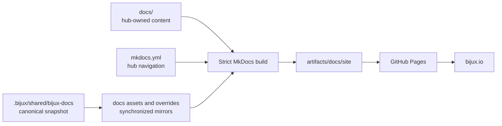
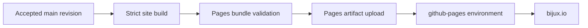

# bijux.github.io

`bijux.github.io` is the source repository for the public Bijux documentation
hub at [bijux.io](https://bijux.io/). It owns cross-repository orientation,
root-site navigation, and the publication path for the hub.

The public content begins at [`docs/index.md`](docs/index.md). This README
describes how the repository is built and maintained; it is not part of the
published reader handbook.

## Reader And Maintainer Boundaries

The repository has two documentation audiences with different needs:

| Surface | Reader | Purpose |
| --- | --- | --- |
| [`docs/`](docs) | public readers, product users, researchers, and integrators | explain the repository family, route readers to owning products, and bound public claims |
| [`README.md`](README.md) | contributors and maintainers of this hub | explain ownership, source classes, build behavior, verification, and publication custody |

Public pages must not narrate editorial intent, repository maintenance, or
automation-control process. A reader should encounter the system, evidence, and
limitations directly. Maintainer instructions belong here or in the owning
repository's dedicated operations documentation.

## Responsibility

| Surface | Owner | This repository's relationship |
| --- | --- | --- |
| hub pages and root navigation | `bijux.github.io` | authors, validates, and publishes |
| shared documentation shell | `bijux-std` | consumes a synchronized, checksummed snapshot |
| managed GitHub workflows and policy files | `bijux-std` | consumes manifest-rendered managed content |
| live repository settings and branch rules | `bijux-iac` | is governed by the external control plane |
| project implementation and technical depth | destination repository | links to the owner; does not duplicate its handbook |

The hub can explain where a product belongs and why a route matters. Product
contracts, runtime evidence, operational procedures, and scientific claims
remain authoritative in the destination repository.

## Repository Architecture



There are two source classes:

- hub-owned Markdown and `mkdocs.yml` define local meaning and routes;
- the checked-in `.bijux/shared/bijux-docs` snapshot defines shared shell
  behavior and generates selected files under `docs/assets` and
  `docs/overrides`.

Do not hand-edit a synchronized mirror. Change the canonical source in
`bijux-std`, accept that change, refresh this consumer from the exact commit,
and validate the resulting managed diff.

## Repository Layout

| Path | Responsibility |
| --- | --- |
| [`docs/`](docs) | public hub pages and synchronized presentation assets |
| [`mkdocs.yml`](mkdocs.yml) | site identity, root navigation, destination registry, and local theme configuration |
| [`mkdocs.shared.yml`](mkdocs.shared.yml) | strict shared MkDocs contract consumed by this site |
| [`makes/docs.mk`](makes/docs.mk) | build, serve, sanity, and artifact commands |
| [`makes/bijux-docs.mk`](makes/bijux-docs.mk) | shared-shell synchronization and contract checks |
| [`makes/bijux-std.mk`](makes/bijux-std.mk) | standards snapshot update and verification entry points |
| [`.bijux/shared/`](.bijux/shared) | managed standards packages vendored from an accepted `bijux-std` revision |
| [`.github/`](.github) | repository policy, deployment trigger, and managed workflow consumers |
| [`artifacts/`](artifacts) | generated sites, environments, caches, reports, and local run output |

## Public Information Architecture

The hub answers a bounded set of cross-repository questions:

| Reader question | Owning hub route |
| --- | --- |
| which repository owns this authority? | Platform and System Map |
| how does an output move from source to a user? | Delivery Surfaces |
| what evidence qualifies a delivered system? | Operational Assurance |
| where is a security control enforced? | Security Model |
| what does the root publication path prove? | Publication Integrity |
| which product or scientific repository should I open? | Projects |
| which executable learning program matches this pressure? | Learning |

The hub should stop at the point where a destination repository becomes
authoritative. It may compare ownership and evidence classes; it must not fork
package contracts, operational procedures, live capability matrices, or
scientific conclusions into a second handbook.

## Build The Site

The documentation toolchain versions are pinned in
[`configs/docs/requirements-docs.txt`](configs/docs/requirements-docs.txt).
With `uv` installed:

```bash
make docs
```

The build:

1. removes the previous generated site;
2. verifies required configuration, tools, icons, and shared scripts;
3. synchronizes the checked-in shared shell into consumer paths;
4. runs MkDocs in strict mode;
5. writes the site to `artifacts/docs/site`;
6. copies root compatibility icons and `CNAME` into the bundle.

No generated HTML belongs at the repository root or in committed source.

## Serve Locally

```bash
make docs-serve
```

The server binds to `127.0.0.1` and starts at port `8000`. If that port is in
use and `lsof` is available, the command selects the next free port. Override
the defaults with `HOST` and `PORT`.

## Focused Documentation Validation

```bash
make docs-sanity
```

The sanity target runs the Markdown table guard, synchronizes the shared shell,
checks the shell contract and source-of-truth relationship, and completes a
strict site build.

Use the narrower standards checks when the managed snapshot changes:

```bash
make bijux-docs-check
make bijux-std-checks
```

`bijux-docs-check` validates the documentation shell and its generated mirrors.
`bijux-std-checks` validates managed packages against their configured
canonical source. Neither command replaces review of hub-owned content or
destination accuracy.

## Review A Hub Claim

Before accepting a new or materially changed public claim:

1. identify the repository that owns the behavior or evidence;
2. inspect its current README, public handbook, and relevant contract or
   limitation page;
3. describe only the boundary supported by those sources;
4. link readers to the owning route instead of duplicating the handbook;
5. build the complete hub in strict mode so navigation and local references are
   validated together;
6. inspect the rendered route when diagrams, tables, or cross-site journeys
   materially changed.

For time-sensitive capability summaries, include a review date and retain the
owning destination as authority. A project page should say when a route is
planned, simulated, internal, bounded, or unavailable instead of filling the
gap with architectural intent.

## Operational And Security Ownership

This repository owns a static public documentation deployment, not the
operations of every destination it describes.

- the strict build establishes that the configured site can be rendered from
  the selected source revision;
- the Pages artifact and deployment establish the root site's publication
  identity;
- pinned Actions, least-privilege Pages permissions, and OIDC constrain the
  deployment path;
- bundled Mermaid and presentation assets reduce runtime dependency on
  third-party CDNs;
- destination availability, API authorization, runtime isolation, dataset
  correction, and scientific acceptance remain with the owning repositories.

Do not turn a successful site deployment into a broader product-readiness or
security claim. The public [Operational Assurance](docs/01-platform/operational-assurance/index.md),
[Security Model](docs/01-platform/security-model/index.md), and
[Publication Integrity](docs/01-platform/publication-integrity/index.md) pages
state those boundaries for readers.

## Publication Path

A push to `main` invokes the repository-owned deployment trigger, which calls
the managed reusable documentation workflow.



The build job has read access to repository contents. Deployment uses scoped
`pages: write` and `id-token: write` permissions. It does not require a
general-purpose repository write token. Concurrency is grouped by Git
reference so a newer deployment can cancel an obsolete in-progress run.

The pipeline establishes that the selected revision produced a valid static
site bundle and passed the configured publication path. It does not prove
continuous external-link availability, destination-product correctness, or an
independent uptime objective for GitHub Pages.

## Change Ownership

Change this repository when the work concerns:

- the public family map or reader routes;
- hub-owned descriptions and diagrams;
- root navigation or site metadata;
- the repository-owned build and deployment composition.

Change `bijux-std` first when the work concerns:

- shared headers, footers, navigation behavior, visual tokens, or shell scripts;
- canonical reusable workflows, policy scripts, or templates;
- shared Make, check, Python, or Rust contracts;
- generators or manifests for managed consumer files.

Change the destination repository when the work concerns its API, runtime,
dataset, scientific evidence, operations, or technical handbook. Update the hub
only to keep the public route and bounded summary accurate.

## Content Standard

Public pages are written for readers. They should:

- lead with the system or question, not with documentation-process commentary;
- distinguish ownership, contract, evidence, and limitation;
- link overview claims to repository-owned depth;
- use diagrams for authority, sequence, or state relationships;
- avoid duplicating entire destination handbooks;
- state missing qualification and unsupported conclusions directly.

The hub should remain useful when read without access to a maintainer's local
workspace or institutional memory.

## License

This repository is licensed under the MIT License. Copyright 2026 Bijan
Mousavi <bijan@bijux.io>. See [`LICENSE`](LICENSE).
