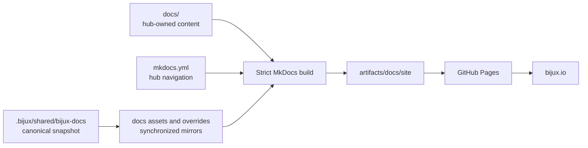
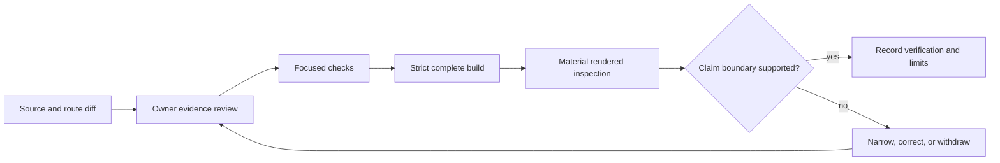
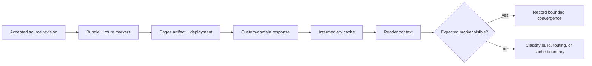
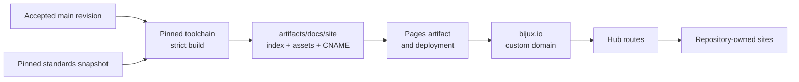
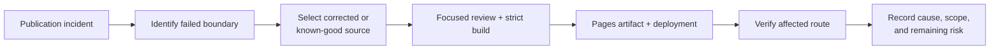
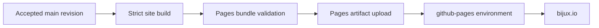

# bijux.github.io

`bijux.github.io` is the source repository for the public Bijux documentation
hub at [bijux.io](https://bijux.io/). It owns cross-repository orientation,
root-site navigation, and the publication path for the hub.

The public content begins at [`docs/index.md`](docs/index.md). This README
describes how the repository is built and maintained; it is not part of the
published reader handbook.

## Reader And Maintainer Boundaries

The repository has two documentation audiences with different needs:

| Surface | Reader | Purpose |
| --- | --- | --- |
| [`docs/`](docs) | public readers, product users, researchers, and integrators | explain the repository family, route readers to owning products, and bound public claims |
| [`README.md`](README.md) | contributors and maintainers of this hub | explain ownership, source classes, build behavior, verification, and publication custody |

Public pages must not narrate editorial intent, repository maintenance, or
automation-control process. A reader should encounter the system, evidence, and
limitations directly. Maintainer instructions belong here or in the owning
repository's dedicated operations documentation.

## Responsibility

| Surface | Owner | This repository's relationship |
| --- | --- | --- |
| hub pages and root navigation | `bijux.github.io` | authors, validates, and publishes |
| shared documentation shell | `bijux-std` | consumes a synchronized, checksummed snapshot |
| managed GitHub workflows and policy files | `bijux-std` | consumes manifest-rendered managed content |
| live repository settings and branch rules | `bijux-iac` | is governed by the external control plane |
| project implementation and technical depth | destination repository | links to the owner; does not duplicate its handbook |

The hub can explain where a product belongs and why a route matters. Product
contracts, runtime evidence, operational procedures, and scientific claims
remain authoritative in the destination repository.

## Repository Architecture



There are two source classes:

- hub-owned Markdown and `mkdocs.yml` define local meaning and routes;
- the checked-in `.bijux/shared/bijux-docs` snapshot defines shared shell
  behavior and generates selected files under `docs/assets` and
  `docs/overrides`.

Do not hand-edit a synchronized mirror. Change the canonical source in
`bijux-std`, accept that change, refresh this consumer from the exact commit,
and validate the resulting managed diff.

## Repository Layout

| Path | Responsibility |
| --- | --- |
| [`docs/`](docs) | public hub pages and synchronized presentation assets |
| [`mkdocs.yml`](mkdocs.yml) | site identity, root navigation, destination registry, and local theme configuration |
| [`mkdocs.shared.yml`](mkdocs.shared.yml) | strict shared MkDocs contract consumed by this site |
| [`makes/docs.mk`](makes/docs.mk) | build, serve, sanity, and artifact commands |
| [`makes/bijux-docs.mk`](makes/bijux-docs.mk) | shared-shell synchronization and contract checks |
| [`makes/bijux-std.mk`](makes/bijux-std.mk) | standards snapshot update and verification entry points |
| [`.bijux/shared/`](.bijux/shared) | managed standards packages vendored from an accepted `bijux-std` revision |
| [`.github/`](.github) | repository policy, deployment trigger, and managed workflow consumers |
| [`artifacts/`](artifacts) | generated sites, environments, caches, reports, and local run output |

## Public Information Architecture

The hub answers a bounded set of cross-repository questions:

| Reader question | Owning hub route |
| --- | --- |
| which repository owns this authority? | Platform and System Map |
| how does an output move from source to a user? | Delivery Surfaces |
| what evidence qualifies a delivered system? | Operational Assurance |
| where is a security control enforced? | Security Model |
| what does the root publication path prove? | Publication Integrity |
| which product or scientific repository should I open? | Projects |
| which executable learning program matches this pressure? | Learning |

The hub should stop at the point where a destination repository becomes
authoritative. It may compare ownership and evidence classes; it must not fork
package contracts, operational procedures, live capability matrices, or
scientific conclusions into a second handbook.

## Build The Site

The documentation toolchain versions are pinned in
[`configs/docs/requirements-docs.txt`](configs/docs/requirements-docs.txt).
With `uv` installed:

```bash
make docs
```

The build:

1. removes the previous generated site;
2. verifies required configuration, tools, icons, and shared scripts;
3. synchronizes the checked-in shared shell into consumer paths;
4. runs MkDocs in strict mode;
5. writes the site to `artifacts/docs/site`;
6. copies root compatibility icons and `CNAME` into the bundle.

No generated HTML belongs at the repository root or in committed source.

## Serve Locally

```bash
make docs-serve
```

The server binds to `127.0.0.1` and starts at port `8000`. If that port is in
use and `lsof` is available, the command selects the next free port. Override
the defaults with `HOST` and `PORT`.

## Focused Documentation Validation

```bash
make docs-sanity
```

The sanity target runs the Markdown table guard, synchronizes the shared shell,
checks the shell contract and source-of-truth relationship, and completes a
strict site build.

Use the narrower standards checks when the managed snapshot changes:

```bash
make bijux-docs-check
make bijux-std-checks
```

`bijux-docs-check` validates the documentation shell and its generated mirrors.
`bijux-std-checks` validates managed packages against their configured
canonical source. Neither command replaces review of hub-owned content or
destination accuracy.

## Verify Accessible Reader Paths

A strict build establishes document structure and route resolution; it does
not establish that a reader can operate the rendered site or recover the same
meaning without visual-only cues. Material changes to navigation, diagrams,
status, tables, or interaction need a proportionate rendered review.

| Changed surface | Reader paths to inspect | Acceptance evidence |
| --- | --- | --- |
| global header, drawer, tabs, or footer | keyboard traversal, visible focus, escape and dismissal, direct entry, narrow viewport, and persisted theme | controls remain reachable, labeled, ordered, and reversible without pointer-only behavior |
| Mermaid diagram | source semantics, rendered text, nearby prose or table, zoom, theme contrast, and non-diagram reading path | the relationship and conclusion remain available when the visual is not understood or rendered |
| status, warning, or limitation | text label, heading order, contrast, link purpose, and placement near the affected claim | state and consequence do not depend on color, icon, or hover |
| wide table or evidence matrix | semantic headers, reading order, reflow or controlled scrolling, and equivalent context outside compact labels | rows and ownership remain understandable at high zoom and narrow width |
| cross-site route | descriptive link text, focus behavior, destination identity, authority transition, and return path | direct and hub-mediated entry expose the same owner and purpose |
| correction or withdrawal | keyboard and non-visual discovery, old-to-new identity relation, and reader action | affected readers can find the changed status without reconstructing visual history |

The review should record the routes, viewport or zoom context, input method,
theme, relevant assistive interpretation, observed result, and remaining
limitation. One screenshot is not interaction evidence, and automated markup
checks do not replace representative keyboard and reading-order review.

### Keep accessibility evidence safe

Use repository-owned fixtures or public pages for demonstrations. Reports must
not capture browser credentials, private extensions, unrelated desktop
content, personal account details, restricted scientific material, or secret
values. When a defect involves sensitive content, preserve the minimum
restricted evidence needed for remediation and publish only the bounded
correction.

## Review A Hub Claim

Before accepting a new or materially changed public claim:

1. identify the repository that owns the behavior or evidence;
2. inspect its current README, public handbook, and relevant contract or
   limitation page;
3. describe only the boundary supported by those sources;
4. link readers to the owning route instead of duplicating the handbook;
5. build the complete hub in strict mode so navigation and local references are
   validated together;
6. inspect the rendered route when diagrams, tables, or cross-site journeys
   materially changed.

For time-sensitive capability summaries, include a review date and retain the
owning destination as authority. A project page should say when a route is
planned, simulated, internal, bounded, or unavailable instead of filling the
gap with architectural intent.

## Content Custody And Revalidation

Every hub statement has a custody class. The class determines what can change
it and what evidence is needed before the public summary can remain in present
tense.

| Content class | Canonical owner | Revalidation trigger | Required review evidence |
| --- | --- | --- | --- |
| family topology and reader routes | this repository | repository added, removed, renamed, planned, or published | governed inventory, live destination, and route build |
| GitHub governance behavior | `bijux-iac` plus observed GitHub state | policy, target set, workflow, or platform-state change | declared configuration, plan or audit, apply evidence, and effective state |
| shared standards behavior | `bijux-std` plus this consumer snapshot | canonical package, capability set, pin, or managed-file change | accepted upstream revision, canonical digest, consumer checksum, and focused gates |
| product capability | destination repository | public contract, package, runtime, or release change | owning README, handbook, contract, tests or release evidence, and known limitations |
| operational qualification | destination operations surface | topology, profile, security control, workload, recovery, or evidence-window change | identity-bound render, admission, effective-state, experiment, and decision records as applicable |
| scientific or curation claim | destination evidence surface | source, population, method, decision, threshold, output, or freshness dependency change | claim-scoped provenance, complete denominator, checks, verdict, limitations, and freshness |
| root-site publication claim | this repository and GitHub Pages | source, build, workflow, artifact, deployment, or domain change | strict build, bundle identity, deployment record, and bounded external observation |

Review dates are discovery aids, not automatic validity periods. A material
upstream change reopens the dependent summary even when its calendar date is
recent. Conversely, an unchanged owning contract does not need speculative
rewriting merely to refresh a date.

### Handle destination drift

When a destination and the hub disagree:

1. establish whether the destination is authoritative for the disputed fact;
2. narrow or remove the hub statement immediately if current evidence cannot
   support it;
3. correct the owning repository first when its contract or evidence is wrong;
4. update the hub route after the owner exposes an accepted durable account;
5. verify both the local link and the built reader journey.

Do not preserve a stale summary for navigational convenience, and do not copy
destination procedures into the hub to compensate for a weak owning handbook.
The durable correction belongs at the authority that can keep it true.

## Evidence For A Documentation Change

Documentation verification should match the claim being changed:

| Change | Minimum focused verification |
| --- | --- |
| prose without routes or diagrams | Markdown diff review, claim-owner review, and strict build |
| relative navigation or destination URL | strict build plus direct route inspection; check the live destination when availability is part of the claim |
| Mermaid authority, sequence, or state diagram | source review against owning contracts plus rendered inspection |
| managed shell or synchronized asset | exact upstream pin, canonical digest, managed checksum, shell checks, and strict build |
| capability, operational, or scientific summary | current owner artifacts, explicit limitations, source-to-summary trace, and strict build |
| publication or deployment statement | workflow and permission review, built artifact evidence, deployment record, and carefully bounded external observation |

A successful MkDocs build proves that the site renders under the configured
contract. It does not prove destination availability, product correctness,
operational fitness, or scientific acceptance; those require the corresponding
owner evidence above.

## Close A Publication Change

A documentation change is complete when the source, reader route, and bounded
claim can be reconstructed together. Close the change with an evidence packet
appropriate to its impact:

| Packet field | Purpose |
| --- | --- |
| accepted source revision | identifies the hub content that was reviewed |
| changed public routes | names the reader-visible blast radius |
| canonical owners inspected | records where capability, operations, or scientific truth came from |
| claim and limitation changes | separates stronger, narrower, corrected, and withdrawn statements |
| focused checks | proves tables, diagrams, links, managed relationships, or owner contracts as applicable |
| strict build result | proves the complete configured site rendered from the selected source |
| rendered inspection | confirms material diagrams, navigation, and reader journeys where source checks are insufficient |
| deployment and observation | identifies the Pages result only when publication itself is part of the claim |



The packet need not be a new committed artifact for ordinary prose changes;
the pull request, commits, check output, and deployment record can collectively
provide it. High-impact changes should remain easy to reconstruct without
depending on a maintainer's local terminal history.

Before closing, verify that no public statement depends on a planned follow-up
to become true, no withdrawn route remains in navigation, and no destination
procedure was copied into the hub as a substitute for fixing its canonical
owner. Record skipped or unavailable verification with the exact affected
claim rather than treating it as an implicit pass.

## Verify Publication From A Reader Boundary

A green Pages deployment confirms platform acceptance of an artifact. It does
not confirm that every public path serves the intended revision. Verify a
release through named content markers and keep each observation attached to
the cache or routing boundary that produced it.

| Boundary | Verification evidence | Failure meaning |
| --- | --- | --- |
| built bundle | source revision, bundle identity, expected route, and page-specific marker | the intended content was or was not composed locally |
| Pages deployment | workflow run, artifact, environment, and deployment identity | GitHub did or did not accept the selected bundle |
| custom domain | resolved URL, response time and status, certificate context, and expected marker | the domain served a response, which may still be old or misrouted |
| direct-entry route | clean request to a changed deep link with its own marker | root navigation may work while the changed page does not |
| intermediary and browser | cache context, age or validator metadata when visible, and observed marker | a reader can receive a different generation from the origin observation |
| search discovery | indexed route, title, excerpt, and observation time | discovery can lag or preserve withdrawn wording after publication converges |

Use markers specific enough to distinguish the intended revision from the
previous one; a shared header or HTTP `200` is insufficient. Compare the site
entrance, every materially changed direct-entry route, and any old route whose
redirect, withdrawal, or correction is part of the release.



Do not force convergence by publishing unrelated edits or repeatedly
redeploying an unidentified artifact. Preserve the intended and observed
identities, determine which boundary is stale, and verify the correction from
a fresh reader context. Search-engine refresh is externally scheduled, so
record stale discovery separately from site availability and use an explicit
correction or removal route when the indexed text is harmful.

## Operational And Security Ownership

This repository owns a static public documentation deployment, not the
operations of every destination it describes.

- the strict build establishes that the configured site can be rendered from
  the selected source revision;
- the Pages artifact and deployment establish the root site's publication
  identity;
- pinned Actions, least-privilege Pages permissions, and OIDC constrain the
  deployment path;
- bundled Mermaid and presentation assets reduce runtime dependency on
  third-party CDNs;
- destination availability, API authorization, runtime isolation, dataset
  correction, and scientific acceptance remain with the owning repositories.

Do not turn a successful site deployment into a broader product-readiness or
security claim. The public [Operational Assurance](docs/01-platform/operational-assurance/index.md),
[Security Model](docs/01-platform/security-model/index.md), and
[Publication Integrity](docs/01-platform/publication-integrity/index.md) pages
state those boundaries for readers.

## Static-Site Operating Model

The hub is a small service with several independently failing boundaries. Its
source, generated bundle, GitHub Actions execution, Pages deployment, custom
domain, and destination links must not be collapsed into one “docs are up”
state.



| Boundary | Repository-owned control | External dependency | Strongest local claim |
| --- | --- | --- | --- |
| source | hub Markdown, navigation, configuration, review evidence | GitHub source hosting | exact accepted content is identifiable |
| shared shell | pinned managed snapshot, digests, checksums, source-of-truth checks | accepted `bijux-std` revision | consumer bytes match the selected canonical source |
| build | pinned documentation requirements, strict MkDocs, local Mermaid and shell assets | runner image, Python and package availability | selected sources produce a complete local bundle |
| artifact and deployment | resolved site directory, `index.html` validation, SHA-pinned Pages actions, scoped permissions | GitHub Actions and Pages | a named workflow can upload and deploy the selected bundle |
| custom domain | `CNAME` included in the built bundle and canonical `site_url` | DNS, TLS, GitHub Pages routing | the bundle requests the intended domain identity |
| destination network | hub-owned routes and labels | every repository-owned site and external reference | local routing intent is reviewable; destination availability remains external |

The root site has no application database, request-processing backend, private
reader session, or repository-owned edge cache. That reduces its runtime state
surface; it does not remove dependency on Actions, Pages, DNS, TLS, browser
caching, or destination sites.

## Operating States And Signals

| State | Required evidence | Do not infer |
| --- | --- | --- |
| source accepted | revision on `main` with required policy context | that a deployment started or succeeded |
| locally buildable | strict build and bundle checks from the selected revision | that GitHub Pages received the same bundle |
| artifact uploaded | workflow run and Pages artifact identity | that the custom domain serves it |
| deployment accepted | Pages deployment record and environment URL | continuous domain availability or cache convergence |
| route observed | URL, time, response, and expected content marker | ongoing availability or correctness of linked products |
| destination verified | bounded observation of the repository-owned route | product correctness, operational fitness, or future availability |

The workflow run is the primary deployment record. The generated bundle under
`artifacts/` is local evidence and remains disposable. Git history is the
durable source record; generated HTML is reconstructed rather than committed.

This repository does not declare an independent availability objective,
synthetic monitoring service, latency budget, or traffic-capacity target for
GitHub Pages. Do not invent one from a successful deployment or occasional
manual observation.

## Incident Classification

Start with the failed boundary so remediation does not mutate an unrelated
owner.

| Symptom | Inspect first | Corrective owner and action |
| --- | --- | --- |
| strict build fails | failing page, navigation, extension, template, synchronized mirror, or pinned toolchain | correct hub source here, or correct `bijux-std` first when the shared source owns the defect |
| build passes but bundle validation fails | resolved site directory, `index.html`, icons, and `CNAME` copy | correct repository build composition or managed deployment workflow at its canonical owner |
| artifact upload or Pages deployment fails | workflow run, action step, permissions, environment, concurrency, and external Pages status | correct repository configuration or upstream shared workflow; retry only after the cause is understood |
| Pages succeeds but `bijux.io` is unavailable | deployment URL, `CNAME`, DNS, TLS, custom-domain state, and observation time | reconcile the domain or Pages boundary; do not rewrite content as an availability fix |
| one local route is missing or broken | `mkdocs.yml`, source path, relative link, and built route | correct hub navigation or content and rebuild the whole bundle |
| destination route is missing | owning repository's published path and current contract | correct the destination first, then update the hub route and bounded summary |
| visible content is outdated | source revision, deployment identity, browser or intermediary cache, and upstream claim freshness | identify whether source, deployment, observation, or destination evidence is stale before changing anything |
| unsafe or overstated guidance is public | affected claim, canonical owner, source revision, deployment, and consumer consequence | narrow or remove the statement, correct the owner, redeploy, and preserve the correction relation |

Do not use a deployment retry as a generic incident response. Retries are
appropriate for a diagnosed transient external failure; they are not evidence
that source, configuration, permissions, or destination identity is correct.

## Prioritize Publication Incidents By Consumer Harm

HTTP availability alone does not determine urgency. A reachable page can be a
more serious incident than an unavailable page when it exposes unsafe
guidance, secrets, false scientific authority, or an unmarked withdrawn result.

| Impact class | Examples | Immediate publication response | Evidence required before closure |
| --- | --- | --- | --- |
| harmful or sensitive content | exposed credential or personal data, unsafe instruction, fabricated authority, materially false security or scientific claim | contain the affected route or statement, preserve source and deployment identity, engage the canonical owner, then publish a correction | exposure window, affected routes and consumers, containment, owner correction, secret or data response where relevant, verified replacement, and residual risk |
| broken authority or identity | wrong revision, stale dataset generation, superseded claim, cross-project attribution failure | identify the served and intended identities, prevent further ambiguous use, correct the owner or hub route, and redeploy | old-to-new identity relation, dependency impact, complete build, deployment, and bounded route observation |
| unavailable or degraded route | build failure, Pages failure, DNS/TLS fault, missing local route, unavailable destination | preserve the last known-good state when safe, classify the failing boundary, and recover through the owning path | observation window, failed boundary, recovery action, deployment identity, route verification, and known external dependency state |
| presentation defect | layout, non-essential asset, or wording problem that does not change meaning or access | correct through normal review while confirming that the defect has no hidden authority or accessibility impact | source review, focused render or accessibility check, strict build, and affected-route inspection |

Impact can move between classes as facts emerge. Record the highest supported
consumer consequence and the evidence that narrowed it; do not downgrade an
incident merely because deployment recovered. If affected consumers cannot be
identified, state the notification gap and use the public correction route as
an explicit part of containment.

### Preserve evidence without preserving exposure

Retain commit, workflow, artifact, deployment, and observation identities in a
restricted incident record when public reproduction would repeat sensitive or
harmful content. Remove secrets and personal data from public pages and normal
logs, rotate compromised authority, and avoid pasting the exposed value into a
correction. Evidence custody does not require keeping dangerous bytes publicly
reachable.

## Publication Recovery

Recovery selects reviewed source and moves it through the same build and Pages
path used for normal publication.



For content defects, prefer a new correction commit that preserves history and
explains the durable source state. When restoration truly requires an earlier
revision, select it explicitly and redeploy it; do not overwrite Git history or
copy generated HTML into source. After recovery, verify the affected route and
the site entrance, then confirm that the correction did not leave navigation
pointing at the withdrawn content.

Recovery is incomplete if only the Pages environment turns green. Retain the
source revision, workflow run, deployment, observed route and time, affected
claim or navigation surface, and any destination follow-up still required.

## Security And Dependency Response

If a workflow action, documentation dependency, shared shell revision, or
published instruction becomes unsafe:

1. identify the exact pinned component and affected revisions;
2. stop or constrain the affected publication path when continued delivery
   increases harm;
3. correct the canonical owner rather than patching a generated consumer copy;
4. update the pin or managed snapshot with digest and checksum verification;
5. rebuild and inspect the complete bundle;
6. deploy through the Pages environment and verify the public correction; and
7. record residual exposure and consumer action when previously published
   guidance or assets were affected.

Pinning makes change attributable; it does not prove upstream code safe. OIDC
and Pages-scoped permissions limit deployment authority; they do not make a
compromised source revision benign.

## Publication Path

A push to `main` invokes the repository-owned deployment trigger, which calls
the managed reusable documentation workflow.



The build job has read access to repository contents. Deployment uses scoped
`pages: write` and `id-token: write` permissions. It does not require a
general-purpose repository write token. Concurrency is grouped by Git
reference so a newer deployment can cancel an obsolete in-progress run.

The pipeline establishes that the selected revision produced a valid static
site bundle and passed the configured publication path. It does not prove
continuous external-link availability, destination-product correctness, or an
independent uptime objective for GitHub Pages.

## Change Ownership

Change this repository when the work concerns:

- the public family map or reader routes;
- hub-owned descriptions and diagrams;
- root navigation or site metadata;
- the repository-owned build and deployment composition.

Change `bijux-std` first when the work concerns:

- shared headers, footers, navigation behavior, visual tokens, or shell scripts;
- canonical reusable workflows, policy scripts, or templates;
- shared Make, check, Python, or Rust contracts;
- generators or manifests for managed consumer files.

Change the destination repository when the work concerns its API, runtime,
dataset, scientific evidence, operations, or technical handbook. Update the hub
only to keep the public route and bounded summary accurate.

## Content Standard

Public pages are written for readers. They should:

- lead with the system or question, not with documentation-process commentary;
- distinguish ownership, contract, evidence, and limitation;
- link overview claims to repository-owned depth;
- use diagrams for authority, sequence, or state relationships;
- avoid duplicating entire destination handbooks;
- state missing qualification and unsupported conclusions directly.

The hub should remain useful when read without access to a maintainer's local
workspace or institutional memory.

## License

This repository is licensed under the MIT License. Copyright 2026 Bijan
Mousavi <bijan@bijux.io>. See [`LICENSE`](LICENSE).
