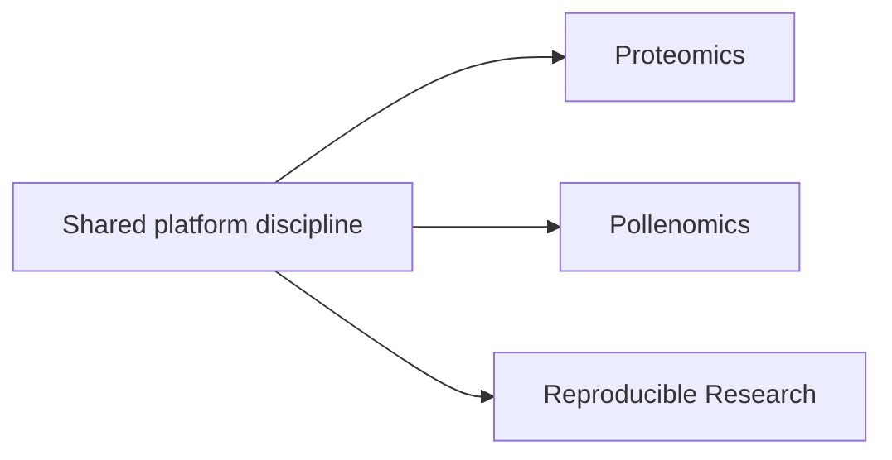

# Applied Domains

Applied domains show how the same engineering posture behaves when the
subject matter gets more demanding.

## Domain Map

## Domain Surfaces

| Domain surface | What makes it demanding |
| --- | --- |
| Proteomics | schema depth and evidence lineage requirements from laboratory workflows shape package boundaries, validation, and publication paths |
| Pollenomics | interpretation complexity across archaeology, eDNA, aDNA, and regional context shapes model design and output structure |
| Learning workflows (Masterclass reproducible research) | reproducibility pressure appears as teachable workflow behavior where reruns, artifact lineage, and review steps are part of the deliverable |

## Why These Domains Matter

The value here is not breadth by itself. The value is that the work
moves between infrastructure, data systems, scientific products, and
teaching without losing structural clarity.

## What Stays The Same

- bounded ownership instead of monolithic responsibility
- interfaces and operational contracts that stay visible
- reproducibility and evidence discipline as non-optional quality criteria

## What Gets Harder

- schema complexity: domain entities, relationships, and constraints become deeper than generic data models
- interpretation burden: outputs must remain understandable to specialists making real decisions
- publication burden: delivery surfaces must preserve context, caveats, and reproducibility in public outputs

## Domain-Driven Repositories

  
<h3>Bijux Proteomics</h3>
A domain product surface for proteomics and discovery work, where engineering structure has to remain clear while serving laboratory and scientific context.

  
<h3>Bijux Pollenomics</h3>
An evidence-mapping and site-selection surface where technical architecture supports archaeology, eDNA, aDNA, and pollenomics narratives without collapsing into generic geodata language.

  
<h3>Reproducible Research (Masterclass)</h3>
A learning workflow surface where methods, artifacts, and review steps are taught and executed under the same reproducibility discipline used in repository work.

## Pressure Comparison

| Surface | How pressure shows up |
| --- | --- |
| Proteomics | higher schema complexity for biological entities, stronger evidence lineage requirements, and high error cost in interpretation decisions |
| Pollenomics | heavier interpretation burden across archaeology, eDNA, aDNA, and regional narratives, plus publication pressure for evidence-backed reports |
| Learning (Reproducible Research) | pacing and proof requirements so learners can run workflows, follow the artifacts, and validate reproducibility claims |

## Reading Route

Read the platform pages first for shared rules, then move into the
domain repositories to see how those rules hold under evidence
pressure, interpretation burden, and publication constraints.
