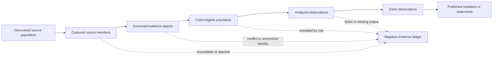
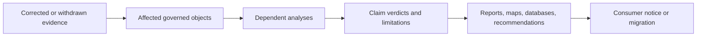
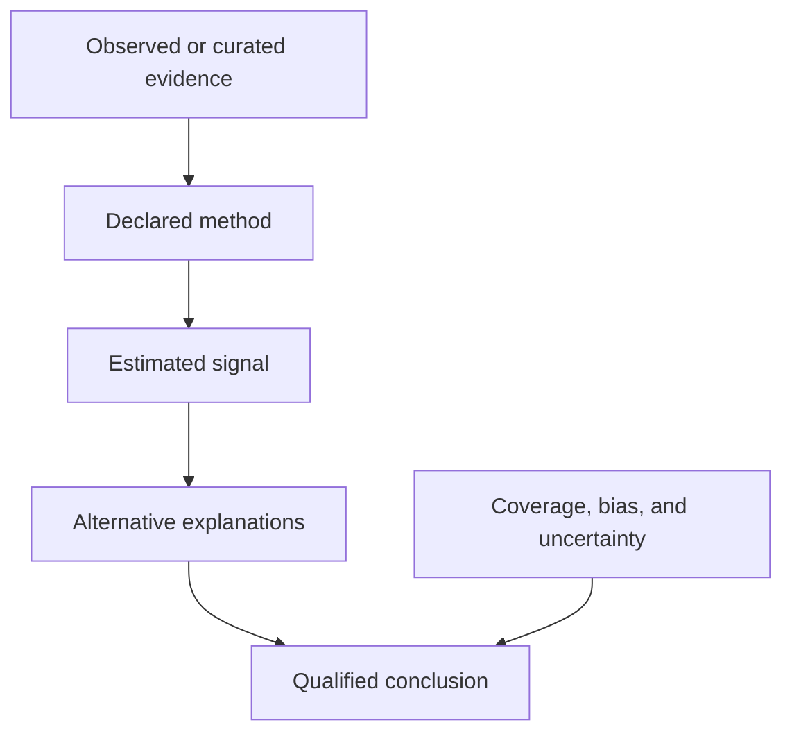
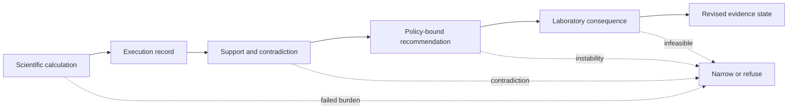

# Applied Domains

Bijux scientific repositories treat data preparation, evidence selection, and
interpretation as first-class product work. Analysis begins only after source
identity, inclusion decisions, normalization, and provenance are made visible.

## Scientific Evidence Chain

```mermaid
flowchart LR
    source["Source records and literature"] --> curate["Curate and qualify"]
    curate --> normalize["Normalize and reconcile identity"]
    normalize --> model["Model domain relationships"]
    model --> analyze["Analyze and compare"]
    analyze --> interpret["Interpret with limitations"]
    interpret --> publish["Publish data, maps, or evidence books"]
    publish --> reproduce["Reconstruct from declared inputs"]
```

Every transition can change the conclusion. Curation is therefore not a
preliminary clerical activity; it is part of the evidence model.

## Domain Systems

**Bijux Canon — governed knowledge.** Heterogeneous sources move through
deterministic ingest, structured indexing, retrieval, reasoning, and controlled
runtime acceptance. Public surfaces include indexed knowledge, query behavior,
reasoning contracts, and compatibility boundaries.

**Bijux Proteomics — protein evidence and discovery.** Database preparation,
entity reconciliation, evidence lineage, validation, and analysis contracts
support packages, knowledge assets, and laboratory-facing workflows.

**Bijux Pollenomics — pollen evidence in place and time.** Source curation,
taxonomic and spatial reconciliation, archaeology/eDNA/aDNA context, and report
preparation support curated databases, maps, atlases, and evidence-backed
interpretation.

**Bijux Phylogenetics — comparative evidence across lineages.** Sequence and
trait curation, phylogenetic comparative models, and alternative explanations
support comparative analyses and evidence books.

## Curation As Evidence

A curated dataset expresses scientific judgment through inclusion, exclusion,
normalization, and reconciliation.

| Curation decision | Why it can change the result |
| --- | --- |
| source selection | coverage and publication bias enter before analysis begins |
| entity identity | synonyms, accessions, taxa, sites, or assemblies can otherwise fragment one entity or merge distinct ones |
| unit and schema normalization | incomparable values can appear compatible when transformation rules are hidden |
| missingness treatment | absence, unknown, below-detection, and not-applicable carry different meanings |
| conflict resolution | choosing one source over another changes the authoritative record |
| exclusion criteria | filtering can change the population to which a conclusion applies |
| version pinning | upstream drift can make an older result impossible to reconstruct |

The curation record should preserve these decisions alongside the resulting
database rather than presenting the database as raw fact.

## Keep Source, Evidence, Analysis, And Claim Populations Distinct

Scientific systems repeatedly narrow and transform a population. Each
transition needs its own denominator and refusal record.

| Population | Identity that must survive | Common overclaim |
| --- | --- | --- |
| discovered sources | query, registry, bibliography, release, and discovery time | treating search results as captured evidence |
| captured members | source-native key, payload or locator, version, and access context | treating collection as scientific acceptance |
| governed objects | normalized identity, fact ownership, lineage, conflicts, and curation decision | treating normalization as truth resolution |
| eligible objects | named claim, inclusion and exclusion rules, missingness and precision | hiding selection behind the analyzed count |
| analyzed observations | method, configuration, failures, diagnostics, and complete result inventory | reporting only successful rows |
| published members | manifestation rule, caveat, revision, and stable public identity | treating visibility as universal support |

Counts are comparable only when their observation unit, identity namespace,
scope, eligibility, missingness, and revision agree. A larger captured database
can legitimately produce a smaller public product when the publication burden
is stricter.

## Propagate Evidence Corrections Without Rewriting History

A source retraction, taxonomy correction, changed protein accession, revised
coordinate, or invalidated analytical output can affect several descendants.
The correction should follow explicit dependency edges.

Preserve the previous record, the correction reason, old and new identities,
affected descendants, and the decision that supersedes or withdraws each
claim. Regenerating a polished output without a correction relation destroys
the evidence needed to understand what changed.

## Interpretation Boundary

A result becomes trustworthy through qualification, not certainty language.
Scientific pages should distinguish:

- observation from inference;
- correlation from mechanism;
- model support from proof;
- signal absence from absence of evidence;
- regional or taxonomic scope from universal claims;
- exploratory findings from evidence ready for downstream use.

## Evidence And Action Remain Separate

Proteomics makes a general scientific principle visible: computation,
execution, grounding, recommendation, and observed consequence are different
records with different authorities.

The chain is asymmetric. Any missing or failed burden can narrow the public
claim; success later in the chain cannot upgrade weak evidence earlier in the
chain. An observed outcome informs the next decision without rewriting the
record that led to the original action.

## Shared Capabilities, Local Meaning

The scientific repositories can consume common execution, knowledge, and
documentation capabilities. They retain authority over their domain semantics.

- `bijux-core` can provide deterministic execution and evidence mechanics;
- `bijux-canon` can provide knowledge ingest and retrieval contracts;
- `bijux-atlas` can provide dataset and service-delivery patterns;
- `bijux-std` can provide shared repository and documentation contracts.

None of those layers decides whether a protein relationship, pollen signal, or
phylogenetic conclusion is scientifically supported. That responsibility stays
with the domain repository and its evidence.

## Reproducible Publication

A scientific publication route is complete when a reader can connect:

1. the claim to the analysis;
2. the analysis to parameters, models, and software identity;
3. the analysis input to a curated dataset version;
4. the curated dataset to source records and curation decisions;
5. the output to stated uncertainty and limitations.

Maps, dashboards, and polished reports are delivery surfaces, not substitutes
for this chain.

Reproducibility also has a ceiling. Reconstructing identical bytes shows that
the declared computation is repeatable; it does not establish that the source
population was unbiased, the method was valid for a new context, or the
interpretation remains current after upstream evidence changes.

## Explore The Domains

- [Bijux Canon](../../04-projects/bijux-canon/index.md) for the knowledge-system
  boundary;
- [Bijux Proteomics](../../04-projects/bijux-proteomics/index.md) for protein
  evidence and discovery workflows;
- [Bijux Pollenomics](../../04-projects/bijux-pollenomics/index.md) for curated
  pollen evidence, spatial interpretation, maps, and reports;
- [Projects](../../04-projects/index.md) for the wider repository catalog;
- [Reproducible Research](../../05-learning/reproducible-research/index.md) for
  the workflow principles behind reconstructable outputs.
