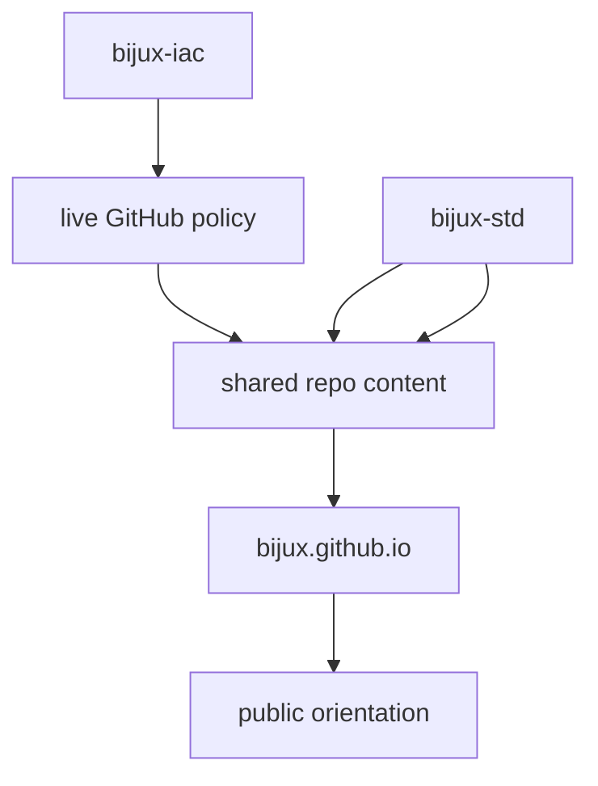

# Bijux Infrastructure-as-Code

`bijux-iac` is the live GitHub control-plane repository for the Bijux
repository family.

`iac` stands for `Infrastructure-as-Code`.

Here that means GitHub administration is declared, reviewed, and
applied in code instead of being left to hidden settings pages.

## What It Owns

`bijux-iac` owns the settings that act on repositories from the outside.

That includes:

- branch protection and merge rules
- required status checks
- repository governance inventory
- Terraform-managed GitHub policy surfaces

## What It Does Not Own

`bijux-iac` does not own the files that repositories synchronize into
themselves. Those belong to `bijux-std`.

The split is direct:

- `bijux-iac` owns live GitHub control-plane policy
- `bijux-std` owns shared repository content

## How It Fits

In practice:

- `bijux-iac` decides how repositories are governed
- `bijux-std` decides which shared files stay aligned
- each repository still owns its own product, runtime, domain, or learning work

## Current Scope

Right now `bijux-iac` starts with `main` branch protection for the
public Bijux repositories. The scope is intentionally narrow: establish
the control plane first, then expand into more GitHub governance
surfaces over time.

## Where To Go Next

- [Platform overview](../index.md)
- [Repository matrix](../repository-matrix/index.md)
- [Bijux standard layer](../bijux-std/index.md)
