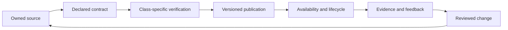
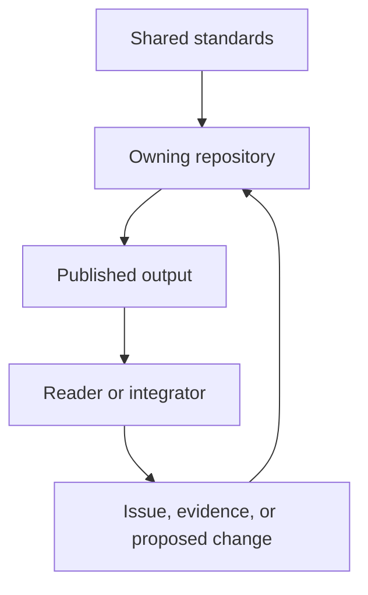
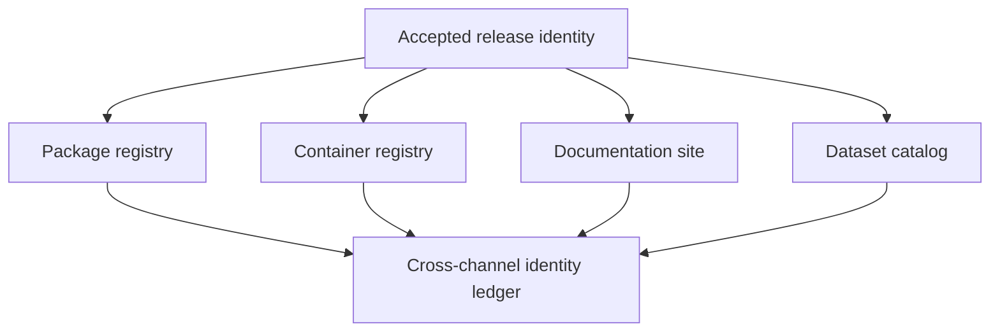
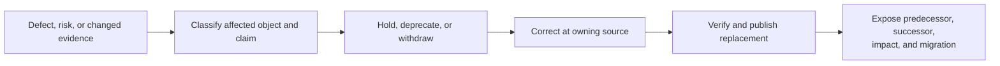
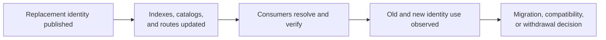
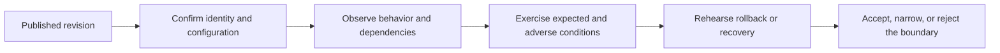

# Delivery Surfaces

A Bijux system is delivered when a reader or user can reach a maintained
contract and trace it back to an owner. Delivery therefore includes more than
binary publication: documentation, packages, APIs, datasets, reports, and
operational evidence each have a distinct custody path.

## Delivery Classes

| Class | Public object | Contract | Primary evidence |
| --- | --- | --- | --- |
| documentation | versioned site and stable route | navigation, rendered content, source ownership, and canonical URL | strict build and Pages artifact |
| software package | versioned archive or registry object | name, version, dependencies, compatibility, and checksums | release workflow and registry metadata |
| service interface | network endpoint | schema, request behavior, response behavior, authorization, and failure semantics | contract tests and operational evidence |
| dataset | immutable or versioned data object | identity, schema, provenance, publication state, and retrieval behavior | manifest, fingerprint, and validation report |
| scientific report | interpretation bound to evidence | cited inputs, methods, assumptions, limitations, and output identity | reproducible build and evidence bundle |
| learning program | published curriculum and runnable work | prerequisites, sequence, exercises, and completion evidence | capstones and inspectable outputs |

Calling all of these “artifacts” would hide the most important differences.
An API needs availability and failure semantics; a dataset needs identity and
provenance; a report needs defensible interpretation; documentation needs
stable routes and a source relationship.

## Custody Flow

Each transition has an owner:

- source owners decide meaning;
- verification owners decide whether the declared evidence is sufficient;
- publication automation transfers a specific revision into a destination;
- operators own availability, rollback, and recovery within the published
  surface's stated boundary;
- maintainers reconcile observed behavior with the next reviewed change.

## Name The Delivery State

“Published” is not a sufficient lifecycle vocabulary. Consumers need to know
whether an object is merely built, accepted by a destination, currently
offered, superseded, deprecated, corrected, or withdrawn.

| State | Meaning | Evidence expected |
| --- | --- | --- |
| candidate | owned source and contract selected for evaluation | source identity and intended destination |
| verified | class-specific checks passed for the candidate | named checks, results, omissions, and verifier identity |
| published | a destination accepted an exact object | registry, catalog, release, deployment, or manifest record |
| available | a bounded observation retrieved or exercised the object | destination, time, object identity, and response or execution evidence |
| deprecated | owner still offers the object with a replacement or end-of-support posture | deprecation contract, migration route, and dates or triggers |
| superseded | a newer authoritative object replaces it for current use | predecessor/successor relation and compatibility or correction note |
| withdrawn | owner no longer offers or endorses the object | withdrawal reason, affected scope, and retained audit identity |

Availability is an observation, not an eternal property. A package registry
record and an API health result both concern delivery, but only the API result
needs a topology and observation window. A scientific report can remain
downloadable after its claim becomes stale; the availability and evidence
states must remain separate.

## Authority Does Not Follow Distribution

Publishing an object does not transfer authority over its meaning.

The standards layer may constrain format and verification. The repository
still owns the contract. A consumer may report evidence or propose a change,
but cannot silently redefine the published meaning.

## Keep Distribution Channels Consistent

One release can appear through several channels: a registry package, GitHub
release, container image, documentation route, catalog entry, or service
endpoint. Matching version labels do not prove that those channels contain the
same object or expose the same support posture.

| Cross-channel question | Evidence |
| --- | --- |
| do the bytes belong to the same release? | immutable digests, provenance, and release manifest |
| are interfaces documented for those bytes? | documentation version or source relation and compatibility statement |
| are all required members present? | channel inventory and explicit unavailable or excluded members |
| did a correction reach every affected channel? | predecessor/successor relation plus per-channel publication or withdrawal state |
| can a consumer verify what it selected? | stable object identity, retrieval location, digest, and trust policy |

A release is partially distributed when one required channel succeeds and
another fails. The safe response depends on the contract: hold all promotion,
publish a clearly bounded subset, or withdraw the inconsistent member. It is
unsafe to let a mutable label make the channels appear converged before their
identities and support statements agree.

## Documentation Delivery

The root hub and project sites form a network of separately built
documentation surfaces:

- `bijux.io` provides family orientation;
- `/bijux-core/`, `/bijux-canon/`, and `/bijux-atlas/` provide repository-owned
  technical handbooks;
- scientific sites explain curation, analysis, evidence, and outputs;
- `/bijux-masterclass/` delivers programs and capstones.

They share a navigation shell, not a content database. When a reader crosses
from the hub into Atlas, authority crosses from hub orientation to the Atlas
repository. The visible route and source link should make that transition
clear.

## Service And Dataset Delivery

Bijux Atlas is the clearest service-delivery example. It separates:

- build-time validation from publication;
- catalog visibility from payload availability;
- authoritative stores from response and dataset caches;
- request contracts from operator-only control surfaces;
- load generation from rollout, rollback, and incident evidence.

This prevents “the API returned a response” from standing in for stronger
claims about data identity, authorization, recovery, or production readiness.
See [Bijux Atlas](../../04-projects/bijux-atlas/index.md) for the public route
into those contracts.

## Scientific Delivery

Scientific output has an additional custody requirement: interpretation must
remain bound to the evidence and method that produced it.

| Surface | Required context |
| --- | --- |
| curated database | source selection, normalization, exclusions, and lineage |
| analysis result | input identity, parameters, software environment, and method |
| map or atlas | coordinate model, aggregation choices, uncertainty, and source coverage |
| evidence book or report | claim, supporting evidence, competing explanations, and limitations |

The public object is incomplete if those relationships are unavailable, even
when the file itself downloads successfully.

## Operational Evidence

Operational evidence belongs to the surface being operated. Useful evidence
answers a bounded question:

- Was this exact site revision built and deployed?
- Did this API contract pass against the exercised topology?
- Was this dataset fingerprint published and retrievable?
- Did a rollback restore the previous known behavior under load?
- Can a report be reconstructed from its declared inputs?

Evidence should also state what was *not* exercised. A local fixture is not a
production topology; a schema is not a completed drill; a generated OpenAPI
document is not proof that every route is live.

## Correction, Revocation, And Consumer Impact

Delivery owners must be able to stop propagating an object without erasing the
identity needed to find affected consumers.

The action depends on the delivery class:

| Class | Safe lifecycle action |
| --- | --- |
| package | deprecate or withdraw according to registry capability; publish a corrected version without reusing immutable version identity |
| service | deny or constrain affected operations, roll back an identified release, then verify the effective route and data state |
| dataset | supersede or withdraw the catalog identity while preserving provenance and the correction relation |
| scientific report | mark the affected claim and evidence state, retain the prior record, and publish a bounded correction |
| documentation | correct the owning source, rebuild the complete bundle, deploy it, and verify the affected route |
| learning program | revise the contract and expected evidence while preserving what earlier completion records actually demonstrated |

Silent replacement is unsafe whenever consumers may already have acted on the
old identity. A correction record should state affected scope, old and new
identities, reason, compatibility or scientific consequence, and any action a
consumer must take.

## Prove Consumer Convergence After A Delivery Change

Publishing a replacement does not prove that consumers stopped using the
superseded object. Package resolvers, container tags, catalogs, API clients,
documentation links, intermediary caches, and local mirrors converge through
different mechanisms.

| Consumer surface | Convergence evidence |
| --- | --- |
| package registry | immutable version available, metadata correct, and supported resolver selects the intended version |
| container or release artifact | digest-pinned pull, provenance and checksum verification, and obsolete mutable pointer behavior |
| dataset catalog | promoted generation, cache invalidation, client provenance, and superseded identity status |
| API | compatibility window, version negotiation, retry behavior, and old-client refusal or migration evidence |
| documentation | canonical route, redirect or withdrawal behavior, search freshness, and direct-entry context |

A migration closes only for the named consumer population and observation
window. Absence of support requests is not evidence that every dependent user,
mirror, automation, or cached copy converged.

## From Publication To Operation

Publication transfers a revision into a destination. Operation begins when
that destination is observed and maintained against its declared boundary.

The qualification decision belongs to the output owner. The publication
pipeline can supply revision and artifact identity, but it cannot infer an API
capacity limit, a dataset correction policy, or a scientific acceptance rule.
Those require surface-specific evidence.

## Inspect A Delivery Claim

Follow the same sequence for any public output:

1. identify the owning repository;
2. find the declared contract and version or identity;
3. find the verification that covers that contract;
4. identify the publication destination and custody transition;
5. inspect lifecycle, rollback, or correction behavior;
6. read the limitations at the same evidence boundary.

Continue with [Publication Integrity](../publication-integrity/index.md) for
the root-site chain, [Operational Assurance](../operational-assurance/index.md)
for readiness and recovery evidence, [Documentation Network](../documentation-network/index.md)
for cross-site ownership, or [Projects](../../04-projects/index.md) to choose a
product surface.
