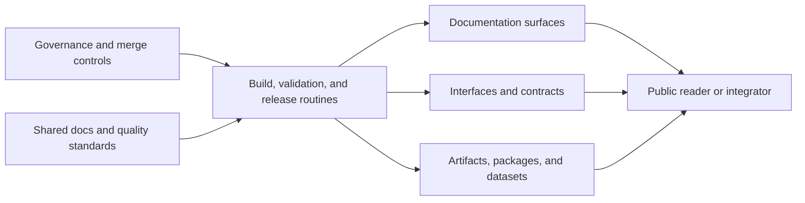

# Delivery Surfaces

A delivery surface is any public output through which the system is
used, checked, or reviewed.

In Bijux, delivery includes more than published software. It includes
the control plane, the documentation routes, the interfaces, and the
evidence that shows how they are maintained.

## What Counts As Delivery In Bijux

- public documentation that shows ownership, operating routes, and system boundaries
- published software and artifacts that can be traced back to build and release routines
- service and runtime interfaces that are reviewable outside local developer context
- release and operational evidence that shows how quality checks are run, not only claimed

## Delivery Map

## Delivery Classes

| Class | Ownership source | What it includes | What to inspect first |
| --- | --- | --- | --- |
| Governance | `bijux-iac` and repository-owned workflow policy | branch protection, required checks, merge discipline, and controlled release paths | whether repository policy is applied from code and whether merge gates are named clearly |
| Documentation | shared standards in `bijux-std`, consumed by repository docs | repository handbooks, docs navigation, and public explanatory routes | whether ownership, boundaries, and operating procedures are consistent across sites |
| Published software | repository-owned delivery responsibilities | packages, generated artifacts, and versioned release outputs | whether build and release paths are reproducible and reviewable |
| Service interfaces | repository-owned service and runtime boundaries | APIs, runtime interfaces, and user-facing data endpoints | whether interface contracts and behavior expectations are documented clearly |
| Release and ops evidence | repository checks aligned by shared quality standards | CI checks, validation routines, and promotion workflows | whether quality claims are backed by observable checks and traceable evidence |

## Why This Matters Beyond Ops

Delivery is where architecture stops being a claim and becomes a public
surface. Even if you are reviewing design rather than operations, this
page shows whether the stated structure can be used, checked, and
trusted outside the original implementation team.

## Where Delivery Shows Up

| Surface | What to inspect | Why it is useful |
| --- | --- | --- |
| Repository-owned delivery surfaces | [Bijux Atlas](../../04-projects/bijux-atlas/index.md) APIs, dataset routes, and release-facing docs | shows where product delivery contracts are owned directly by a delivery repository |
| Shared docs delivery continuity | `bijux.github.io` platform docs and [Masterclass](../../05-learning/index.md) docs routes backed by shared shell standards | shows how documentation delivery stays consistent across separate sites while local content remains independent |
| Contract discipline | repository docs, generated artifacts, schema surfaces, and handbook ownership | serious systems make their interfaces and operating rules visible |
| Release posture | release workflows, published docs, versioned repositories, and visible distribution surfaces | public work should show how it is built, checked, and published |
| Operational thinking | runtime handbooks, validation commands, docs checks, and repository automation | delivery quality is easier to trust when routine checks are part of the workflow |
| Information design | shared docs chrome, stable navigation, scoped handbooks, and repository-specific documentation systems | documentation quality is part of delivery quality, not a separate editorial concern |

## Public Destinations

These are the main places where delivery becomes visible to a reader.

| If you want to open... | Start here | What it gives you |
| --- | --- | --- |
| the hub and route layer | [bijux.github.io](https://github.com/bijux/bijux.github.io) | the public entry point into the family |
| governance and merge controls | [bijux-iac](https://github.com/bijux/bijux-iac) | the control plane behind repository delivery rules |
| shared shell and checks | [bijux-std](https://github.com/bijux/bijux-std) | the shared standards behind docs and baseline repo behavior |
| delivery-heavy repository docs | [Bijux Atlas docs](https://bijux.io/bijux-atlas/) | APIs, datasets, reports, and operated delivery routes |
| project context before repo docs or source | [Projects](../../04-projects/index.md) | repository roles and route hints |
| implementation detail behind a public surface | the matching GitHub repository | source, history, contracts, and automation |

## Main Routes

  
<h3>Governance</h3>
Inspect `bijux-iac` and repository workflow policy when you want proof that merge controls and quality gates are part of delivery.

  
<h3>Core</h3>
Inspect CLI, DAG, evidence, and release handbooks for runtime and governance delivery boundaries.

  
<h3>Canon</h3>
Inspect ingest, indexing, reasoning, and orchestration package boundaries in docs and source layout.

  
<h3>Atlas</h3>
Inspect APIs, datasets, docs checks, and operational routes as maintained product delivery surfaces.

## Where To Inspect

### Fast Checks

- open one repository handbook and verify ownership boundaries
- open one public destination and one matching source repository, then confirm they describe the same owned surface

### Medium Checks

- inspect package and release workflow docs for clear publication boundaries
- inspect contract or schema references for compatibility promises

### Deep Checks

- follow one release or validation path end to end and confirm reproducible checks
- compare docs claims against automation entry points

## Fast Routes

| If you want to start with... | Open |
| --- | --- |
| governance and merge discipline | [Bijux Infrastructure-as-Code](../../02-bijux-iac/index.md) |
| public delivery and service posture | [Bijux Atlas](../../04-projects/bijux-atlas/index.md) |
| runtime governance and repository discipline | [Bijux Core](../../04-projects/bijux-core/index.md) |
| governed knowledge-system delivery | [Bijux Canon](../../04-projects/bijux-canon/index.md) |
| stable published destinations | [Delivery surfaces](index.md) |

## Open This Page When

- you want direct routes into the strongest delivery-oriented material
- you care more about concrete surfaces than summary alone
- you want to understand why the public docs are treated as part of delivery rather than an afterthought
