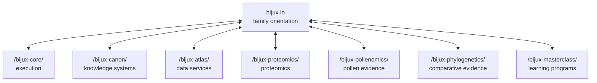
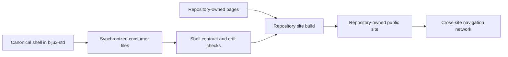

# Documentation Network

Bijux documentation is a network of independently owned sites connected by a
shared navigation contract. The network keeps orientation stable while letting
each repository describe its own runtime, operations, scientific evidence, or
curriculum at the depth the subject requires.

## Network Topology

The hub is an orientation node, not a proxy for destination content. A project
site remains useful and authoritative even when reached directly.

## Three Ownership Layers

| Layer | Owner | Responsibility |
| --- | --- | --- |
| shell contract | `bijux-std` | shared header, footer, navigation behavior, styling primitives, scripts, icons, and validation rules |
| network map | `bijux.github.io` | root navigation, family descriptions, route selection, and cross-repository framing |
| technical content | destination repository | implementation contracts, examples, operational procedures, evidence, and limitations |

This division prevents consistent styling from being mistaken for centralized
technical authority.

## Source And Render Flow

The synchronized files are checked-in mirrors. Build-time synchronization
copies from that local shared source into generated documentation paths;
contract checks compare the result back to its canonical input. This makes the
shell reproducible without loading presentation code from another site at
runtime.

## What Remains Stable Across Sites

- a family-level destination selector;
- theme persistence and responsive navigation behavior;
- familiar header, footer, and content framing;
- source and repository links;
- local Mermaid rendering and shared visual tokens;
- checks that detect drift in synchronized shell files.

Stability does not require every site to have the same information
architecture. Atlas needs operations, load, and API sections; a scientific
evidence book needs methods, claims, and limitations; a learning program needs
prerequisites, sequence, exercises, and capstones.

## Context At A Site Boundary

A useful cross-site transition answers four questions:

1. **Where am I going?** The destination is named by product or program.
2. **Who owns the next claim?** The destination repository becomes the content
   authority.
3. **Why is this link relevant?** The hub explains the destination's role
   before sending the reader away.
4. **How do I return?** Shared family navigation preserves a route back to the
   hub and adjacent systems.

## Navigation Is Not Evidence

The shared shell provides continuity, but it cannot prove:

- that destination content is current;
- that a runtime or scientific claim is correct;
- that every public route is continuously available;
- that two repositories use the same compatibility policy;
- that a destination has completed operational qualification.

Those claims must be supported by repository-owned source, checks, evidence,
and limitations. The network makes them discoverable; it does not manufacture
their proof.

## Failure Isolation

Separate builds provide useful isolation:

- a failed hub deployment affects family orientation but does not rebuild or
  mutate a project site;
- a project documentation failure does not change the shared shell source;
- a shared-shell defect can be corrected canonically and then synchronized to
  consumers through reviewed changes;
- repository content can evolve without waiting for an unrelated site's
  release.

The trade-off is that cross-site links and shared-shell adoption require
continued verification. A common visual system cannot prevent an obsolete
destination or an inaccurate hub summary by itself.

## Follow The Network

Start at [Projects](../../04-projects/index.md) when you know the product
question, [System Map](../system-map/index.md) when you need dependency context,
or [Publication Integrity](../publication-integrity/index.md) when you need the
root-site delivery chain.
