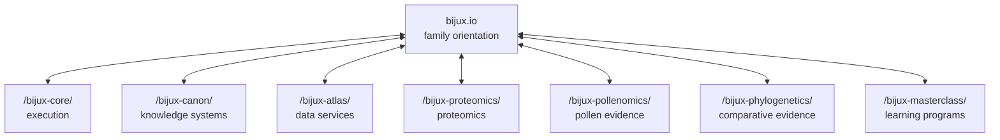
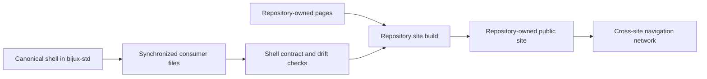
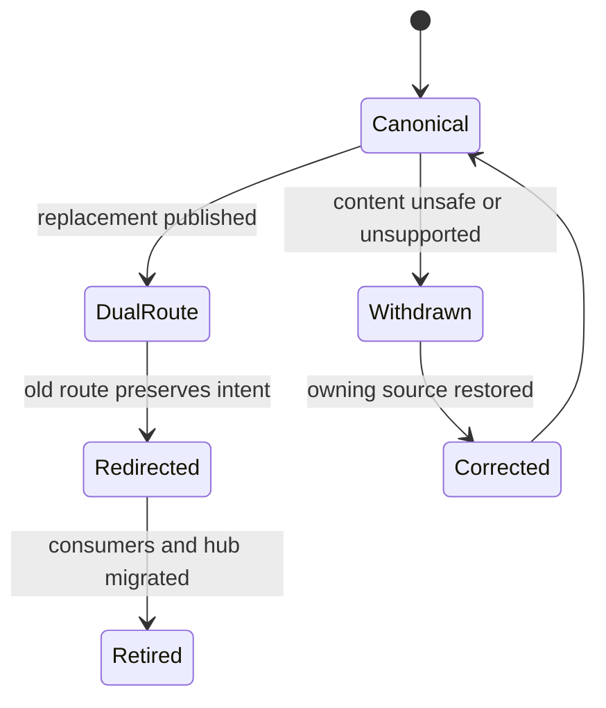

# Documentation Network

Bijux documentation is a network of independently owned sites connected by a
shared navigation contract. The network keeps orientation stable while letting
each repository describe its own runtime, operations, scientific evidence, or
curriculum at the depth the subject requires.

## Network Topology

The hub is an orientation node, not a proxy for destination content. A project
site remains useful and authoritative even when reached directly.

## Three Ownership Layers

| Layer | Owner | Responsibility |
| --- | --- | --- |
| shell contract | `bijux-std` | shared header, footer, navigation behavior, styling primitives, scripts, icons, and validation rules |
| network map | `bijux.github.io` | root navigation, family descriptions, route selection, and cross-repository framing |
| technical content | destination repository | implementation contracts, examples, operational procedures, evidence, and limitations |

This division prevents consistent styling from being mistaken for centralized
technical authority.

## Source And Render Flow

The synchronized files are checked-in mirrors. Build-time synchronization
copies from that local shared source into generated documentation paths;
contract checks compare the result back to its canonical input. This makes the
shell reproducible without loading presentation code from another site at
runtime.

## What Remains Stable Across Sites

- a family-level destination selector;
- theme persistence and responsive navigation behavior;
- familiar header, footer, and content framing;
- source and repository links;
- local Mermaid rendering and shared visual tokens;
- checks that detect drift in synchronized shell files.

Stability does not require every site to have the same information
architecture. Atlas needs operations, load, and API sections; a scientific
evidence book needs methods, claims, and limitations; a learning program needs
prerequisites, sequence, exercises, and capstones.

## Accessibility Is A Network Contract

A reader should not lose access when crossing from the hub into a product
site. Familiar styling is insufficient if navigation, diagrams, status, or
evidence can be understood only through pointer precision, color, motion, or a
particular viewport.

| Reader need | Cross-site expectation | Failure to avoid |
| --- | --- | --- |
| keyboard navigation | focus order follows the visible structure and controls expose a visible focus state | a menu opens visually but cannot be reached, dismissed, or escaped without a pointer |
| assistive technology | headings, landmarks, controls, tables, and link labels carry semantic meaning | generic labels or decorative markup replace the destination and relationship |
| diagram interpretation | nearby prose or a table states the authority, sequence, or conclusion encoded by the diagram | Mermaid is the only place where the relationship is explained |
| status interpretation | text names the state, scope, and consequence | color or icon alone distinguishes accepted, degraded, blocked, or withdrawn |
| zoom and reflow | reading and navigation remain usable without horizontal page-scale dependence | critical controls or evidence disappear at narrow widths or high zoom |
| reduced motion and theme | motion is non-essential and contrast remains usable across supported themes | animation, persistence, or theme choice obscures content or state |

The shared shell owns reusable interaction behavior. Each destination still
owns semantic headings, link purpose, alternative explanation, table quality,
and readable failure language. A shell check cannot make an unlabeled product
diagram accessible after the fact.

## Context At A Site Boundary

A useful cross-site transition answers four questions:

1. **Where am I going?** The destination is named by product or program.
2. **Who owns the next claim?** The destination repository becomes the content
   authority.
3. **Why is this link relevant?** The hub explains the destination's role
   before sending the reader away.
4. **How do I return?** Shared family navigation preserves a route back to the
   hub and adjacent systems.

## Treat Every Cross-Site Link As A Contract

A link carries more than a URL. It promises a destination identity, a reason
for the transition, an authority boundary, and enough context for the reader to
continue without guessing.

| Link field | Reader contract | Failure if omitted |
| --- | --- | --- |
| destination | stable canonical route for the owning surface | redirects or guessed paths become the hidden interface |
| label | product, decision, or evidence surface being opened | generic “learn more” text loses intent outside its paragraph |
| relationship | why the destination is relevant to the current question | navigation looks like endorsement without a bounded claim |
| authority | which repository owns the next technical statement | hub orientation and product truth become indistinguishable |
| expected identity | package, dataset, claim, workflow, or handbook object to retain | the reader reaches a page but cannot join it to the disputed output |
| return path | family or adjacent-system route | direct visitors become trapped in an isolated site tree |

The shared shell supplies the family and return paths. Page authors still own
the semantic label and relationship. A visually consistent link with vague
text is not a complete transition.

## Change A Public Route Without Losing Readers

Before retiring a route, identify inbound hub links, shared navigation,
repository README links, package metadata, release notes, and durable evidence
records that cite it. Prefer a stable redirect when the destination meaning is
unchanged. Use an explicit withdrawal or correction notice when the meaning is
no longer supportable; a redirect to a superficially similar page would hide
the evidence break.

A route migration closes only when the new destination builds, the old route
has the intended behavior, the hub and owner agree on the summary, and direct
navigation still exposes source and return context.

## Separate Canonical Identity From Route Aliases

A page can be reachable through a custom domain, repository Pages path,
redirect, language or format projection, and search result. Those routes may
converge on one document, but they are not independent authorities.

| Route role | Required behavior |
| --- | --- |
| canonical route | names the owning public identity used for citation and correction |
| compatibility alias | preserves old inbound intent and resolves to the canonical meaning |
| mirror or projection | discloses its source identity and does not appear fresher than the owner |
| withdrawn route | explains the unsafe or unsupported state instead of redirecting invisibly |
| search result | remains discovery evidence only; title or excerpt does not supersede the destination |

Canonical metadata, navigation, sitemaps, and redirects should agree on the
same owner. When two reachable pages contain materially different claims,
resolve the authority conflict explicitly; choosing whichever ranks higher or
loads faster would make delivery behavior decide product truth.

## Freshness And Authority

Cross-site documentation has two independent freshness questions:

| Question | Owner | Evidence |
| --- | --- | --- |
| does the destination still exist at the published route? | publishing repository | successful strict build, deployment identity, and route observation |
| does the hub summary still match the destination contract? | `bijux.github.io` | review against the owning handbook, contract, capability limits, and review date |

A working link can lead to an obsolete summary. A current summary can point to
a temporarily unavailable site. Treating availability and semantic freshness
as separate checks makes both failures diagnosable.

Project capability statements should preserve the destination vocabulary.
Terms such as `internal_support_only`, stable, simulated, bounded, or
not implemented must not be translated into stronger marketing language at
the hub boundary.

## Navigation Is Not Evidence

The shared shell provides continuity, but it cannot prove:

- that destination content is current;
- that a runtime or scientific claim is correct;
- that every public route is continuously available;
- that two repositories use the same compatibility policy;
- that a destination has completed operational qualification.

Those claims must be supported by repository-owned source, checks, evidence,
and limitations. The network makes them discoverable; it does not manufacture
their proof.

## Failure Isolation

Separate builds provide useful isolation:

- a failed hub deployment affects family orientation but does not rebuild or
  mutate a project site;
- a project documentation failure does not change the shared shell source;
- a shared-shell defect can be corrected canonically and then synchronized to
  consumers through reviewed changes;
- repository content can evolve without waiting for an unrelated site's
  release.

The trade-off is that cross-site links and shared-shell adoption require
continued verification. A common visual system cannot prevent an obsolete
destination or an inaccurate hub summary by itself.

## Preserve Direct-Entry Context

Most readers will not enter through the hub. A repository-owned page should
therefore remain intelligible from a search result, source link, or saved URL.
Its opening surface should identify the product, decision or object under
review, current boundary, and route to deeper owner evidence. Requiring a
reader to reconstruct context from the family homepage turns navigation order
into an undocumented dependency.

The hub should likewise avoid summaries that make sense only after reading
internal platform pages. Public orientation succeeds when a reader can arrive
at any node, understand its authority, and traverse the evidence chain in both
directions.

## Network Failure Modes

| Failure | Correct response |
| --- | --- |
| root hub is unavailable | use the destination site directly; product authority remains intact |
| destination route moved | correct the owner first, then update hub navigation and contextual links |
| hub summary exceeds destination evidence | narrow the hub claim immediately and point to the owning limitation |
| shared shell drifts in one consumer | restore the accepted canonical snapshot and validate the generated mirror |
| shared shell itself is defective | correct `bijux-std`, accept the source change, then refresh consumers |
| external link is intermittently unavailable | retain source ownership and distinguish transient availability from semantic invalidity |

The network should fail in visible, bounded ways. It should never preserve a
smooth navigation experience by copying stale technical content into the hub.

## Follow The Network

Start at [Projects](../../04-projects/index.md) when you know the product
question, [System Map](../system-map/index.md) when you need dependency context,
or [Publication Integrity](../publication-integrity/index.md) when you need the
root-site delivery chain.
