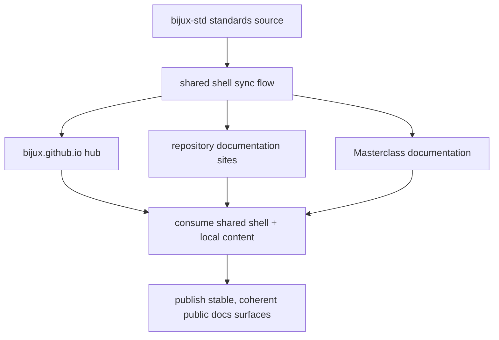

# Documentation Network

The documentation network lets people move across Bijux repositories
without losing context. It is part of the architecture, but the shared
shell it relies on is owned upstream in `bijux-std`.

`bijux-std` is the source for the shared documentation shell and the
shared standards used across the family.

<strong>Documentation is a shared communication layer.</strong>
The shared shell keeps movement and presentation steady across
repositories while each repository keeps local control of its own
content.

## Source Flow

## Documentation Architecture Roles

| Role | Primary owner | What it does |
| --- | --- | --- |
| standards source | `bijux-std` | defines shared shell behavior, navigation contract, and checks used by docs consumers |
| hub | `bijux.github.io` | provides cross-repository orientation and entry routes into repository and learning docs |
| repository docs | each destination repository or site | owns local technical content, domain vocabulary, and implementation detail |

## What The Shared Shell Actually Covers

The shared shell is the common movement layer across Bijux docs sites.

It keeps these parts aligned:

- top navigation behavior
- shared styles and responsive layout
- shared shell JavaScript for navigation state
- shared docs checks that catch drift before publish

The shell does **not** own repository meaning. Each repository still
owns its own pages, examples, diagrams, and technical depth.

## What Stays Shared Vs What Stays Local

- shared: top-level navigation patterns, shell structure, and orientation routes that let readers move across repositories consistently.
- local: repository-specific docs content, domain vocabulary, and implementation detail owned by the destination handbook.
- shared and local together: shared chrome provides stable movement; local ownership provides technical depth without flattening repository boundaries.

## How The Shell Stays Aligned

The shell uses a simple source-and-sync model:

1. shared shell files are owned upstream in `bijux-std`
2. consuming docs sites synchronize the shared layer locally
3. shared checks verify that the local mirrors still match the source
4. docs build checks confirm the reader surface still works

For readers, the result is simple: moving from one Bijux docs site to
another should feel familiar even though the content is owned locally.

## What It Gives The Reader

- it reduces documentation drift across related repositories
- it keeps navigation coherent without flattening local content
- it makes new sections feel familiar more quickly
- it helps the family evolve without turning every site into a separate design problem

## Example Reading Route

1. start at [Home](../../index.md) for orientation.
2. open [Projects](../../04-projects/index.md) and choose a repository page such as [Bijux Atlas](../../04-projects/bijux-atlas/index.md).
3. move into the destination docs site; shared shell behavior stays familiar while content becomes local.
4. return through [Platform](../index.md) when you need system-level context.

## Stability Rule

If the hub describes a repository, the destination should preserve the
same shared shell behavior and stable public URL structure.
