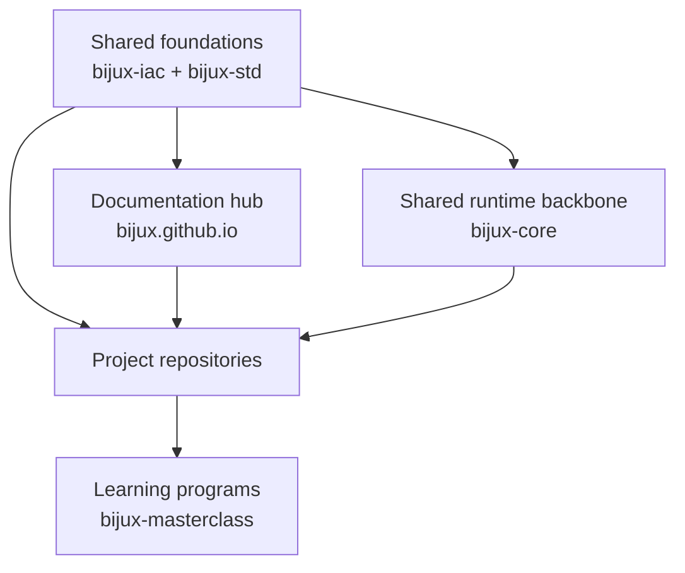

# Platform

Platform explains how the Bijux repository family is held together.

This section shows where governance is owned, where shared standards
are owned, where the documentation hub fits, and how the shared runtime
backbone, delivery repositories, domain repositories, and learning
repositories sit on top of those layers.

It is the orientation branch for the family, not the full documentation
home for `bijux-iac` or `bijux-std`. Those now have their own top-level
branches because they carry more public weight than a subpage can hold.

<strong>Focus on responsibility before repository count.</strong>
The key question is not how many repositories exist, but why responsibilities are split the way they are.
Runtime governance, shared standards, shared runtime, delivery, domain
products, and learning programs each have their own home, but they
still read as one system.

## Platform Map

## What This Branch Covers

- the route between repositories
- the shared layers that sit underneath the family
- the quickest explanation of why the split exists
- the best next page for the question you want to answer

## Where To Inspect Evidence

- GitHub governance ownership: [Bijux Infrastructure-as-Code](../02-bijux-iac/index.md)
- shared shell and cross-repository standards: [Bijux standard layer](../03-bijux-std/index.md)
- repository ownership and split intent: [System map](system-map/index.md)
- delivery and publication posture: [Delivery surfaces](delivery-surfaces/index.md)
- recurring standards that remain stable across repositories: [Work qualities](work-qualities/index.md)

## System Shape

  
<h3>Control Plane</h3>
`bijux-iac` keeps GitHub governance visible as code instead of leaving it buried in repository settings.

  
<h3>Hub</h3>
`bijux.github.io` is the public route layer: it helps readers move through the repository family, but it is not the source of shared shell behavior.

  
<h3>Core</h3>
`bijux-core` is the shared runtime backbone for command surfaces, DAG behavior, evidence, and repository discipline used across the project family.

  
<h3>Canon</h3>
The governed knowledge-system stack for ingest, indexing, reasoning, orchestration, and controlled runtime behavior.

  
<h3>Atlas</h3>
The delivery and control-plane surface for APIs, datasets, docs-aware checks, and operational reporting.

  
<h3>Bijux Standard Layer</h3>
`bijux-std` is the shared standards source for documentation shell continuity, cross-repository checks, and promoted shared make behavior.

  
<h3>Products And Programs</h3>
Canon, Atlas, Proteomics, Pollenomics, Telecom, Genomics, and Masterclass consume these shared layers while owning their own knowledge, delivery, domain, or learning work.

## Branch Reading Order

| Read this first when you need to understand... | Open |
| --- | --- |
| the layered structure of the whole public system family | [System map](system-map/index.md) |
| where live GitHub governance is owned and enforced | [Bijux Infrastructure-as-Code](../02-bijux-iac/index.md) |
| where shared standards are defined and verified across repositories | [Bijux standard layer](../03-bijux-std/index.md) |
| where delivery work shows up most clearly across the repositories | [Delivery surfaces](delivery-surfaces/index.md) |
| how the engineering extends into domain-heavy product work | [Applied domains](applied-domains/index.md) |
| which qualities recur across the public work | [Work qualities](work-qualities/index.md) |
| why the docs shell is shared instead of duplicated carelessly | [Documentation network](documentation-network/index.md) |
