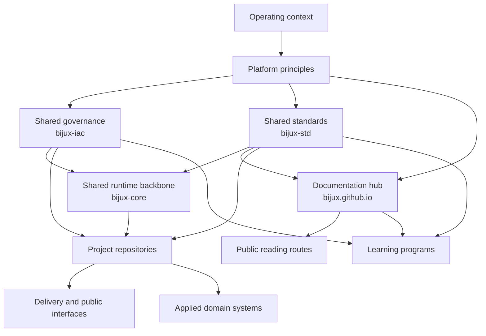

# Platform

Platform explains how the Bijux repository family is held together.

This section shows where governance is owned, where shared standards
are owned, where the documentation hub fits, and how the shared runtime
backbone, delivery repositories, domain repositories, and learning
repositories sit on top of those layers.

<strong>Focus on responsibility before repository count.</strong>
The key question is not how many repositories exist, but why responsibilities are split the way they are.
Runtime governance, shared standards, shared runtime, delivery, domain
products, and learning programs each have their own home, but they
still read as one system.

## Platform Map

## Canonical Platform Axes

- context: the operating reasons and constraints behind the repository family
- control plane: how GitHub governance is applied as code
- shared standards: how shell behavior and quality checks stay aligned
- documentation hub: how readers move through the system without losing ownership
- shared runtime: how common execution behavior stays aligned across projects
- delivery: how architecture becomes visible through release and public interfaces

## What Belongs Here

- the route between repositories
- the principles that make the split coherent
- the stable route that readers can navigate today

## What Does Not Belong Here

- package-level implementation details
- repository-specific maintainer rules
- course-level teaching detail that already lives in masterclass

## Why This Branch Exists

- show the control-plane, standards, hub, and shared runtime layers before readers dive into implementation repositories
- explain why runtime authority, knowledge architecture, delivery responsibilities, and domain work are split into separate repositories
- keep repository boundaries stable while allowing domain-specific evolution
- make documentation useful for inspection and review, not only orientation
- show where evidence for structure and delivery decisions can be checked directly

## Where To Inspect Evidence

- GitHub governance ownership: [Bijux Infrastructure-as-Code](bijux-iac/index.md)
- shared shell and cross-repository standards: [Bijux standard layer](bijux-std/index.md)
- repository ownership and split intent: [Repository matrix](repository-matrix/index.md)
- layer boundaries and responsibility flow: [System map](system-map/index.md)
- delivery and publication posture: [Delivery surfaces](delivery-surfaces/index.md)
- recurring standards that remain stable across repositories: [Work qualities](work-qualities/index.md)

## Principles

| Principle | What it changes in public |
| --- | --- |
| boundaries before breadth | clear ownership is easier to inspect than a vague super-repository |
| delivery as part of design | documentation, release posture, and public routes should reinforce the architecture rather than decorate it |
| domain pressure belongs in the system | the engineering posture should survive scientific and evidence-heavy contexts, not stop at generic tooling |
| explainability matters | systems that can be taught, sequenced, and documented clearly are usually better understood and easier to operate |

## System Shape

  
<h3>Control Plane</h3>
`bijux-iac` keeps GitHub governance visible as code instead of leaving it buried in repository settings.

  
<h3>Hub</h3>
`bijux.github.io` is the public route layer: it helps readers move through the repository family, but it is not the source of shared shell behavior.

  
<h3>Core</h3>
`bijux-core` is the shared runtime backbone for command surfaces, DAG behavior, evidence, and repository discipline used across the project family.

  
<h3>Canon</h3>
The governed knowledge-system stack for ingest, indexing, reasoning, orchestration, and controlled runtime behavior.

  
<h3>Atlas</h3>
The delivery and control-plane surface for APIs, datasets, docs-aware checks, and operational reporting.

  
<h3>Bijux Standard Layer</h3>
`bijux-std` is the shared standards source for documentation shell continuity, cross-repository checks, and promoted shared make behavior.

  
<h3>Products And Programs</h3>
Canon, Atlas, Proteomics, Pollenomics, Telecom, Genomics, and Masterclass consume these shared layers while owning their own knowledge, delivery, domain, or learning work.

## System Reading Order

| Read this first when you need to understand... | Open |
| --- | --- |
| where live GitHub governance is owned and enforced | [Bijux Infrastructure-as-Code](bijux-iac/index.md) |
| where shared standards are defined and verified across repositories | [Bijux standard layer](bijux-std/index.md) |
| which qualities recur across the public work | [Work qualities](work-qualities/index.md) |
| the layered structure of the whole public system family | [System map](system-map/index.md) |
| the repository split at a glance | [Repository matrix](repository-matrix/index.md) |
| where delivery work shows up most clearly across the repositories | [Delivery surfaces](delivery-surfaces/index.md) |
| how the engineering extends into domain-heavy product work | [Applied domains](applied-domains/index.md) |
| the broader operating context behind the current repository family | [Operating context](operating-context/index.md) |
| why the docs shell is shared instead of duplicated carelessly | [Documentation network](documentation-network/index.md) |
| which public destinations exist today | [Public surface](public-surface/index.md) |
