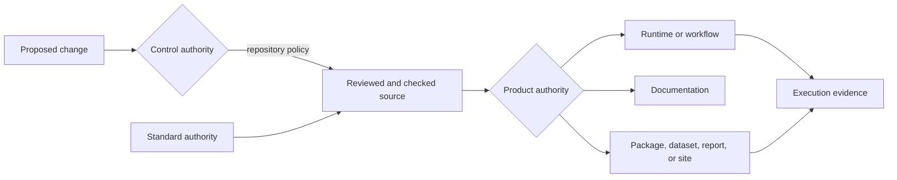
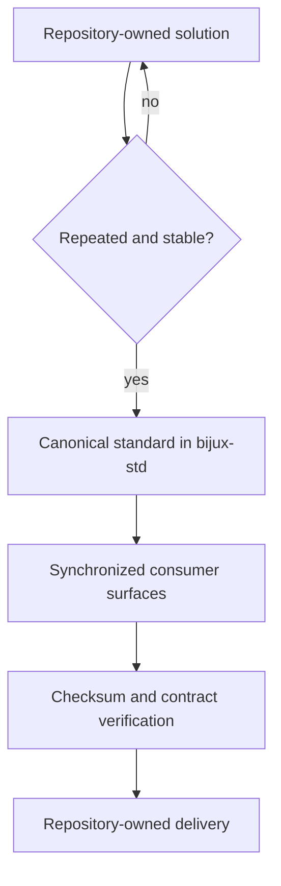

# Platform

The Bijux platform is the set of authorities and contracts that lets separate
repositories behave as a coherent public system without collapsing their
ownership boundaries.

It is not one runtime and not one deployment. It combines:

- a GitHub control plane for repository governance;
- a standards source for shared files and validation contracts;
- an execution backbone for commands and workflows;
- a knowledge-system stack for structured ingest, retrieval, and reasoning;
- delivery systems for APIs, datasets, reports, and documentation;
- scientific products and learning programs that own their domain meaning.

## Operating Model

The model makes three questions answerable:

1. **Who may change this surface?** Control authority is visible in repository
   governance and review policy.
2. **Which parts must match the family contract?** Standard authority is
   visible in source manifests, synchronized files, and drift checks.
3. **Who defines the meaning of the output?** Product authority remains with
   the repository that implements and documents the behavior.

## Responsibility Boundaries

| Responsibility | Authority | Evidence boundary |
| --- | --- | --- |
| GitHub rules, required checks, and merge constraints | `bijux-iac` | declared control-plane state and applied repository policy |
| shared documentation shell and repository standards | `bijux-std` | canonical exports, consumer checksums, and contract validation |
| family orientation and root-site publication | `bijux.github.io` | hub content, strict build, Pages artifact, and public routes |
| CLI and DAG execution semantics | `bijux-core` | contracts, execution records, and release evidence |
| knowledge ingestion, retrieval, and reasoning | `bijux-canon` | package contracts and controlled runtime boundaries |
| datasets, queries, APIs, and service operations | `bijux-atlas` | immutable identities, schemas, endpoint behavior, and operational evidence |
| scientific claims and interpretations | domain repositories | curated inputs, methods, provenance, limitations, and generated outputs |
| curricula and capstones | `bijux-masterclass` | runnable materials and inspectable learner outputs |

## How Change Travels

A cross-repository idea does not become a shared standard merely because it is
useful once.

This preserves local experimentation while giving mature behavior a canonical
source. It also keeps the direction of authority clear: consumers verify
shared material; they do not redefine it locally.

## Trust Boundaries

The platform does not treat every green check as equivalent.

- A source checksum proves byte-level alignment, not product correctness.
- A strict documentation build proves the configured site renders without
  build errors, not that every external destination is available forever.
- A passing runtime check proves the exercised contract, not every production
  topology.
- A published artifact proves delivery occurred, not that scientific
  interpretation is universally valid.

The evidence must be read at the boundary it actually covers. This is why
public pages link into repository-owned contracts and limitations rather than
asking the hub to summarize every implementation detail.

## Explore The Platform

| Question | Continue with |
| --- | --- |
| Which repositories depend on which others? | [System Map](system-map/index.md) |
| What counts as a delivered output? | [Delivery Surfaces](delivery-surfaces/index.md) |
| How does the public site move from source to `bijux.io`? | [Publication Integrity](publication-integrity/index.md) |
| How can separate documentation sites remain coherent? | [Documentation Network](documentation-network/index.md) |
| Which qualities recur across different systems? | [Engineering Qualities](work-qualities/index.md) |
| How does the model hold under scientific pressure? | [Applied Domains](applied-domains/index.md) |
| How are repository controls applied? | [Bijux Infrastructure-as-Code](../02-bijux-iac/index.md) |
| How is shared behavior promoted? | [Bijux Standards](../03-bijux-std/index.md) |
