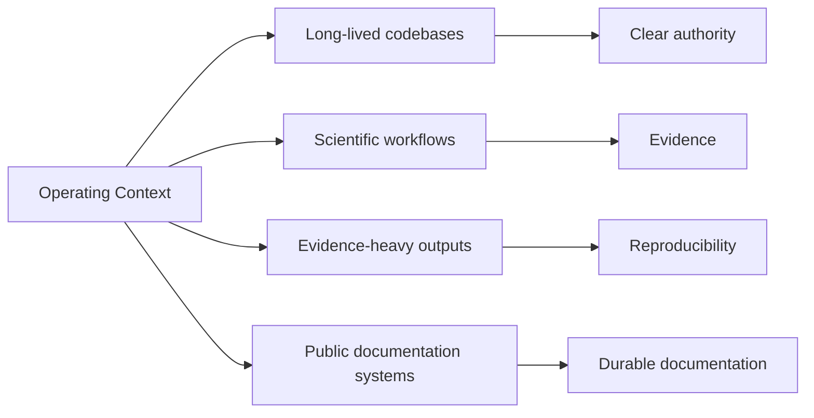

# Operating Context

This page explains why the repository family is split this way by
starting from concrete operating pressures:
reproducibility, evidence traceability, long-lived maintenance, and
public delivery.

This repository family brings together three related kinds of public
work: platform engineering, applied project work, and technical
education.

The split is intentional. Each part of the repository family answers a
different question for the reader:

- **Platform** shows system structure, runtime concerns, and operational design.
- **Projects** show how that structure is applied in domain-specific settings.
- **Learning** explains methods, trade-offs, and workflow decisions that appear across both.

This split is also the top-level public information architecture for
Bijux. It is the main navigation model readers should use before
opening any individual repository surface, and its cross-repository
continuity is supported by shared standards owned in `bijux-std`.

The work published here is shaped by environments where software has to
stay inspectable under change. That includes service and data systems,
evidence-heavy workflows, and scientific or technical contexts where
reproducibility, clear boundaries, and explicit contracts matter.

Four concrete context types shape this design:

- long-lived codebases
- scientific workflows
- evidence-heavy outputs
- public documentation systems

This is why the repositories tend to look the way they do.
Responsibilities are separated at the repository level. Documentation is
part of delivery, not a side artifact. Domain-specific work is
presented with enough engineering structure to make the system legible
to someone outside the project. Shared standards continuity from
`bijux-std` keeps shell behavior and baseline checks aligned across the
family.

## Context Map

## Contexts Where This Style Matters

| Context | Pressure | Why structure matters here |
| --- | --- | --- |
| long-lived codebases | continuous change across years of maintenance | explicit boundaries reduce accidental coupling and make ownership transitions safer |
| scientific workflows | reproducibility and method transparency under revision | traceable workflows and clear contracts keep results reviewable over time |
| evidence-heavy outputs | high burden of proof for claims and interpretations | artifact lineage and bounded publication routes reduce ambiguity during review |
| public documentation systems | readers must navigate across repositories without losing context | shared navigation with local ownership keeps orientation stable while preserving depth |

## Pressure To Repository Shape

| Pressure | Consequence | Repository shape |
| --- | --- | --- |
| long-lived maintenance across multiple repositories | ownership and change authority must remain explicit over time | responsibilities split across Platform, Projects, and Learning instead of one mixed repository |
| evidence traceability requirements in scientific and data work | claims must be reproducible from source to published surface | runtime/evidence discipline in `bijux-core` and domain-specific evidence handling in project repositories |
| cross-site public delivery continuity | readers need stable navigation and verification behavior across docs sites | shared standards and shell contracts in `bijux-std`, consumed by hub and repository docs |

## What Readers Should Expect

- clear repository boundaries with explicit ownership
- documentation treated as delivery, not a side artifact
- domain and learning work that keeps engineering structure visible

## How To Read The Repository Family

- many readers begin in **Platform** for architectural and operational
  foundations
- **Projects** then show how those ideas are applied in specific domains
- **Learning** helps connect recurring patterns, trade-offs, and
  workflows behind both

## What This Page Should Make Clear

- repository boundaries are intentional and operationally useful
- documentation structure supports maintenance and cross-repository continuity
- domain pressure does not collapse the architecture model into ad hoc changes

Operating context matters because software quality is defined by change
pressure, evidence burden, and long-lived responsibility. The repository
family is shaped around that reality.

After this page, a reader should know why the repository family is
split this way before opening any individual repository.
