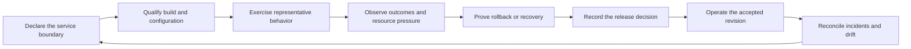
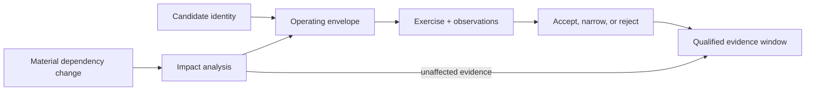
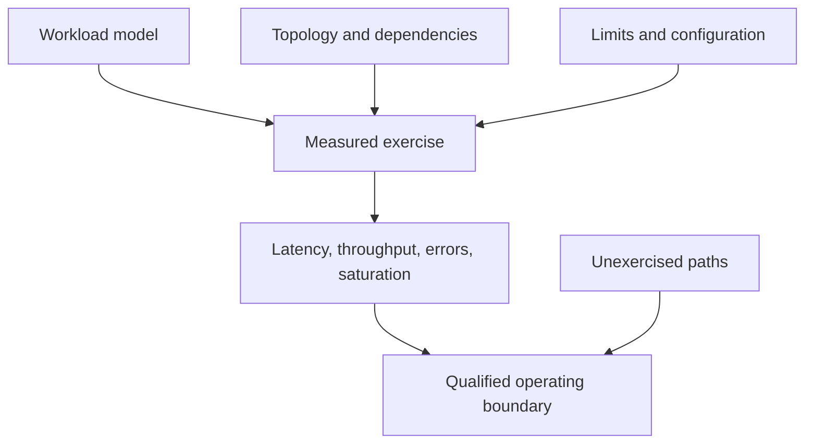

# Operational Assurance

Operational assurance is the evidence that a system can be introduced,
observed, recovered, and changed within its declared service boundary. It is
broader than a successful build and narrower than a claim that every possible
deployment is production-ready.

Bijux repositories keep this evidence close to the surface it qualifies. A DAG
run has different operational proof from an API rollout, a dataset publication,
or a static documentation deployment.

## Assurance Cycle

No node can stand in for the whole cycle. A contract without an exercised path
is an intention. A load result without topology and configuration is not
portable evidence. A rollback procedure that has never been rehearsed is not a
demonstrated recovery capability.

## Evidence By Surface

| Surface | Evidence that matters | Boundary to retain |
| --- | --- | --- |
| command runtime | deterministic envelopes, exit semantics, diagnostics, and retained history | commands can still depend on caller permissions and ambient resources |
| DAG execution | graph and plan identity, node traces, artifact digests, lineage, replay, and comparison | equal structure does not prove equal environment, side effects, or outputs |
| knowledge workflow | accepted inputs, index identity, retrieval evaluation, decision traces, and refusal behavior | successful loading or orchestration does not prove knowledge quality |
| API service | schema conformance, authorization behavior, dependency health, load profile, telemetry, and recovery exercise | one exercised topology does not qualify every deployment shape |
| dataset publication | immutable identity, schema, provenance, payload availability, and correction policy | catalog visibility does not prove payload availability or scientific validity |
| documentation site | strict build, concrete Pages bundle, deployment identity, and stable route | publication does not prove destination correctness or continuous availability |
| scientific workflow | curated input identity, parameters, software environment, generated evidence, and limitations | reproducibility does not turn an interpretation into universal truth |

## Readiness Is A Decision, Not A Label

A credible readiness decision binds a release candidate to named evidence:

1. **scope** — the product, version, topology, dataset, or workflow being
   qualified;
2. **contract** — the behavior and failure semantics users may rely on;
3. **exercise** — the tests, drills, or workload that were actually run;
4. **result** — the observed outcome, including degradation and refusal;
5. **exceptions** — known limitations and conditions not exercised;
6. **authority** — the owner who accepts, narrows, or rejects the release.

This structure prevents a generic “ready” badge from hiding an untested
backend, unresolved operational risk, or unsupported scientific claim.

## Bind Evidence To An Operating Envelope

Operational evidence expires when the identity or conditions that gave it
meaning change. A result should therefore bind the exercised revision to a
complete operating envelope rather than to a product name alone.

| Envelope dimension | Identity to retain | Change that reopens qualification |
| --- | --- | --- |
| software | source revision, package or image digest, feature set | code, dependency, compiler, or enabled capability changes |
| configuration | effective values, policy, secrets references, limits | configuration, policy, credential scope, or resource limit changes |
| data | dataset, catalog generation, schema, migration state | payload, schema, migration, or correction changes |
| topology | target, replicas, stores, caches, queues, network path | dependency, placement, scaling, or traffic-path changes |
| workload | request population, rate, duration, concurrency, state posture | traffic mix, burst shape, data distribution, or warm/cold state changes |
| observation | time window, signals, thresholds, missing telemetry | instrumentation, threshold, clock, or evidence-retention changes |
| recovery | known-good identity, rollback path, restore source, objectives | release layout, backup, pointer, or recovery procedure changes |

Requalification can be focused when the dependency graph is explicit. A
documentation wording correction need not rerun a database restore drill. A
store migration cannot inherit a previous recovery result merely because the
API schema stayed stable.

The evidence window ends at the first material unreviewed change, not at an
arbitrary calendar anniversary. Time still matters for capacity, dependency,
certificate, threat, and recovery assumptions that can age without a source
change.

## Load And Capacity Evidence

Load evidence is useful only when the workload and environment travel with the
result.

The report should distinguish generated pressure from real traffic, warm from
cold state, steady load from bursts, and dependency saturation from application
behavior. Rate limits, queues, caches, and backpressure are part of the tested
configuration, not incidental details to omit from the result.

## Recovery Evidence

Recovery is demonstrated by restoring an identified good state while
preserving enough evidence to explain the failure.

- **runtime recovery** retains terminal state, partial failure, and artifact
  integrity instead of reporting only a final exit code;
- **service recovery** identifies the revision and data state restored, then
  checks behavior after rollback or failover;
- **dataset correction** preserves superseded identity and provenance rather
  than silently replacing bytes under the same claim;
- **publication recovery** redeploys a known source revision through the same
  governed artifact path.

Recovery time and data-loss objectives belong to the owning service. The hub
does not invent them when a repository has not declared them.

### Separate mitigation, rollback, restore, and reconstruction

These operations answer different incident questions:

| Operation | Intended outcome | Evidence needed |
| --- | --- | --- |
| mitigate | reduce immediate user or system harm | action, scope, operator, time, and observed effect |
| rollback | return software, configuration, or a catalog pointer to a known revision | before/after identities and post-rollback behavior |
| restore | recover state from an owned copy after loss or corruption | restore source, recovery point, integrity checks, and usable target state |
| reconstruct | rebuild state from immutable sources and declared transformations | complete source inventory, producer identity, deterministic steps, and comparison |

A fast mitigation may deliberately reduce functionality. A successful pointer
rollback does not prove that backups are restorable. A byte-identical
reconstruction does not by itself prove that the recovered service is
authorized, observable, or ready for traffic.

## Record The Decision, Not Only The Run

The terminal assurance artifact should say who accepted which boundary and
why. At minimum it identifies the candidate and envelope, supporting evidence,
failed or missing exercises, approved exceptions, expiration triggers, and the
decision owner. Keeping a measurement without its decision makes it impossible
to tell whether the result was acceptable, merely informative, or release
blocking.

## Where To Inspect The Evidence

- [Bijux Core](../../04-projects/bijux-core/index.md) connects DAG execution to
  run manifests, node traces, artifact identity, replay, and isolation limits.
- [Bijux Canon](../../04-projects/bijux-canon/index.md) connects knowledge
  processing to ingest, index, retrieval, decision, and runtime evidence.
- [Bijux Atlas](../../04-projects/bijux-atlas/index.md) connects datasets and
  APIs to rollout, load, telemetry, authorization, and recovery boundaries.
- [Publication Integrity](../publication-integrity/index.md) defines what the
  root-site deployment path verifies.
- [Delivery Surfaces](../delivery-surfaces/index.md) identifies the custody
  contract for each class of public output.

Operational assurance is strongest when the evidence remains specific enough
to falsify a claim. If a result cannot say which revision, topology, inputs, or
failure boundary it covered, it is orientation—not qualification.
