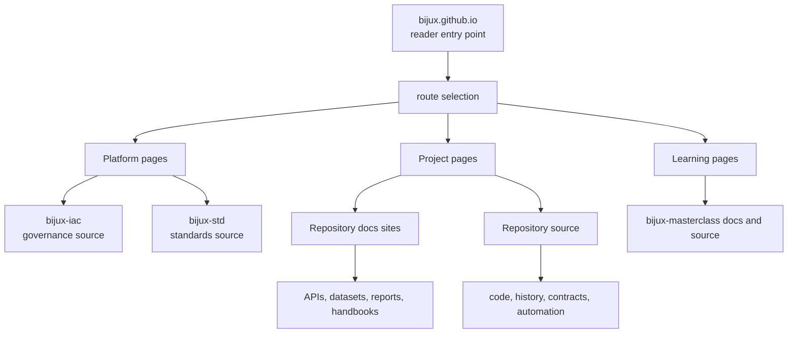
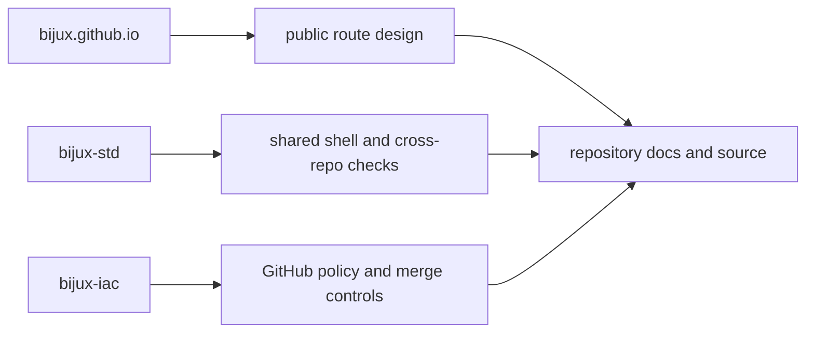

# Public Surface

The public Bijux surface is the set of destinations that readers can
open directly from `bijux.io` today. The goal is to make the hub
behave like a maintained documentation network, not a static landing
page.

Some public surfaces are browsed destinations (where readers navigate
content), while others are ownership sources (where shared standards and
contracts are defined).

The useful question is not only what can be opened, but what each
destination proves.

## Surface Map

## Curated Public Destinations By Surface Type

### Hub

| Surface | Purpose | Use this when | What becomes visible here |
| --- | --- | --- | --- |
| [bijux.github.io](https://github.com/bijux/bijux.github.io) | shared documentation hub and cross-repository shell | you need orientation before choosing an owning repository | `docs/` structure, shell assets, and navigation contracts |

### Standards

| Surface | Purpose | Use this when | What becomes visible here |
| --- | --- | --- | --- |
| [bijux-std](https://github.com/bijux/bijux-std) | canonical source for shared documentation shell and shared checks | you need ownership source for cross-repository standards and shell behavior | shared docs shell contracts, sync/check tooling, and cross-repository standards boundaries |

### Governance Source

| Surface | Purpose | Use this when | What becomes visible here |
| --- | --- | --- | --- |
| [bijux-iac](https://github.com/bijux/bijux-iac) | canonical source for GitHub control-plane governance | you need to inspect branch protection, required checks, and repository governance ownership | Terraform-managed GitHub controls and repository governance inventory |

### Repository Docs

| Surface | Purpose | Use this when | What becomes visible here |
| --- | --- | --- | --- |
| [bijux-core docs](https://bijux.io/bijux-core/) | runtime backbone and repository governance | you want runtime and governance routes with handbook context | CLI and DAG surfaces, governance docs, and release rules |
| [bijux-canon docs](https://bijux.io/bijux-canon/) | governed knowledge-system architecture | you want ingest/index/reason/orchestrate pathways with documented boundaries | knowledge workflows decomposed into accountable interfaces |
| [bijux-atlas docs](https://bijux.io/bijux-atlas/) | data and service delivery surfaces | you want API, dataset, and reporting delivery context | delivery treated as maintained product architecture |
| [bijux-proteomics docs](https://bijux.io/bijux-proteomics/) | proteomics-oriented scientific system delivery | you want to inspect scientific workflows with reproducibility constraints | domain pressure handled without architecture drift |
| [bijux-pollenomics docs](https://bijux.io/bijux-pollenomics/) | evidence mapping and site-selection system design | you want evidence-heavy outputs with explicit operational structure | specialized domain pressure with bounded system design |
| [bijux-masterclass docs](https://bijux.io/bijux-masterclass/) | technical education programs tied to real system practice | you want course-level technical routes and deep-dive programs | architecture thinking translated into reusable instruction |

### Source Repositories

| Surface | Purpose | Use this when | What becomes visible here |
| --- | --- | --- | --- |
| [bijux-core source](https://github.com/bijux/bijux-core) | source of runtime and governance implementation | you need file-level structure and history for core runtime decisions | package boundaries, command surfaces, and evolution over time |
| [bijux-canon source](https://github.com/bijux/bijux-canon) | source of governed knowledge-system implementation | you need package-level ownership and change history for Canon layers | ingest/index/reason/orchestrate ownership in code |
| [bijux-atlas source](https://github.com/bijux/bijux-atlas) | source of delivery and control-plane implementation | you need operational and delivery mechanics beyond docs summaries | API/dataset/reporting structure with automation entry points |
| [bijux-proteomics source](https://github.com/bijux/bijux-proteomics) | source of proteomics-oriented system implementation | you need workflow details, package boundaries, and reproducibility mechanics | scientific system behavior under domain constraints |
| [bijux-pollenomics source](https://github.com/bijux/bijux-pollenomics) | source of evidence-mapping system implementation | you need data and reporting structure behind published outputs | domain modeling and evidence handling in repository form |
| [bijux-masterclass source](https://github.com/bijux/bijux-masterclass) | source of learning programs and executable course materials | you need course-book and capstone implementation details | explanation linked to runnable learning artifacts |

### Delivery Endpoints

| Surface | Purpose | Use this when | What becomes visible here |
| --- | --- | --- | --- |
| [Bijux Atlas docs](https://bijux.io/bijux-atlas/) and [Bijux Atlas source](https://github.com/bijux/bijux-atlas) | entry points for API, dataset, and reporting delivery behavior | you need delivery-facing interfaces and their implementation context together | how published service/data outputs map to owned contracts and repository implementation |

### Project Overview Pages

| Surface | Purpose | Use this when | What becomes visible here |
| --- | --- | --- | --- |
| [Projects index](../../02-projects/index.md) | overview of repository roles in one place | you want a fast map before selecting a destination | repository family roles and cross-links |
| [Bijux Core](../../02-projects/bijux-core/index.md), [Bijux Canon](../../02-projects/bijux-canon/index.md), [Bijux Atlas](../../02-projects/bijux-atlas/index.md), [Bijux Proteomics](../../02-projects/bijux-proteomics/index.md), [Bijux Pollenomics](../../02-projects/bijux-pollenomics/index.md), [Learning index](../../03-learning/index.md) | project-level summaries and route hints | you want role context before opening repo docs or source | role intent, key surfaces, and suggested entry routes |

## What This Page Makes Visible

- the repository family is coherent rather than a random list of projects
- each destination has a distinct role in runtime, knowledge, delivery, domain, or learning layers
- the public surface supports both high-level routing and deeper technical inspection

## Ownership Map

## Start Here

Start with the hub and [System Map](../system-map/index.md) before opening source
repositories.

| If your question is... | Open first | Then open |
| --- | --- | --- |
| where should I begin? | [bijux.github.io](https://github.com/bijux/bijux.github.io) | [System Map](../system-map/index.md) |
| where is repository governance owned? | [bijux-iac](https://github.com/bijux/bijux-iac) | [Bijux Infrastructure-as-Code](../bijux-iac/index.md) |
| which repository owns this concern? | [Projects index](../../02-projects/index.md) | matching project page |
| where are shared shell and standards owned? | [bijux-std](https://github.com/bijux/bijux-std) | [Shared Documentation Shell](../shell-architecture/index.md) |
| where can I inspect implementation details? | matching repository docs site | matching source repository |

Use this page as an index: pick the surface type, then move to the
owning destination.

## Stability Expectation

The public surface should behave like a maintained index, not a
point-in-time snapshot.

### Meant To Stay Stable

- top-level repository destinations and their public docs roots
- cross-repository navigation routes from the hub
- shared docs shell continuity and navigation behavior across documentation sites
- the role-level separation between platform, project, and learning surfaces

### Expected To Evolve

- page contents inside each repository docs site
- internal package structure and implementation details in source repos
- project-level summary wording as repository scope matures

### Canonical Ownership

- hub-level route ownership: `bijux.github.io`
- GitHub governance ownership: `bijux-iac`
- repository docs and source ownership: each destination repository
- shared shell and docs standards ownership: `bijux-std`

The public surface is designed to make the work inspectable from
multiple angles: documentation for orientation, repositories for
verification, and project pages for context.
