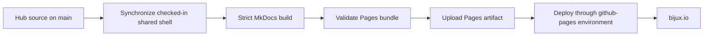
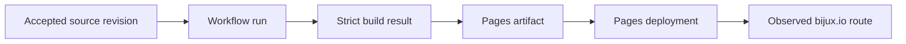
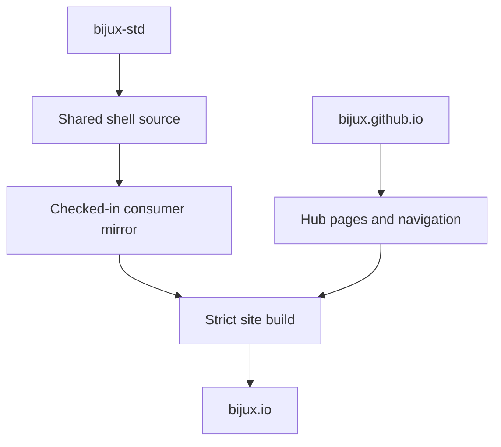
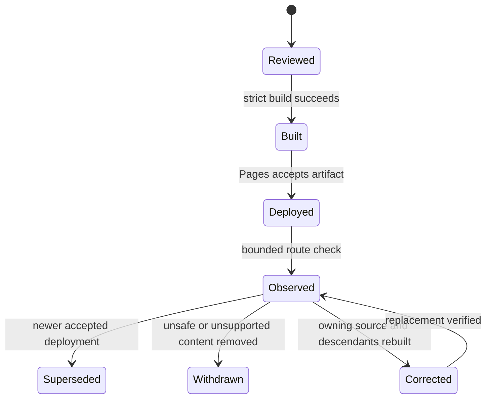
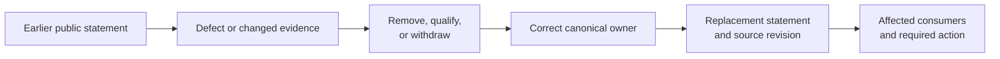
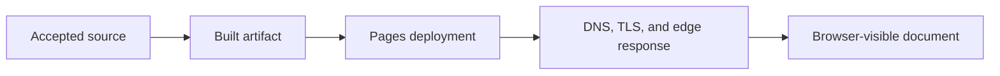

# Publication Integrity

`bijux.io` is built from reviewed source and deployed as a GitHub Pages
artifact. The publication path has explicit checks, limited permissions, and a
clear separation between hub-owned content and the shared documentation shell.

## Source To Public Site

A push to `main` invokes the reusable documentation deployment workflow. The
workflow checks out the exact repository revision, resolves the site URL and
build command, builds into `artifacts/docs/site`, verifies that a publishable
`index.html` exists, uploads that directory as a Pages artifact, and deploys it
through the `github-pages` environment.

## Integrity Layers

| Layer | Mechanism | What it establishes |
| --- | --- | --- |
| repository admission | required policy and standards checks | the revision entered `main` through the governed repository path |
| shared-source alignment | checksum, manifest, source-of-truth, and contract checks | synchronized shell and managed standards match their canonical inputs |
| content build | MkDocs strict mode | configured pages, navigation, extensions, templates, and local references are buildable together |
| artifact boundary | resolved site directory containing `index.html` | the deployment receives a concrete static-site bundle |
| deployment identity | GitHub Pages OIDC with `pages: write` and `id-token: write` | publication uses the Pages deployment path rather than a long-lived repository deployment credential |
| concurrency | one deployment group per Git reference with cancellation | an obsolete in-progress build does not race a newer revision on the same reference |

## Preserve Publication Identity End To End

The public domain does not expose every internal identifier in one response.
Review therefore joins the source, build, artifact, deployment, and observed
route records rather than treating a successful URL fetch as the entire proof.

| Identity | What it establishes | Evidence gap if missing |
| --- | --- | --- |
| source revision | exact hub content and managed snapshot selected | public bytes cannot be tied to reviewed source |
| workflow run | automation definition and execution that handled the revision | build and deployment steps are unattributed |
| site directory and artifact | concrete bundle offered to Pages | a local build may be mistaken for a deployed bundle |
| deployment | Pages environment accepted a named artifact | upload success may be mistaken for publication |
| observed route and time | the domain served a response during a bounded observation | deployment state may be mistaken for continuous reachability |

The source link helps a reader inspect authorship, but it is not a
cryptographic statement that the open browser tab contains that revision.
Conversely, matching visible prose does not identify the complete bundle,
shared shell, or deployment that served it.

## Shared And Local Ownership

The rendered site combines two sources with different owners.

`bijux-std` owns the shared header, footer, navigation shell, styles, scripts,
icons, and their contract. `bijux.github.io` owns the page content, root
navigation, site metadata, and route choices. Synchronization copies the
checked-in shared source into its generated consumer paths before the build;
source-of-truth checks then compare the generated files back to that source.

This prevents two common failures:

- editing a generated shell file locally and mistaking that edit for a durable
  site customization;
- changing hub content in the standards repository and blurring product and
  presentation ownership.

## Build Inputs

The site build is intentionally reproducible from repository-owned inputs:

- MkDocs, Material for MkDocs, Autorefs, and PyMdown Extensions use pinned
  versions;
- Mermaid is shipped as a versioned local asset rather than loaded from a
  third-party CDN at render time;
- generated output stays under `artifacts/docs/site` and is not committed as
  root-site source;
- `CNAME` and compatibility icons are copied into the completed site bundle;
- the configured canonical URL is `https://bijux.io/`.

## Security Boundary

The deployment workflow grants the build job read access to repository
contents. Publication permissions are limited to GitHub Pages and its OIDC
token. The workflow does not require a general-purpose personal access token or
write access to repository contents.

Actions in the managed workflows are pinned to immutable commit SHAs and
checked against the managed manifest. Protected workflow and governance paths
have additional policy checks because changing the deployment mechanism is
more sensitive than changing prose.

## Publication Threat Model

The root-site path is designed to reduce four specific risks:

| Risk | Control in the publication path | Remaining boundary |
| --- | --- | --- |
| unreviewed source reaches the site | governed admission to `main` and protected policy paths | repository identity and reviewer accounts remain trusted |
| a shared shell drifts locally | canonical snapshot, checksums, source-of-truth comparison, and contract checks | the accepted upstream revision remains trusted |
| a build dependency changes implicitly | pinned documentation packages and immutable GitHub Action revisions | upstream code is not formally verified by pinning alone |
| a deployment credential is overpowered or retained | Pages-scoped permissions, environment deployment, and OIDC | GitHub Pages and GitHub Actions remain external trust dependencies |

The site is public and static. It is not an authenticated application and does
not offer private-content authorization. Repository secrets must never be
placed in page source, generated HTML, JavaScript configuration, or retained
build logs.

Mermaid and shell assets are bundled with the site, so normal rendering does
not require executing documentation code fetched from a third-party CDN. This
reduces runtime dependency drift; it does not make arbitrary future scripts
safe merely because they are checked into the repository.

## Treat Content As An Operational Input

Static prose can change operator behavior. Commands, configuration examples,
download destinations, compatibility statements, and security boundaries need
the same owner and revision discipline as other public interfaces.

| Content risk | Reader consequence | Required control |
| --- | --- | --- |
| command omits a destructive or irreversible condition | unintended data or state loss | explicit preconditions, target identity, bounded scope, and recovery route |
| example contains a secret or private locator | credential or data disclosure | source and built-bundle inspection, revocation, and history-aware response |
| download or repository link changes authority | consumer selects untrusted bytes | canonical owner, immutable identity where available, and correction of every affected route |
| isolation or authorization language is stronger than enforcement | unsafe execution or exposure | enforcement-point review, negative-path evidence, and narrowed public wording |
| stale compatibility or migration guidance remains visible | consumer breakage or unsupported deployment | predecessor/successor identity, current support posture, and visible replacement route |

The strict build cannot determine whether a shell command is safe or a security
claim is true. Those statements require review against the owning product or
control boundary. When safe use depends on context, the page should name the
context rather than rely on a generic warning detached from the action.

## What The Pipeline Does Not Prove

Publication success has a precise scope.

- It does not prove that every external website linked from the hub is
  continuously available.
- It does not prove that a destination repository's runtime or scientific
  claims are correct; those claims belong to that repository's evidence.
- It does not provide an application availability objective, synthetic probe,
  or incident response service for GitHub Pages.
- It does not make an older open browser session automatically reflect the
  newest deployment.
- It does not replace accessibility, editorial, or domain review merely
  because the static site builds successfully.

These boundaries matter because a green deployment should never be presented
as evidence broader than the checks that produced it.

## Correct Or Withdraw A Publication

Publication recovery uses the same governed source-to-artifact path as normal
delivery. A maintainer corrects the owning source or selects a known-good
revision, rebuilds the complete site, deploys the resulting Pages artifact,
and verifies the affected public route.

Supersession is not deletion of history. The previous source revision and run
remain part of the audit trail even when the public domain serves newer bytes.
A correction should identify the affected claim and owner; rebuilding an
unchanged page only to make it look newer is not evidence repair.

The workflow cancels obsolete in-progress executions for the same Git
reference. That reduces a deployment race, but it is not an automatic content
rollback, a cache purge guarantee, or an external availability monitor. A
known-good site is restored by selecting reviewed source and redeploying it
through the governed path.

## Publish A Correction That Readers Can Follow

Removing incorrect text protects future readers but does not tell prior readers
what changed. A material correction should preserve a relation between the
affected statement and its replacement.

The correction record should identify the affected route or claim, earlier and
replacement source identities, reason, owner, consequence, and whether readers
must rerun a command, replace an artifact, revisit a decision, or take no
action. Scientific and dataset corrections also retain their evidence or
generation identities; a documentation revision alone cannot describe their
full impact.

If the exposure window or affected readership is unknown, say so. Page views
are not proof that guidance was followed, and lack of a reported incident is
not proof that an unsafe instruction caused no harm.

## Interpret Public Staleness Carefully

Several states can look like “the site is stale”:

- the accepted source has not yet produced a successful deployment;
- Pages accepted an artifact but the custom domain is not serving it at the
  observation time;
- a browser or intermediary retains older content;
- the hub is current but the destination repository changed its contract or
  route;
- the page renders current text while an embedded operational or scientific
  claim has exceeded its evidence window.

Diagnose these states at their owning boundary. Re-running deployment cannot
repair an outdated product claim, and editing prose cannot repair domain or
Pages availability.

## Separate Origin, Edge, And Browser State

The source revision, Pages deployment, custom domain, intermediary cache, and
browser can expose different states during publication or correction. A reader
observation must identify which boundary it actually reached.

| Boundary | Identity or signal to retain | Misleading conclusion |
| --- | --- | --- |
| source | accepted revision and intended public routes | source acceptance means deployment completed |
| build artifact | workflow run, bundle identity, and included `CNAME` | valid bundle means the domain serves it |
| Pages deployment | deployment record and environment URL | Pages acceptance means every edge or browser is current |
| domain and edge | hostname, resolution, TLS result, response headers, time, and content marker | one successful location proves global convergence |
| browser | requested URL, cache mode, service-worker state where relevant, and visible marker | a stale local copy proves the origin is stale |

Correction verification should sample the affected route and the site entrance,
compare an identity-bearing marker, and record the observation time. Cache
bypass can diagnose staleness; it does not itself evict every retained copy or
prove that all readers received the correction.

## Reader Verification

A reader can verify the public chain at three levels:

1. use the page's source link to inspect the owning Markdown revision;
2. inspect the repository workflows and required checks for the publication
   path;
3. follow project links to the destination repository for product contracts,
   operational evidence, and limitations.

Continue with [Documentation Network](../documentation-network/index.md) for
cross-site navigation ownership or [Delivery Surfaces](../delivery-surfaces/index.md)
for the broader delivery model. [Security Model](../security-model/index.md)
places this static-site boundary beside runtime, service, data, and repository
controls.
