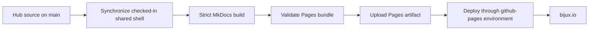
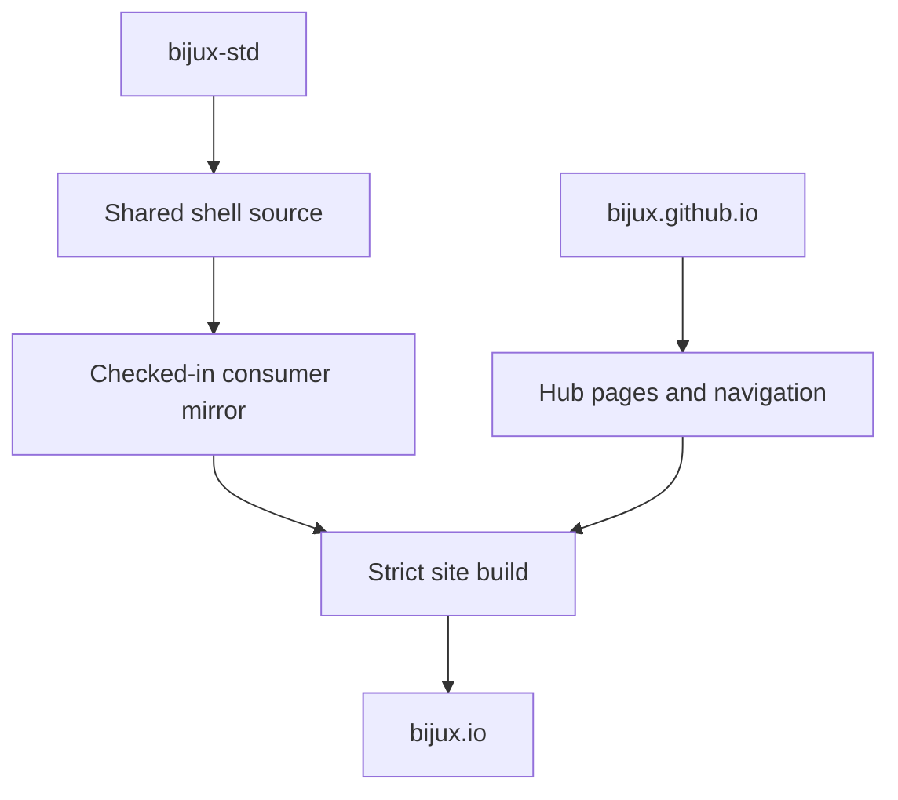

# Publication Integrity

`bijux.io` is built from reviewed source and deployed as a GitHub Pages
artifact. The publication path has explicit checks, limited permissions, and a
clear separation between hub-owned content and the shared documentation shell.

## Source To Public Site

A push to `main` invokes the reusable documentation deployment workflow. The
workflow checks out the exact repository revision, resolves the site URL and
build command, builds into `artifacts/docs/site`, verifies that a publishable
`index.html` exists, uploads that directory as a Pages artifact, and deploys it
through the `github-pages` environment.

## Integrity Layers

| Layer | Mechanism | What it establishes |
| --- | --- | --- |
| repository admission | required policy and standards checks | the revision entered `main` through the governed repository path |
| shared-source alignment | checksum, manifest, source-of-truth, and contract checks | synchronized shell and managed standards match their canonical inputs |
| content build | MkDocs strict mode | configured pages, navigation, extensions, templates, and local references are buildable together |
| artifact boundary | resolved site directory containing `index.html` | the deployment receives a concrete static-site bundle |
| deployment identity | GitHub Pages OIDC with `pages: write` and `id-token: write` | publication uses the Pages deployment path rather than a long-lived repository deployment credential |
| concurrency | one deployment group per Git reference with cancellation | an obsolete in-progress build does not race a newer revision on the same reference |

## Shared And Local Ownership

The rendered site combines two sources with different owners.

`bijux-std` owns the shared header, footer, navigation shell, styles, scripts,
icons, and their contract. `bijux.github.io` owns the page content, root
navigation, site metadata, and route choices. Synchronization copies the
checked-in shared source into its generated consumer paths before the build;
source-of-truth checks then compare the generated files back to that source.

This prevents two common failures:

- editing a generated shell file locally and mistaking that edit for a durable
  site customization;
- changing hub content in the standards repository and blurring product and
  presentation ownership.

## Build Inputs

The site build is intentionally reproducible from repository-owned inputs:

- MkDocs, Material for MkDocs, Autorefs, and PyMdown Extensions use pinned
  versions;
- Mermaid is shipped as a versioned local asset rather than loaded from a
  third-party CDN at render time;
- generated output stays under `artifacts/docs/site` and is not committed as
  root-site source;
- `CNAME` and compatibility icons are copied into the completed site bundle;
- the configured canonical URL is `https://bijux.io/`.

## Security Boundary

The deployment workflow grants the build job read access to repository
contents. Publication permissions are limited to GitHub Pages and its OIDC
token. The workflow does not require a general-purpose personal access token or
write access to repository contents.

Actions in the managed workflows are pinned to immutable commit SHAs and
checked against the managed manifest. Protected workflow and governance paths
have additional policy checks because changing the deployment mechanism is
more sensitive than changing prose.

## Publication Threat Model

The root-site path is designed to reduce four specific risks:

| Risk | Control in the publication path | Remaining boundary |
| --- | --- | --- |
| unreviewed source reaches the site | governed admission to `main` and protected policy paths | repository identity and reviewer accounts remain trusted |
| a shared shell drifts locally | canonical snapshot, checksums, source-of-truth comparison, and contract checks | the accepted upstream revision remains trusted |
| a build dependency changes implicitly | pinned documentation packages and immutable GitHub Action revisions | upstream code is not formally verified by pinning alone |
| a deployment credential is overpowered or retained | Pages-scoped permissions, environment deployment, and OIDC | GitHub Pages and GitHub Actions remain external trust dependencies |

The site is public and static. It is not an authenticated application and does
not offer private-content authorization. Repository secrets must never be
placed in page source, generated HTML, JavaScript configuration, or retained
build logs.

Mermaid and shell assets are bundled with the site, so normal rendering does
not require executing documentation code fetched from a third-party CDN. This
reduces runtime dependency drift; it does not make arbitrary future scripts
safe merely because they are checked into the repository.

## What The Pipeline Does Not Prove

Publication success has a precise scope.

- It does not prove that every external website linked from the hub is
  continuously available.
- It does not prove that a destination repository's runtime or scientific
  claims are correct; those claims belong to that repository's evidence.
- It does not provide an application availability objective, synthetic probe,
  or incident response service for GitHub Pages.
- It does not make an older open browser session automatically reflect the
  newest deployment.
- It does not replace accessibility, editorial, or domain review merely
  because the static site builds successfully.

These boundaries matter because a green deployment should never be presented
as evidence broader than the checks that produced it.

## Reader Verification

A reader can verify the public chain at three levels:

1. use the page's source link to inspect the owning Markdown revision;
2. inspect the repository workflows and required checks for the publication
   path;
3. follow project links to the destination repository for product contracts,
   operational evidence, and limitations.

Continue with [Documentation Network](../documentation-network/index.md) for
cross-site navigation ownership or [Delivery Surfaces](../delivery-surfaces/index.md)
for the broader delivery model. [Security Model](../security-model/index.md)
places this static-site boundary beside runtime, service, data, and repository
controls.
