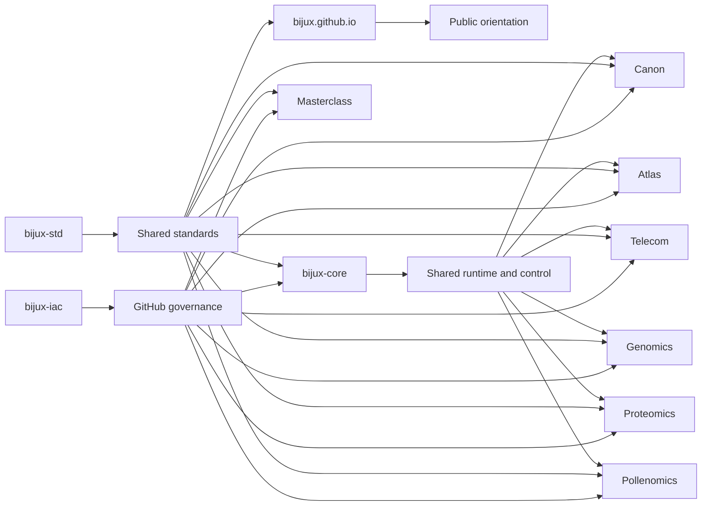

# Repository Matrix

This matrix is the shortest route to understanding how the public Bijux
repositories differ by ownership responsibility and repository type.

Repository separation here is a design tool for controlling ownership
and change, not an organizational preference.

## Matrix Map

## How To Read This Matrix

- read each row as a single ownership boundary, not as a feature list
- use the primary responsibility column to decide the first repository to open
- use the shared standards column to see where behavior is inherited vs locally owned

## Why These Repositories Are Separate

- `bijux-iac` owns live GitHub governance so repository policy is applied from code instead of settings drift
- `bijux.github.io` owns the public route into the family so orientation is a maintained surface rather than a side effect
- `bijux-std` owns the shared layer so shell behavior, checks, and promoted shared make behavior stay aligned across repositories
- `bijux-core` owns runtime authority so execution behavior and governance remain explicit
- `bijux-canon` owns knowledge-system orchestration so ingest/index/reason/orchestrate concerns do not collapse into one layer
- `bijux-atlas` owns public delivery interfaces so APIs, datasets, and reporting routes remain maintainable
- `bijux-telecom` and `bijux-genomics` consume the same shared runtime and governance layers while keeping their own service and genomics ownership
- `bijux-proteomics` and `bijux-pollenomics` own domain workflows so scientific pressure is handled without rewriting platform ownership
- `bijux-masterclass` owns learning programs so explanation and teaching evolve without diluting repository implementation boundaries

## System Family At A Glance

| Repository | Repository type | Primary responsibility | What it owns publicly | Consumes shared standards | Start here |
| --- | --- | --- | --- | --- | --- |
| `bijux-iac` | control-plane repository | own GitHub governance and repository policy as code | Terraform-managed GitHub controls and repo governance inventory | yes | [Platform page](../bijux-iac/index.md) |
| `bijux.github.io` | public hub repository | own cross-repository orientation and route design | the main Bijux hub, navigation, and public entry paths | yes | [Home](../../index.md) |
| `bijux-std` | standards source | own shared standards, documentation shell contracts, and cross-repository quality checks | shared contracts, quality gates, and documentation shell source used by the family | no; this repository is the standards source | [Repository page](../bijux-std/index.md) |
| `bijux-core` | platform runtime repository | own runtime authority and release discipline | CLI surfaces, DAG runtime, evidence artifacts, release rules | yes | [Project page](../../02-projects/bijux-core/index.md) |
| `bijux-canon` | governed knowledge repository | own knowledge-system orchestration boundaries | ingest/index/reason/orchestrate package boundaries | yes | [Project page](../../02-projects/bijux-canon/index.md) |
| `bijux-atlas` | delivery repository | own public delivery interfaces and contracts | APIs, datasets, reporting, docs-aware operational routes | yes | [Project page](../../02-projects/bijux-atlas/index.md) |
| `bijux-telecom` | service repository | own telecom-oriented service and delivery behavior | telecom system surfaces built on shared governance, standards, and runtime layers | yes | [System map](../system-map/index.md) |
| `bijux-genomics` | rust genomics repository | own genomics-oriented rust systems and contracts | genomics domain, pipelines, policies, and rust implementation surfaces | yes | [System map](../system-map/index.md) |
| `bijux-proteomics` | scientific application repository | own proteomics product workflows | proteomics domain workflows and reproducible product routes | yes | [Project page](../../02-projects/bijux-proteomics/index.md) |
| `bijux-pollenomics` | scientific application repository | own evidence-mapping product workflows | archaeology/eDNA/aDNA evidence surfaces and site-selection outputs | yes | [Project page](../../02-projects/bijux-pollenomics/index.md) |
| `bijux-masterclass` | learning and teaching repository | own structured technical learning programs | sequenced programs, deep dives, and runnable learning materials | yes | [Learning catalog](../../03-learning/index.md) |

## How The Repositories Work Together

| Layer | Repositories | Why the split stays useful |
| --- | --- | --- |
| shared foundations | `bijux-iac`, `bijux-std` | governance and standards stay aligned across every repository before project-specific work begins |
| hub | `bijux.github.io` | public entry routes stay maintainable without turning the hub into the source of shared shell behavior |
| backbone | `bijux-core` | execution, evidence, and governance stay visible instead of disappearing into scripts and convention |
| knowledge and service architecture | `bijux-canon`, `bijux-atlas`, `bijux-telecom`, `bijux-genomics` | knowledge workflows, service systems, and rust-based domains can evolve independently while consuming common layers |
| domain products | `bijux-proteomics`, `bijux-pollenomics` | domain systems inherit platform discipline instead of becoming isolated one-off projects |
| learning surface | `bijux-masterclass` | the same engineering language becomes teachable, reusable, and public-facing |

## Routes

For route-first navigation, use [Reading Paths](../../index.md#reading-paths).
This matrix stays focused on repository ownership and responsibility
boundaries.
