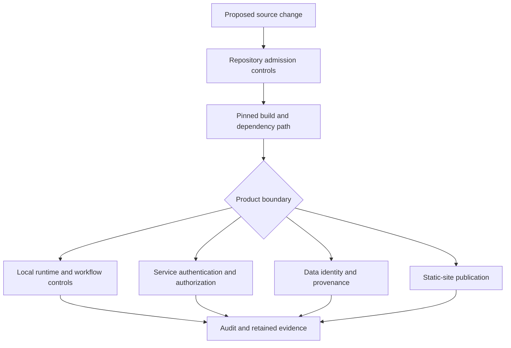
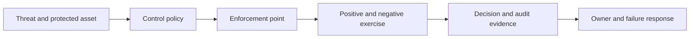
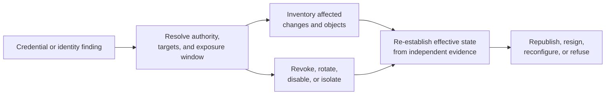
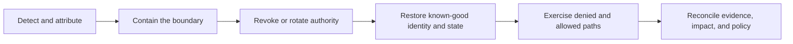

# Security Model

Bijux does not claim one security boundary for every repository. The family
contains source governance, local command execution, knowledge processing,
network services, scientific data, and public documentation. Each surface has
different assets, adversaries, enforcement points, and residual risks.

The common rule is to name the enforcement boundary before describing a
control. A policy declaration is not a sandbox. A checksum is not
authentication. A passing schema check is not authorization. A successful
deployment is not continuous service assurance.

## Layered Boundaries

The layers reinforce one another but do not merge. Repository admission can
protect source history; it cannot constrain arbitrary behavior after a local
process starts. A service can authorize requests; it cannot establish the
scientific truth of a returned dataset.

## Security Responsibilities

| Boundary | Protected asset | Principal controls | Does not establish |
| --- | --- | --- | --- |
| repository governance | protected source and configuration | review policy, required checks, protected paths, and declared GitHub state | runtime isolation or product correctness |
| shared supply chain | synchronized standards and workflow dependencies | immutable revisions, manifests, checksums, action pins, and drift checks | the correctness of every upstream implementation |
| local execution | workflow inputs, outputs, and retained evidence | path authorization, policy gates, environment shaping, backend controls, and artifact verification | a general host sandbox unless the backend explicitly provides one |
| knowledge processing | accepted sources, indexes, traces, and decisions | typed contracts, schema validation, fingerprints, refusal paths, and replay evidence | source authenticity or answer correctness by itself |
| service delivery | API, operator routes, and backing stores | authentication, authorization, request limits, dependency policy, and audit telemetry | universal protection across undeclared topologies |
| data and science | dataset identity, lineage, and interpretation | immutable identifiers, provenance, curation records, validation, and qualified claims | freedom from source bias or universal scientific validity |
| documentation publication | reviewed content and Pages artifact | strict build, local assets, pinned actions, least-privilege deployment, and OIDC | private content access control or continuous external-link availability |

## Follow A Control From Threat To Evidence

A trustworthy control claim joins six records. Missing one makes the boundary
ambiguous even when the implementation exists.

| Record | Required question |
| --- | --- |
| threat | what actor, action, and consequence is in scope? |
| policy | which identities and operations are allowed, denied, or conditional? |
| enforcement | which component makes the decision, and can callers bypass it? |
| exercise | were both authorized and unauthorized paths tested for the named topology? |
| telemetry | can an operator attribute the decision without exposing secrets? |
| response | who rotates, revokes, isolates, restores, or corrects the control after failure? |

Configuration presence establishes only the policy record. Effective-state
inspection and negative-path evidence are needed to show enforcement. Audit
telemetry should record enough identity and decision context for investigation
without copying credentials or sensitive payloads into logs.

## Repository And Supply-Chain Controls

The repository layer protects how source and automation change:

- `bijux-iac` declares live GitHub governance and separates planning from
  application;
- `bijux-std` owns shared workflows, checks, and documentation contracts;
- consumers pin an accepted standards revision and verify managed content;
- GitHub Actions dependencies are pinned to immutable commit identifiers;
- sensitive workflow and governance paths receive additional policy review.

These controls make change provenance and drift visible. They do not mean that
all dependencies are formally verified or that a compromised maintainer
account is harmless. Identity protection, credential hygiene, and upstream
risk remain part of the threat model.

## Bound Credential And Authority Exposure

A credential incident is scoped by what the credential could do, where it was
accepted, and for how long—not only by where it was stored.

| Authority | Potential effect | Evidence needed to bound exposure |
| --- | --- | --- |
| repository write or maintainer identity | source, tags, workflow definitions, and review state may change | audit events, accepted revisions, protected-path decisions, sessions, and revocation time |
| GitHub administration token | repository settings and rulesets across its target family may change | token scope, target inventory, API events, live governance audit, and rotation time |
| Pages deployment authority | an untrusted static bundle may become public | workflow run, artifact and deployment identities, environment history, and observed routes |
| package or image publication credential | consumers may receive an unauthorized release object | registry events, immutable digests, provenance, channel inventory, and withdrawal state |
| service or store credential | requests, data, catalog state, or administrative operations may be exposed or changed | identity use, affected resources, audit telemetry, data-integrity comparison, and effective revocation |
| evidence signing or custody key | forged or unverifiable evidence may appear authoritative | key identity, signed-object inventory, verification time, revocation relation, and replacement trust root |

Rotation stops future use of the old authority; it does not prove that earlier
objects, decisions, or settings are trustworthy. Incident review must inspect
every accepted surface within the authority's scope and mark evidence unknown
when attribution or integrity cannot be reconstructed.

## Treat Build Tools As Executed Dependencies

Package installers, documentation plugins, compilers, generators, Actions,
and repository scripts execute with the build environment's authority. A
version pin improves identity; it does not make execution harmless.

| Build boundary | Security evidence |
| --- | --- |
| dependency resolution | canonical origin, immutable identity, digest or lock relationship, and withdrawal response |
| credentials | minimum secret class, scoped destination, masking, and absence from artifacts and logs |
| filesystem | writable paths, source immutability where practical, artifact boundary, and cleanup |
| network | required destinations, denied ambient access where supported, and retained retrieval identity |
| generated output | producer identity, explained variance, schema, and review before promotion |
| runner | image and tool identity, isolation assumptions, and untrusted contribution boundary |

A successful build proves neither that the dependency was benign nor that
generated output is safe to publish. Compromise response must identify builds,
artifacts, releases, and deployments that executed the affected dependency,
not only repositories whose lock file contained it.

## Execution Isolation

Bijux Core states its execution boundary explicitly. The `bijux-dag` shell
backend validates declared effects, environment bindings, output targets, and
governed storage paths, but it does not firewall sockets, virtualize clocks, or
block arbitrary host reads. It is for code already inside the host trust
boundary.

Container execution can add engine-enforced mount shaping and no-network
behavior when the selected Docker or Podman adapter supports them. That is
container-engine isolation, not a virtual-machine boundary. Replay sandboxing
protects retained source evidence from writes; it does not sandbox the
replayed process.

This distinction matters because the word “sandbox” is otherwise easy to
overread. Inspect the
[Core execution security contract](https://bijux.io/bijux-core/bijux-dag/operations/security-isolation-truth/)
before running code outside an established trust boundary.

## Knowledge And Agent Boundaries

Knowledge systems introduce input and decision risks that process isolation
cannot solve alone:

- source material may be malformed, misleading, duplicated, or untrusted;
- serialized indexes and traces may be oversized or tampered with;
- retrieval can be well-formed but irrelevant;
- a reasoning run can converge on an unsupported conclusion;
- partial failures can produce an output that must be downgraded or refused.

Bijux Canon separates ingest, index, retrieval, reasoning, agent, and runtime
contracts so each boundary can validate and retain its own evidence. External
authentication is still required when producer identity or tamper resistance
matters. A loader accepting a supported schema proves neither origin nor
semantic quality.

## Service And Data Boundaries

Network delivery adds controls that local libraries do not need: authenticated
identity, authorization policy, rate and resource limits, dependency health,
abuse resistance, and operator-only routes. Bijux Atlas carries these concerns
with dataset identity, catalog state, cache behavior, load evidence, rollout,
rollback, and recovery.

The API and dataset boundaries must remain separate. Authorization to retrieve
an object does not establish its provenance. A correct dataset fingerprint
does not authorize a caller. Service availability does not prove that a
scientific interpretation is sound.

### Treat identity, authorization, and data provenance separately

These checks often meet at one request but answer independent questions:

- authentication establishes a caller or workload identity under a named
  trust mechanism;
- authorization decides whether that identity may perform an operation on a
  resource in the current context;
- dataset resolution selects the authoritative data generation;
- provenance explains where that data came from and how it was produced;
- scientific review determines which interpretation the evidence can support.

Passing one boundary cannot repair another. An authenticated caller can still
be unauthorized. An authorized response can still select stale data. A
correctly fingerprinted dataset can still have incomplete scientific support.

## Security Failure And Recovery

Security recovery is not complete when traffic resumes. The response must
preserve the evidence needed to determine scope while removing compromised or
overpowered authority.

The owning surface decides whether containment means disabling a workflow,
withdrawing a release, isolating a service, revoking a credential, or refusing
a dataset or publication. Incident closure needs the resulting effective
state, not only the intended remediation.

## When Security Evidence Is Untrusted

Audit records are part of the protected system. If the same compromised
identity could change the object and its local evidence, agreement between the
two is not independent corroboration.

Use the strongest evidence outside the suspected boundary: immutable registry
records, separately controlled audit events, consumer-retained digests,
independent source mirrors, external observations, or a reconstructed object
from known inputs. Record the trust basis and observation time for each.

| Situation | Honest conclusion |
| --- | --- |
| product bytes differ but producer logs are intact and independently retained | investigate the producer-to-artifact boundary |
| product bytes and colocated logs changed under one compromised identity | both are suspect until independently reconstructed |
| audit coverage has a gap during the exposure window | scope is at least unknown for the missing interval |
| a known-good source reconstructs the expected object | expected identity is recovered; earlier unauthorized use still needs impact review |
| allowed and denied paths pass after rotation | current enforcement is observed; historical confidentiality or integrity is not restored |

Evidence uncertainty is itself a security result. Do not convert “no retained
record of misuse” into “no misuse occurred” when the record source was absent,
mutable by the suspected actor, or outside its retention window.

## Public Documentation Boundary

`bijux.io` is a public static site. It contains no private reader area and
should not contain secrets. Its deployment uses GitHub Pages permissions and
OIDC rather than a general-purpose repository write credential. Mermaid and
the presentation shell are shipped with the site instead of requiring runtime
code from a third-party CDN.

Public documentation still has security consequences. A misleading command,
an obsolete destination, or an overstated isolation claim can cause unsafe
operator behavior. Editorial accuracy and bounded language therefore belong
to the security posture even though the site itself is static.

## How To Evaluate A Claim

For any security statement, ask:

1. Which asset and threat does the control address?
2. Where is the control enforced rather than merely declared?
3. Which identity, revision, configuration, or topology was exercised?
4. What evidence records success, refusal, or degraded behavior?
5. Which adjacent risks remain outside that boundary?
6. Which repository owns remediation when the control fails?

Continue with [Publication Integrity](../publication-integrity/index.md) for
the root-site trust chain, [Operational Assurance](../operational-assurance/index.md)
for readiness and recovery evidence, or [System Map](../system-map/index.md) to
locate the owning repository.
