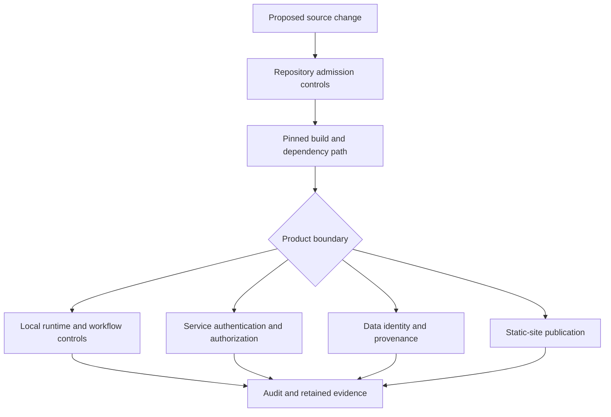

# Security Model

Bijux does not claim one security boundary for every repository. The family
contains source governance, local command execution, knowledge processing,
network services, scientific data, and public documentation. Each surface has
different assets, adversaries, enforcement points, and residual risks.

The common rule is to name the enforcement boundary before describing a
control. A policy declaration is not a sandbox. A checksum is not
authentication. A passing schema check is not authorization. A successful
deployment is not continuous service assurance.

## Layered Boundaries

The layers reinforce one another but do not merge. Repository admission can
protect source history; it cannot constrain arbitrary behavior after a local
process starts. A service can authorize requests; it cannot establish the
scientific truth of a returned dataset.

## Security Responsibilities

| Boundary | Protected asset | Principal controls | Does not establish |
| --- | --- | --- | --- |
| repository governance | protected source and configuration | review policy, required checks, protected paths, and declared GitHub state | runtime isolation or product correctness |
| shared supply chain | synchronized standards and workflow dependencies | immutable revisions, manifests, checksums, action pins, and drift checks | the correctness of every upstream implementation |
| local execution | workflow inputs, outputs, and retained evidence | path authorization, policy gates, environment shaping, backend controls, and artifact verification | a general host sandbox unless the backend explicitly provides one |
| knowledge processing | accepted sources, indexes, traces, and decisions | typed contracts, schema validation, fingerprints, refusal paths, and replay evidence | source authenticity or answer correctness by itself |
| service delivery | API, operator routes, and backing stores | authentication, authorization, request limits, dependency policy, and audit telemetry | universal protection across undeclared topologies |
| data and science | dataset identity, lineage, and interpretation | immutable identifiers, provenance, curation records, validation, and qualified claims | freedom from source bias or universal scientific validity |
| documentation publication | reviewed content and Pages artifact | strict build, local assets, pinned actions, least-privilege deployment, and OIDC | private content access control or continuous external-link availability |

## Repository And Supply-Chain Controls

The repository layer protects how source and automation change:

- `bijux-iac` declares live GitHub governance and separates planning from
  application;
- `bijux-std` owns shared workflows, checks, and documentation contracts;
- consumers pin an accepted standards revision and verify managed content;
- GitHub Actions dependencies are pinned to immutable commit identifiers;
- sensitive workflow and governance paths receive additional policy review.

These controls make change provenance and drift visible. They do not mean that
all dependencies are formally verified or that a compromised maintainer
account is harmless. Identity protection, credential hygiene, and upstream
risk remain part of the threat model.

## Execution Isolation

Bijux Core states its execution boundary explicitly. The `bijux-dag` shell
backend validates declared effects, environment bindings, output targets, and
governed storage paths, but it does not firewall sockets, virtualize clocks, or
block arbitrary host reads. It is for code already inside the host trust
boundary.

Container execution can add engine-enforced mount shaping and no-network
behavior when the selected Docker or Podman adapter supports them. That is
container-engine isolation, not a virtual-machine boundary. Replay sandboxing
protects retained source evidence from writes; it does not sandbox the
replayed process.

This distinction matters because the word “sandbox” is otherwise easy to
overread. Inspect the
[Core execution security contract](https://bijux.io/bijux-core/bijux-dag/operations/security-isolation-truth/)
before running code outside an established trust boundary.

## Knowledge And Agent Boundaries

Knowledge systems introduce input and decision risks that process isolation
cannot solve alone:

- source material may be malformed, misleading, duplicated, or untrusted;
- serialized indexes and traces may be oversized or tampered with;
- retrieval can be well-formed but irrelevant;
- a reasoning run can converge on an unsupported conclusion;
- partial failures can produce an output that must be downgraded or refused.

Bijux Canon separates ingest, index, retrieval, reasoning, agent, and runtime
contracts so each boundary can validate and retain its own evidence. External
authentication is still required when producer identity or tamper resistance
matters. A loader accepting a supported schema proves neither origin nor
semantic quality.

## Service And Data Boundaries

Network delivery adds controls that local libraries do not need: authenticated
identity, authorization policy, rate and resource limits, dependency health,
abuse resistance, and operator-only routes. Bijux Atlas carries these concerns
with dataset identity, catalog state, cache behavior, load evidence, rollout,
rollback, and recovery.

The API and dataset boundaries must remain separate. Authorization to retrieve
an object does not establish its provenance. A correct dataset fingerprint
does not authorize a caller. Service availability does not prove that a
scientific interpretation is sound.

## Public Documentation Boundary

`bijux.io` is a public static site. It contains no private reader area and
should not contain secrets. Its deployment uses GitHub Pages permissions and
OIDC rather than a general-purpose repository write credential. Mermaid and
the presentation shell are shipped with the site instead of requiring runtime
code from a third-party CDN.

Public documentation still has security consequences. A misleading command,
an obsolete destination, or an overstated isolation claim can cause unsafe
operator behavior. Editorial accuracy and bounded language therefore belong
to the security posture even though the site itself is static.

## How To Evaluate A Claim

For any security statement, ask:

1. Which asset and threat does the control address?
2. Where is the control enforced rather than merely declared?
3. Which identity, revision, configuration, or topology was exercised?
4. What evidence records success, refusal, or degraded behavior?
5. Which adjacent risks remain outside that boundary?
6. Which repository owns remediation when the control fails?

Continue with [Publication Integrity](../publication-integrity/index.md) for
the root-site trust chain, [Operational Assurance](../operational-assurance/index.md)
for readiness and recovery evidence, or [System Map](../system-map/index.md) to
locate the owning repository.
