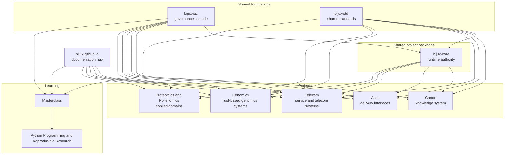

# System Map

<strong>Bijux reads more clearly as a layered system than as a list of repositories.</strong> Shared governance and shared standards sit underneath the repository family, `bijux-core` acts as the project backbone, and the documentation hub routes readers across the whole system.

The Bijux public surface is easier to understand as a layered system
than as a list of repositories. The map shows where responsibility
changes hands and where different kinds of engineering judgment are
expected. Shared standards are part of that system design, not only a
documentation detail.

In plain terms: `bijux-iac` governs GitHub, `bijux-std` keeps shared
behavior aligned, `bijux-core` provides common runtime value across the
project family, and the hub helps readers move between those layers.
Projects and learning repositories consume those shared pieces while
owning their own implementation work.

## Layered View

## Layer Summary

- Shared foundations: keep governance and shared standards stable across the family.
- Hub: routes readers across repositories, but consumes its shell and checks from `bijux-std`.
- Shared project backbone: provides common runtime value across the project family.
- Projects: carry knowledge, delivery, telecom, genomics, and domain ownership.
- Learning: turns the same engineering language into programs and capstones.

## What Each Layer Owns

### Conceptual Layers

| Layer | What it owns | Why it stays separate |
| --- | --- | --- |
| Shared foundations | GitHub governance and shared standards | keeps policy and shared behavior aligned before project-specific work begins |
| Hub | public orientation and documentation routing | lets readers move across the family without confusing routing with standards ownership |
| Shared project backbone | runtime authority, CLI surfaces, DAG behavior, evidence, and release discipline | gives multiple repositories common execution behavior without collapsing them into one codebase |
| Projects | knowledge systems, delivery interfaces, telecom services, genomics systems, and domain products | keeps implementation ownership explicit and reviewable by repository |
| Learning | course books, deep dives, capstones, and reusable technical explanation | keeps teaching and explanation rigorous without replacing repository ownership |

### Repository Family Roles

| Repository role | Primary ownership |
| --- | --- |
| bijux-iac | GitHub control-plane governance |
| bijux-std | shared standards definition and distribution |
| bijux.github.io | public orientation and hub navigation |
| Core | runtime authority and governance behavior |
| Canon | knowledge-system orchestration and reasoning boundaries |
| Atlas | delivery interfaces, service outputs, and reporting routes |
| Telecom and Genomics | service systems that consume the shared runtime and standards layers |
| Proteomics and Pollenomics | domain-specific workflows and evidence-heavy product outputs |
| Masterclass | learning programs and executable instructional artifacts |

## Why The Split Matters

- easier review because each layer has a clear job and inspection route
- easier evolution because changes stay local to the owning layer
- less accidental coupling between runtime, delivery, and domain concerns
- clearer operational truth when responsibilities are explicit in public

## Boundary Questions To Ask

- does each repository own a distinct problem instead of a renamed slice of the same problem
- does the delivery surface stay separate from the runtime and knowledge internals
- do the domain systems inherit the platform posture without being forced into generic abstractions
- can a reader move across layers and still keep a consistent mental model

## Where Responsibility Changes Hands

- Shared foundations -> repos: `bijux-iac` governs repository behavior and `bijux-std` governs shared repo content.
- Hub -> readers: `bijux.github.io` routes readers into the family, but does not own the shared shell behavior it presents.
- Core -> projects: shared CLI, DAG, evidence, and release discipline become reusable runtime value across Canon, Atlas, Telecom, Genomics, Proteomics, and Pollenomics.
- Projects -> Learning: repository practices are translated into course books and capstones without changing source ownership.

Ownership and handoffs should already be clear before repository-level
detail begins.
