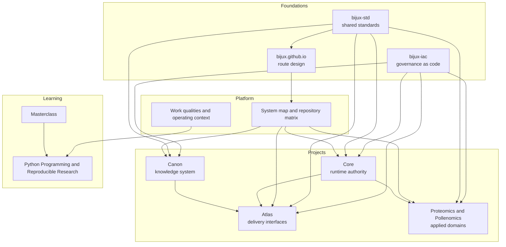

# System Map

<strong>Bijux reads more clearly as a layered system than as a list of repositories.</strong> Platform, Projects, Learning, and the foundation layer each carry a different kind of responsibility.

The Bijux public surface is easier to understand as a layered system
than as a list of repositories. The map shows where responsibility
changes hands and where different kinds of engineering judgment are
expected. Shared standards are part of that system design, not only a
documentation detail.

In plain terms: Platform defines the shared structure and rules, Projects
apply that structure in runtime/knowledge/domain repositories, and
Learning explains the same engineering methods through teachable
programs. Together, these layers keep responsibilities clear while still
forming one public system.

## Layered View

## Layer Summary

- Foundations: keep governance, shared standards, and public orientation stable.
- Platform: explains the split and the rules that make the family coherent.
- Projects: carry runtime, knowledge, delivery, and domain ownership.
- Learning: turns the same engineering language into programs and capstones.

## What Each Layer Owns

### Conceptual Layers

| Layer | What it owns | Why it stays separate |
| --- | --- | --- |
| Platform | shared engineering rules, release discipline, and boundary vocabulary | keeps cross-repository behavior stable and inspectable |
| Projects | runtime systems, knowledge systems, delivery interfaces, and domain products | keeps implementation ownership explicit and reviewable by repository |
| Learning | course books, deep dives, capstones, and reusable technical explanation | keeps teaching and explanation rigorous without replacing repository ownership |
| Foundations | GitHub governance, shared standards, and the public hub | keeps the family operable and legible before any single product repo is opened |

### Repository Family Roles

| Repository role | Primary ownership |
| --- | --- |
| bijux-iac | GitHub control-plane governance |
| bijux.github.io | public orientation and hub navigation |
| bijux-std | shared standards definition and distribution |
| Core | runtime authority and governance behavior |
| Canon | knowledge-system orchestration and reasoning boundaries |
| Atlas | delivery interfaces, service outputs, and reporting routes |
| Proteomics and Pollenomics | domain-specific workflows and evidence-heavy product outputs |
| Masterclass | learning programs and executable instructional artifacts |

## Why The Split Matters

- easier review because each layer has a clear job and inspection route
- easier evolution because changes stay local to the owning layer
- less accidental coupling between runtime, delivery, and domain concerns
- clearer operational truth when responsibilities are explicit in public

## Boundary Questions To Ask

- does each repository own a distinct problem instead of a renamed slice of the same problem
- does the delivery surface stay separate from the runtime and knowledge internals
- do the domain systems inherit the platform posture without being forced into generic abstractions
- can a reader move across layers and still keep a consistent mental model

## Where Responsibility Changes Hands

- Foundations -> repos: `bijux-iac` governs repository behavior, `bijux-std` governs shared repo content, and `bijux.github.io` governs the public route into the family.
- Platform -> Core: shared boundary and release rules become executable runtime and governance behavior.
- Core/Canon -> Atlas: internal runtime and knowledge capabilities become public delivery interfaces and reporting routes.
- Platform/Projects -> Domain products: shared engineering rules are applied to specialized scientific workflows and evidence outputs.
- Projects -> Learning: repository practices are translated into course books and capstones without changing source ownership.

Ownership and handoffs should already be clear before repository-level
detail begins.
