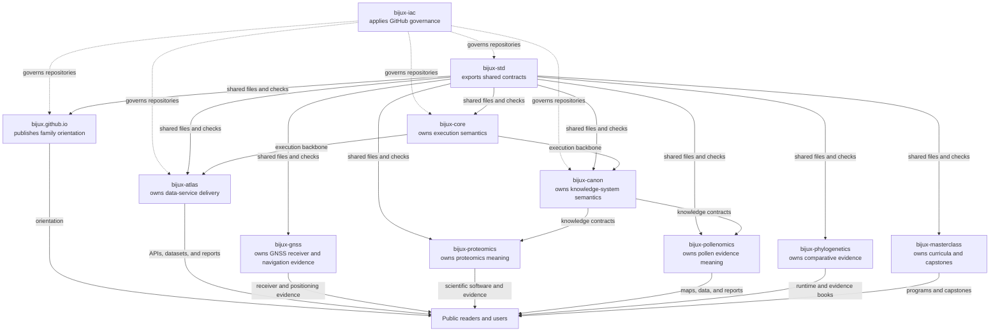
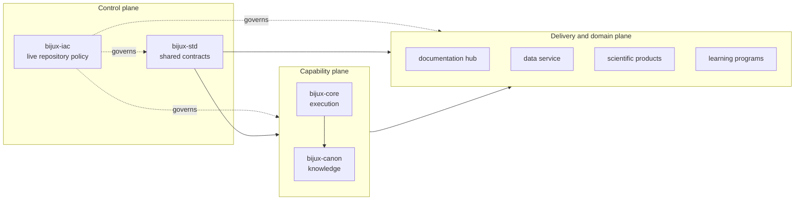
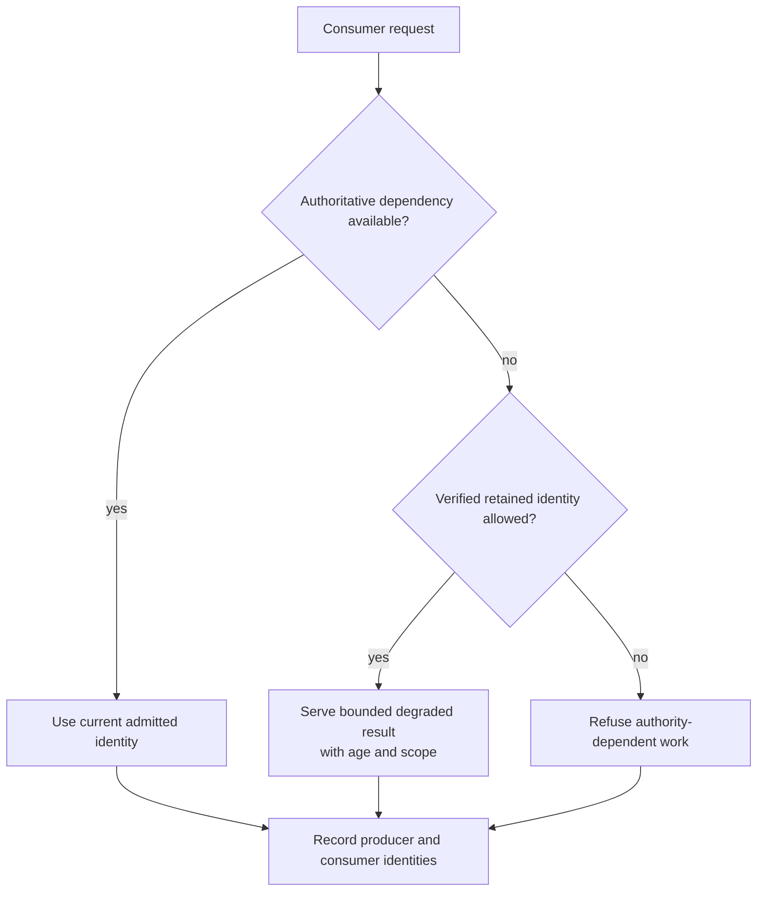
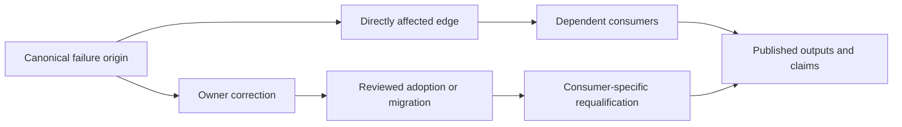

# System Map

The Bijux repository family is a directed system of control, standardization,
execution, knowledge, delivery, and interpretation. Repository boundaries mark
where authority changes hands.

## Dependency And Delivery Map

Solid arrows show consumption or delivery. Dotted arrows show governance.
Neither arrow transfers product ownership.

## Control, Capability, And Delivery Planes

The repository graph is easier to read when three kinds of relationship remain
separate.

- The **control plane** constrains how repository source and shared contracts
  change.
- The **capability plane** provides execution and knowledge-processing
  behavior that products may consume.
- The **delivery and domain plane** owns user contracts, public outputs,
  scientific meaning, and curricula.

Passing control-plane checks does not prove capability correctness. Consuming
a capability does not transfer the downstream product's authority to its
dependency.

## Authority Matrix

| Repository | Decides | Consumes | Does not decide |
| --- | --- | --- | --- |
| `bijux-iac` | live GitHub control-plane policy | standards needed by its own repository | product behavior or shared file contents |
| `bijux-std` | canonical shared exports and their verification contracts | governance applied by `bijux-iac` | consumer product meaning or live GitHub settings |
| `bijux.github.io` | hub information architecture and root-site content | shared shell and governance | implementation contracts owned by destination repositories |
| `bijux-core` | CLI, DAG, execution, and evidence semantics | shared standards and governance | domain interpretation or service-specific meaning |
| `bijux-canon` | knowledge ingest, index, reasoning, orchestration, and runtime contracts | shared execution and standards | downstream scientific conclusions |
| `bijux-atlas` | dataset identity, query behavior, API contracts, and operations | shared execution and standards | source-domain scientific interpretation |
| scientific repositories | curation, analysis, interpretation, and domain outputs | shared platform and knowledge capabilities | family-wide governance or standards |
| `bijux-masterclass` | curriculum, exercises, and capstone evidence | shared shell and selected system patterns | product implementation authority |

## Four Cross-Repository Flows

### Governance flow

`bijux-iac` declares repository policy, policy changes receive review, and the
control plane applies the accepted state. Repository workflows expose the
named checks that branch protection can require.

### Standards flow

`bijux-std` owns canonical shared files. Consumer repositories synchronize
those files and validate source-of-truth, checksum, and contract integrity.
Local content remains outside that ownership boundary.

### Product flow

Runtime and knowledge capabilities can be consumed downstream, but the
consumer remains responsible for the contract it publishes. A dependency does
not move accountability back to the foundation.

### Evidence flow

Evidence travels with the claim it supports: runtime evidence with execution,
operational evidence with services, and provenance with scientific outputs.
The hub links these surfaces; it does not aggregate them into a single vague
quality score.

## Change Propagation

Cross-repository change should move only along the authority edge that owns it.

| Change | Canonical origin | Consumer consequence |
| --- | --- | --- |
| branch rule or repository setting | `bijux-iac` inventory and apply path | live GitHub state changes after reviewed application |
| shared workflow, check, or documentation shell | `bijux-std` canonical package | consumers adopt an exact accepted revision and verify drift |
| CLI or DAG semantic change | `bijux-core` product contract | explicit compatibility review in dependent workflows |
| knowledge handoff or runtime acceptance change | `bijux-canon` owning package | adapters and downstream evidence custody must be revalidated |
| dataset or service contract change | `bijux-atlas` | clients, rollout evidence, and recovery posture must be reviewed |
| scientific interpretation change | owning scientific repository | affected claims and public products are regenerated or narrowed |
| root route or family framing change | `bijux.github.io` | orientation changes without redefining destination behavior |

Copying the same fix into several consumers is a warning that the canonical
origin has not been identified.

## Decide What Survives A Dependency Outage

An unavailable dependency does not grant a consumer permission to invent the
missing authority. The consumer contract must say whether it can continue from
verified retained state, refuse new work, expose a degraded result, or stop.

| Lost dependency | Consumer may preserve | Consumer must not infer |
| --- | --- | --- |
| governance observation | the last named audit and its observation time | that live controls remain unchanged |
| standards source | the selected vendored snapshot and local digest checks | that a newer upstream revision is compatible or adopted |
| execution service or adapter | completed, verified runs and explicitly resumable state | that an unknown external effect did not occur |
| knowledge or data source | a permitted immutable generation with freshness and withdrawal checks | that cached content remains current after a correction |
| documentation destination | the hub's route, owner, and last reviewed summary | that copied technical content would remain authoritative |

Recovery re-establishes the producer identity first, then revalidates the
consumer decision. A dependency returning healthy does not automatically make
results created during the outage ordinary current results.

## Classify The Dependency Before Propagating Change

Not every arrow in the family map carries the same compatibility obligation.

| Dependency class | Consumer relies on | Change evidence needed |
| --- | --- | --- |
| governance | required contexts, approval semantics, repository settings, and workflow prerequisites | declared diff, affected inventory, apply result, effective-state audit, and rollback or reconciliation path |
| synchronized standard | exact managed files, capability set, canonical digest, and consumer checksum | accepted upstream revision, package diff, adoption record, focused consumer checks, and exception review |
| package or library | public types, functions, commands, schemas, and compatibility policy | release identity, contract diff, dependent compile or behavior evidence, and migration path |
| execution adapter | input/output mapping, environment, effects, retries, failure semantics, and evidence handoff | adapter contract, positive and negative integration evidence, retained identity, and partial-failure behavior |
| data or knowledge | dataset, index, vocabulary, provenance, freshness, and interpretation limits | producer revision, schema or semantic diff, consumer admission decision, affected claims, and correction policy |
| documentation route | stable destination, contextual label, owner, and evidence boundary | owning route build, destination observation, hub route update, and semantic-summary review |

Package compatibility cannot establish data-semantic compatibility. A
standards checksum cannot establish that a consumer's product behavior is
correct. The change review must use the evidence class carried by the edge.

## Follow Failure Propagation Without Spreading Ownership

A central correction does not automatically close every downstream risk. Each
consumer must determine whether the change alters its contract, evidence
identity, operating envelope, or public claim.

| Failure origin | Immediate containment | Downstream obligation |
| --- | --- | --- |
| live governance drift | stop or constrain unsafe application; reconcile declared and effective state | re-evaluate admissions made under the affected control window |
| defective shared workflow | correct and accept the canonical source; identify affected pins | consumers adopt the corrected revision and reassess runs produced by the defect |
| incompatible runtime contract | preserve the previous supported line or publish a migration boundary | adapters and products revalidate semantics, not only installation |
| corrupted or corrected dataset | withdraw or supersede the authoritative identity | analyses and claims reopen only where dependency edges show impact |
| inaccurate hub summary | narrow or withdraw the public statement | destination remains authoritative; hub correction does not mutate product evidence |

The impact record should name the origin, affected edge, consumer revision,
public descendants, containment, correction, and evidence required for
closure. Without that record, teams either overreact across unrelated systems
or underreact because the original repository is green again.

## Where Failure Belongs

| Failure | Primary owner | Reader-visible consequence |
| --- | --- | --- |
| repository policy differs from declared state | `bijux-iac` | governance claims cannot be trusted until state is reconciled |
| synchronized content drifts from its canonical source | `bijux-std` and the consumer | shared-contract checks fail; local product files remain independently owned |
| hub route or root publication fails | `bijux.github.io` | orientation becomes unavailable even if destination products remain intact |
| execution semantics change incompatibly | `bijux-core` | dependent workflows need explicit compatibility or migration handling |
| knowledge contract changes incompatibly | `bijux-canon` | downstream retrieval, reasoning, or orchestration consumers must adapt |
| dataset or API delivery fails | `bijux-atlas` | users lose access to a delivery surface; source evidence is not thereby erased |
| scientific interpretation is unsupported | the domain repository | the affected conclusion must be qualified or withdrawn at its evidence boundary |

## Follow A Repository By Intent

| Intent | Route |
| --- | --- |
| inspect governance | [Infrastructure-as-Code](../../02-bijux-iac/index.md) |
| inspect shared standards | [Bijux Standards](../../03-bijux-std/index.md) |
| inspect execution | [Bijux Core](../../04-projects/bijux-core/index.md) |
| inspect knowledge processing | [Bijux Canon](../../04-projects/bijux-canon/index.md) |
| inspect service and dataset delivery | [Bijux Atlas](../../04-projects/bijux-atlas/index.md) |
| inspect scientific systems | [Applied Domains](../applied-domains/index.md) |
| inspect public documentation delivery | [Publication Integrity](../publication-integrity/index.md) |
