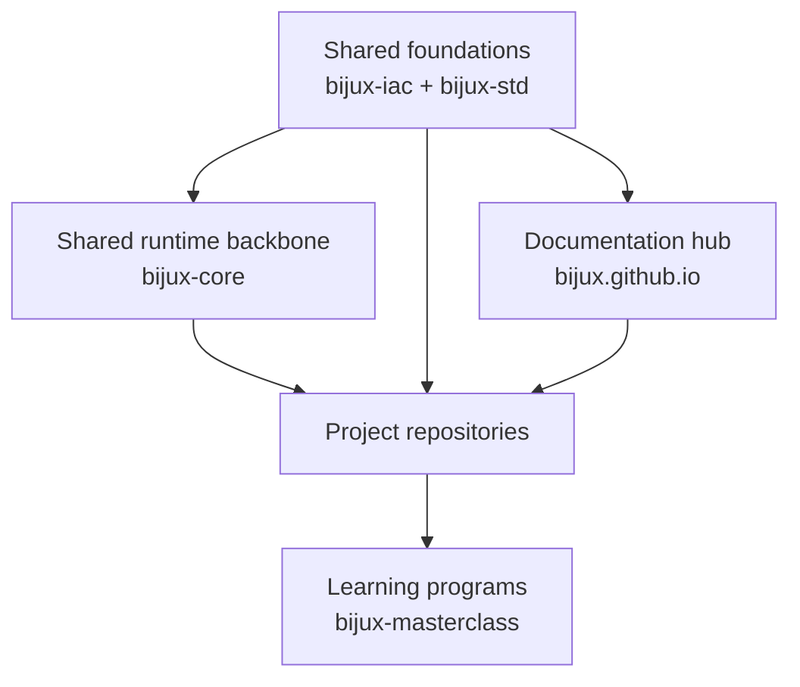

# System Map

<strong>Bijux reads more clearly as a layered system than as a list of repositories.</strong> Shared governance and shared standards sit underneath the repository family, `bijux-core` acts as the project backbone, and the documentation hub routes readers across the whole system.

Bijux is split this way because the work has to stay clear under real
pressure: long-lived maintenance, reproducibility, public delivery, and
evidence-heavy domain work. The simplest way to understand that shape
is to start with the layers and then move into the repositories.

In plain terms:

- `bijux-iac` governs GitHub
- `bijux-std` keeps shared behavior aligned
- `bijux-core` provides common runtime value across the project family
- `bijux.github.io` helps readers move between those layers
- projects and learning repositories consume those shared pieces while owning their own work

## Layered View

## Why The Family Is Split This Way

- long-lived repositories need stable ownership boundaries
- scientific and evidence-heavy work needs reproducibility and traceability
- public delivery needs clear routes, release discipline, and visible contracts
- learning works better when it grows from the same systems instead of detached notes

That is why governance, standards, runtime, projects, and learning are
separate layers instead of one mixed repository surface.

## What Each Layer Owns

| Layer | What it owns | Why it stays separate |
| --- | --- | --- |
| Shared foundations | GitHub governance and shared standards | keeps policy and shared behavior aligned before project-specific work begins |
| Hub | public orientation and documentation routing | keeps movement across the family clear without turning the hub into the source of the standards |
| Shared project backbone | runtime authority, CLI surfaces, DAG behavior, evidence, and release discipline | gives multiple repositories common execution behavior without forcing them into one codebase |
| Projects | knowledge systems, delivery interfaces, telecom services, genomics systems, and domain products | keeps implementation responsibility clear and local |
| Learning | course books, deep dives, capstones, and reusable technical explanation | turns the same engineering language into teachable material |

## Repository Roles At A Glance

| Repository | Main job | Best first read |
| --- | --- | --- |
| `bijux-iac` | GitHub control-plane governance | [Bijux Infrastructure-as-Code](../../02-bijux-iac/index.md) |
| `bijux-std` | shared standards and shell continuity | [Bijux Standards](../../03-bijux-std/index.md) |
| `bijux.github.io` | public orientation and route design | [Home](../../index.md) |
| `bijux-core` | shared runtime backbone | [Bijux Core](../../04-projects/bijux-core/index.md) |
| `bijux-canon` | knowledge-system orchestration | [Bijux Canon](../../04-projects/bijux-canon/index.md) |
| `bijux-atlas` | delivery interfaces and published surfaces | [Bijux Atlas](../../04-projects/bijux-atlas/index.md) |
| `bijux-telecom` and `bijux-genomics` | service and Rust domain systems built on shared layers | [Projects](../../04-projects/index.md) |
| `bijux-proteomics` and `bijux-pollenomics` | domain-heavy scientific product work | [Applied domains](../applied-domains/index.md) |
| `bijux-masterclass` | learning programs and capstones | [Learning](../../05-learning/index.md) |

## Where Pressure Shows Up

| Pressure | What it changes |
| --- | --- |
| long-lived maintenance | repository ownership and change authority must stay explicit |
| scientific workflows | reproducibility and evidence lineage must remain visible |
| public delivery | docs, APIs, releases, and datasets must behave like maintained surfaces |
| cross-site documentation | navigation continuity has to stay shared while content stays local |

## How To Read The Map

1. start with the shared foundations
2. move to `bijux-core` for the shared runtime story
3. move to the project repositories for delivery, knowledge, service, or domain work
4. move to Masterclass for the program layer

## What To Open Next

| If you want to inspect... | Open |
| --- | --- |
| the project split at a glance | [this system map](index.md) |
| public delivery and operated outputs | [Delivery surfaces](../delivery-surfaces/index.md) |
| shared docs behavior across sites | [Documentation network](../documentation-network/index.md) |
| domain-heavy work under scientific pressure | [Applied domains](../applied-domains/index.md) |
| recurring engineering habits across the family | [Work qualities](../work-qualities/index.md) |
