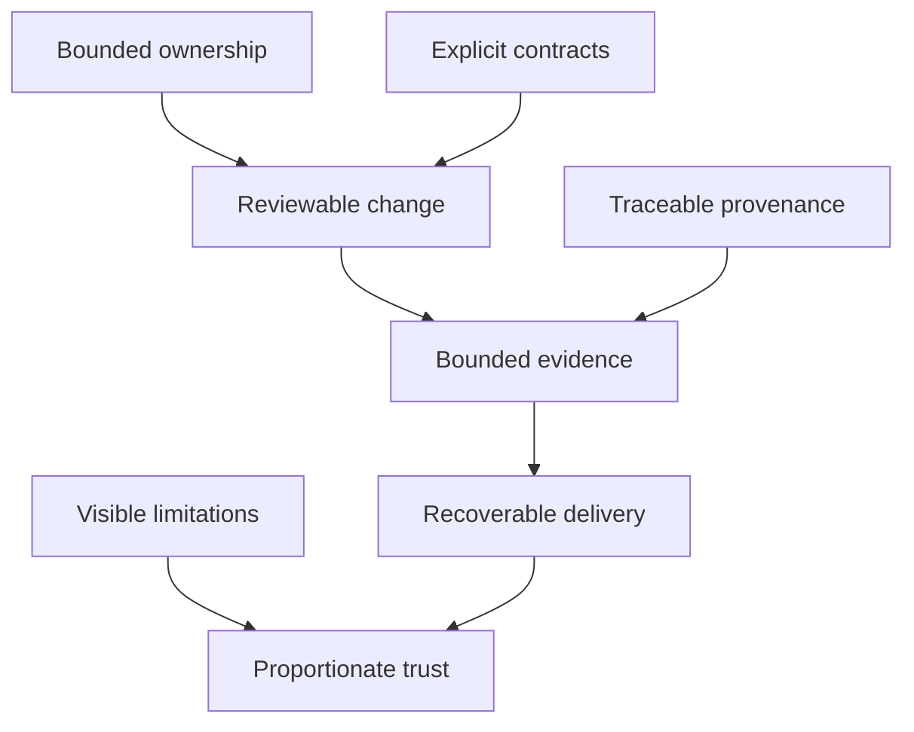
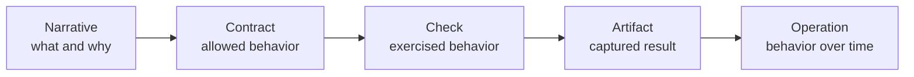

# Engineering Qualities

The Bijux repository family is designed around qualities that can be inspected,
not adjectives that must be taken on trust. Each quality has observable
evidence, a clear failure mode, and an owner capable of correcting it.

## Quality Model

## Observable Qualities

| Quality | Observable evidence | Contradicting signal |
| --- | --- | --- |
| bounded ownership | a repository, package, or workflow has a named authority and explicit exclusions | the same rule is independently redefined in multiple repositories |
| explicit contracts | interfaces are versioned and testable | behavior depends on undocumented local convention |
| deterministic identity | the same inputs and parameters resolve to a stable artifact, dataset, or execution identity | mutable labels are the only way to identify results |
| traceable provenance | outputs retain source, transformation, version, and evidence relationships | a public result cannot be reconstructed or attributed |
| bounded evidence | a check or report states exactly which claim and topology it covers | one green check is used to imply universal readiness |
| recoverable delivery | rollback, restore, or reconstruction has an owned path and coherent state boundary | publication is possible but reversal or recovery is undefined |
| visible limitations | unsupported states, missing evidence, and known exceptions are stated near the claim | documentation hides gaps behind future-tense confidence |
| explainable depth | architecture can be followed from overview to contract to runnable or inspectable proof | every page repeats the same summary without deeper evidence |

## Evidence Is Layered

Evidence becomes stronger as it moves closer to the claim, but different
layers answer different questions.

- A narrative makes the intent understandable.
- A contract makes behavior testable.
- A check records an exercised condition.
- An artifact preserves the result and identity.
- Operational evidence shows behavior across change, failure, or recovery.

No layer should claim the proof of a layer it has not reached.

## Review By Question

### Who owns the meaning?

Repository and package boundaries should reveal where semantics are decided.
Shared standards may constrain format, but product meaning remains local.

### What establishes identity?

Look for immutable versions, fingerprints, manifests, or content-derived
identities. Names such as “latest” are useful pointers, not sufficient evidence.

### What happens on failure?

Look for explicit rejection, partial-state prevention, rollback, recovery, and
evidence preservation. A happy-path diagram is incomplete without the boundary
where processing stops.

### Which claim was actually exercised?

Read the topology, inputs, profile, and result together. A local dependency
fixture and a production deployment are different evidence classes even when
they use the same API.

### What remains unknown?

Strong documentation exposes missing automation, unexecuted scenarios,
unsupported compatibility, and unverified assumptions. Unknowns are part of
the trust model, not editorial defects to conceal.

## How The Qualities Appear

| Surface | Qualities under the most pressure |
| --- | --- |
| GitHub control plane | bounded ownership, reviewable change, drift detection, and reversibility |
| shared standards | canonical source, deterministic synchronization, contract validation, and local exceptions |
| execution runtime | explicit semantics, deterministic identity, replay, and evidence capture |
| knowledge system | source normalization, index contracts, reasoning boundaries, and controlled acceptance |
| data service | identity, authorization, cache authority, failure isolation, load evidence, and recovery |
| scientific product | curation, provenance, method, uncertainty, interpretation, and reproducible publication |
| learning program | prerequisites, progression, runnable work, feedback, and capstone evidence |

## Trust Is Proportionate

The goal is not to make every surface look finished. It is to make the current
state legible enough that a reader can distinguish:

- implemented behavior from an architectural direction;
- generated evidence from an empty schema or example;
- local qualification from production qualification;
- a reversible pointer change from a complete backup and restore system;
- a scientific signal from a general conclusion.

Continue with [Delivery Surfaces](../delivery-surfaces/index.md) to follow these
qualities into published outputs or [Applied Domains](../applied-domains/index.md)
to see their scientific consequences.
