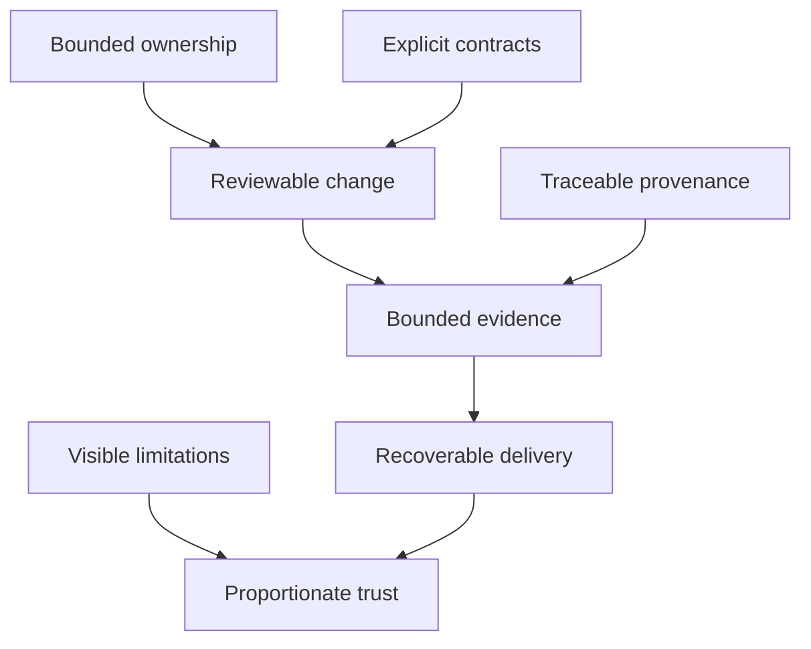
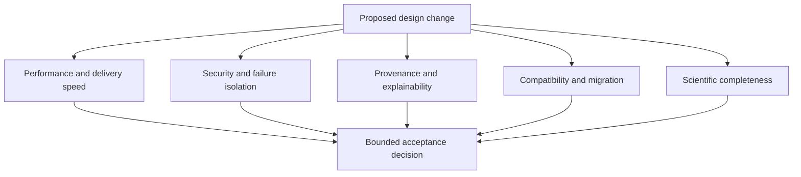
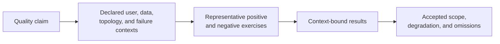
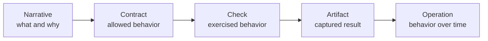
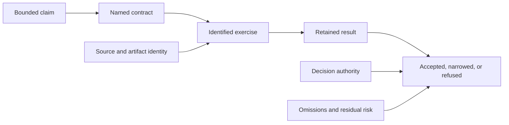

# Engineering Qualities

The Bijux repository family is designed around qualities that can be inspected,
not adjectives that must be taken on trust. Each quality has observable
evidence, a clear failure mode, and an owner capable of correcting it.

## Quality Model

## Observable Qualities

| Quality | Observable evidence | Contradicting signal |
| --- | --- | --- |
| bounded ownership | a repository, package, or workflow has a named authority and explicit exclusions | the same rule is independently redefined in multiple repositories |
| explicit contracts | interfaces are versioned and testable | behavior depends on undocumented local convention |
| deterministic identity | the same inputs and parameters resolve to a stable artifact, dataset, or execution identity | mutable labels are the only way to identify results |
| traceable provenance | outputs retain source, transformation, version, and evidence relationships | a public result cannot be reconstructed or attributed |
| bounded evidence | a check or report states exactly which claim and topology it covers | one green check is used to imply universal readiness |
| recoverable delivery | rollback, restore, or reconstruction has an owned path and coherent state boundary | publication is possible but reversal or recovery is undefined |
| visible limitations | unsupported states, missing evidence, and known exceptions are stated near the claim | documentation hides gaps behind future-tense confidence |
| explainable depth | architecture can be followed from overview to contract to runnable or inspectable proof | every page repeats the same summary without deeper evidence |
| accessible use | meaning, navigation, status, and recovery remain available across keyboard, assistive, zoom, contrast, and reduced-motion needs | a technically present capability depends on visual position, color, pointer use, or hidden context |
| privacy-preserving evidence | retained observations are necessary, purpose-bound, access-controlled, and safe to disclose at their publication surface | trust evidence exposes secrets, personal data, sensitive locality, or unrelated behavior |

## Define Acceptance And Degradation For Each Quality

A quality becomes operational when a reviewer can name its acceptance rule,
degradation signal, and recovery owner.

| Quality | Acceptance question | Degradation signal | Recovery evidence |
| --- | --- | --- | --- |
| ownership | can every consequential decision resolve to one canonical owner and explicit consumers? | duplicated policy, shadow implementations, or unowned adapters | corrected ownership map and consumer migration |
| compatibility | can supported callers identify what remains stable and how incompatible change is introduced? | aliases diverge, schemas change silently, or old artifacts load ambiguously | compatibility matrix, migration proof, and preserved prior identity |
| reproducibility | can the declared inputs, configuration, environment, execution, and outputs be reconstructed and compared? | success depends on ambient state, mutable labels, or missing artifacts | independent reconstruction with a bounded comparison verdict |
| security | does the named enforcement point allow and deny the expected identities and operations? | policy exists without effective-state or negative-path evidence | remediated control, revoked authority, and repeated allowed/denied exercises |
| operability | can operators observe pressure, distinguish dependencies, and recover identified state? | readiness is the only signal or recovery is procedural only | workload-bound observations and executed recovery result |
| scientific integrity | do sources, rejected populations, methods, checks, verdicts, and limitations remain joined? | polished outputs omit exclusions, contradictions, or denominator | corrected evidence graph and claim-specific revalidation |
| documentation integrity | can a reader move from claim to owner, contract, evidence, limitation, and source? | formulaic pages, vague links, duplicated handbooks, or stale capability language | strict build plus source-to-claim review and destination confirmation |
| accessibility | can readers reach and interpret the same consequential state through semantic, keyboard, reflow, contrast, and non-visual paths? | focus traps, visual-only status, unexplained diagrams, clipped content, or motion-dependent meaning | repaired semantic and interaction path plus representative rendered checks |
| privacy | does every retained or published field have a declared purpose, audience, and disclosure boundary? | diagnostics, examples, maps, or evidence packets expose unnecessary sensitive context | containment, minimization, corrected publication, and affected-consumer review |

Acceptance is scoped. A service can meet its availability boundary while
failing scientific freshness; a package can preserve API compatibility while
changing performance. Quality evidence must retain the dimension being judged.

## Understand Quality Tensions

Improving one quality can damage another when the tradeoff is hidden.

Examples include:

- caching can improve latency while hiding source freshness or authorization
  mistakes unless authority remains outside the cache;
- aggressive parallelism can improve throughput while destroying deterministic
  ordering, failure attribution, or resource isolation;
- strict schema evolution can protect compatibility while delaying a necessary
  correction unless explicit versioning and migration are available;
- evidence compression can improve report usability while erasing rare
  failures, rejected populations, or contradictory sources;
- centralized standards can reduce drift while taking product semantics away
  from the repository that understands them.

The decision record should state the improved dimension, the pressure placed
on adjacent qualities, the evidence used to accept the tradeoff, and the
trigger that reopens it.

## Qualify Efficiency Without Hiding Demand

Efficiency is the amount of correct, useful work produced for the resources
and external pressure consumed. A faster response is not automatically more
efficient when it requires disproportionate memory, storage, network calls,
operator attention, or downstream retries.

| Evidence dimension | Record with the result | Misleading shortcut |
| --- | --- | --- |
| admitted demand | operation classes, arrival shape, concurrency, payload distribution, and rejected work | reporting only completed requests |
| useful work | correct terminal outcomes and the population they represent | counting retries or duplicate work as throughput |
| resource pressure | CPU, memory, storage, file descriptors, queue depth, and network activity | naming instance size without observed utilization |
| dependency amplification | calls, bytes, retries, and fan-out per admitted operation | attributing all latency to the local process |
| economic boundary | priced resources, retention, transfer, and observation window where cost matters | presenting an unscoped currency total as a portable property |

Compare systems at equivalent correctness, workload, topology, and evidence
coverage. A change that lowers median latency while moving failures into a
queue, cache, or external service has redistributed pressure; it has not yet
demonstrated an efficiency improvement. Cost evidence is environment- and
time-bound, while resource ratios can remain useful across pricing changes.

## Evaluate Quality Across Reader And Operator Contexts

A quality claim made for one access path does not automatically transfer to
another. The same content or service may behave differently for a direct-link
reader, a keyboard user, a narrow viewport, a cold cache, an unauthenticated
caller, an operator during dependency loss, or a researcher working with
restricted evidence.

Qualification should name the representative contexts, why they matter, which
were exercised, and which remain outside the claim. Sampling every possible
combination is rarely practical; omitting the context model entirely makes a
single convenient path look universal.

Representative coverage is a review decision, not a count of screenshots or
test cases. It should prioritize consequential differences in authority,
disclosure, interaction, topology, and failure behavior.

## Evidence Is Layered

Evidence becomes stronger as it moves closer to the claim, but different
layers answer different questions.

- A narrative makes the intent understandable.
- A contract makes behavior testable.
- A check records an exercised condition.
- An artifact preserves the result and identity.
- Operational evidence shows behavior across change, failure, or recovery.

No layer should claim the proof of a layer it has not reached.

## Evidence Must Be Joinable

Evidence is useful only when a reader can connect it to the claim, revision,
configuration, and owner it qualifies.

An isolated badge, screenshot, or benchmark number is not a complete evidence
record. The join must survive after the original operator is unavailable.

| Required join | Question it preserves |
| --- | --- |
| claim → contract | which behavior was promised? |
| contract → exercise | which part of the promise was tested? |
| exercise → revision | which source, data, environment, and configuration ran? |
| result → decision | why was the evidence accepted, narrowed, or refused? |
| decision → owner | who had authority to make that determination? |
| decision → limitation | what must not be inferred from the result? |

## Review By Question

### Who owns the meaning?

Repository and package boundaries should reveal where semantics are decided.
Shared standards may constrain format, but product meaning remains local.

### What establishes identity?

Look for immutable versions, fingerprints, manifests, or content-derived
identities. Names such as “latest” are useful pointers, not sufficient evidence.

### What happens on failure?

Look for explicit rejection, partial-state prevention, rollback, recovery, and
evidence preservation. A happy-path diagram is incomplete without the boundary
where processing stops.

### Which claim was actually exercised?

Read the topology, inputs, profile, and result together. A local dependency
fixture and a production deployment are different evidence classes even when
they use the same API.

### What remains unknown?

Strong documentation exposes missing automation, unexecuted scenarios,
unsupported compatibility, and unverified assumptions. Unknowns are part of
the trust model, not editorial defects to conceal.

## How The Qualities Appear

| Surface | Qualities under the most pressure |
| --- | --- |
| GitHub control plane | bounded ownership, reviewable change, drift detection, and reversibility |
| shared standards | canonical source, deterministic synchronization, contract validation, and local exceptions |
| execution runtime | explicit semantics, deterministic identity, replay, and evidence capture |
| knowledge system | source normalization, index contracts, reasoning boundaries, and controlled acceptance |
| data service | identity, authorization, cache authority, failure isolation, load evidence, and recovery |
| scientific product | curation, provenance, method, uncertainty, interpretation, and reproducible publication |
| learning program | prerequisites, progression, runnable work, feedback, and capstone evidence |

## Trust Is Proportionate

The goal is not to make every surface look finished. It is to make the current
state legible enough that a reader can distinguish:

- implemented behavior from an architectural direction;
- generated evidence from an empty schema or example;
- local qualification from production qualification;
- a reversible pointer change from a complete backup and restore system;
- a scientific signal from a general conclusion.

## Signals That Reduce Trust

Certain patterns are evidence problems even when every sentence is technically
true:

- a capability list with no distinction between stable, experimental,
  simulated, internal, and unavailable behavior;
- a performance result without workload, topology, configuration, or raw
  measurements;
- a reproducibility claim based only on repeated command success;
- a security claim that names policy but not enforcement;
- a scientific result whose rejected population or denominator is absent;
- a recovery claim supported by a procedure that has not been exercised;
- several repositories claiming ownership of the same canonical rule.

The remedy is not stronger prose. It is a narrower claim connected to better
identity, evidence, and ownership.

Continue with [Delivery Surfaces](../delivery-surfaces/index.md) to follow these
qualities into published outputs or [Applied Domains](../applied-domains/index.md)
to see their scientific consequences.
