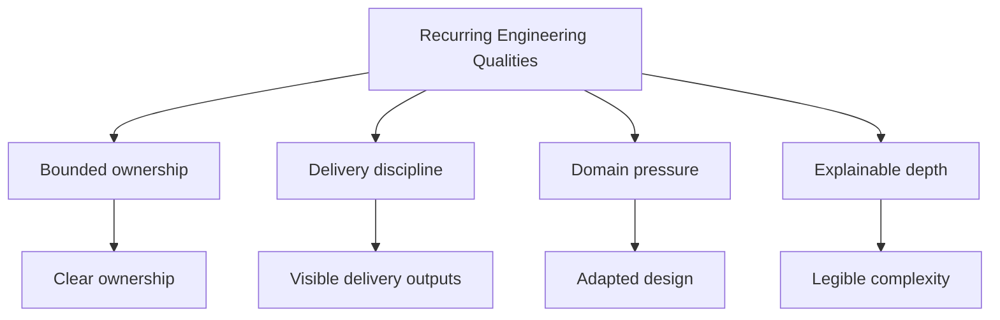

# Recurring Engineering Qualities

Recurring engineering patterns across Bijux repositories. These are the
habits that recur across ownership, delivery, domain adaptation, and
learning continuity.

## Qualities Map

## Canonical Qualities

| Quality | Verification question | Evidence anchors |
| --- | --- | --- |
| Bounded ownership | Are responsibilities split cleanly so repository boundaries stay non-overlapping under change? | [System map](../system-map/index.md) |
| Delivery discipline and standards continuity | Are documentation, release behavior, publication routes, and shared standards kept aligned across repositories? | [Delivery surfaces](../delivery-surfaces/index.md) |
| Domain pressure handling | Does the structure stay coherent when scientific workflows and evidence-heavy interpretation are required? | [Applied domains](../applied-domains/index.md) |
| Explainable depth | Can architecture and workflow decisions be taught with runnable materials instead of only summaries? | [Learning catalog](../../05-learning/index.md) |

Shared continuity is enforced through the standards layer in
[Bijux standard layer](../../03-bijux-std/index.md), not only by local repository
habits.

## Failure Signals When A Quality Is Missing

| Quality | Concrete failure signal | Where to inspect the opposite |
| --- | --- | --- |
| Bounded ownership | one repository starts absorbing runtime, delivery, and domain concerns in the same change stream | [System map](../system-map/index.md) |
| Delivery discipline | docs promise routes or release behavior that cannot be matched to maintained automation and destinations | [Delivery surfaces](../delivery-surfaces/index.md), [Public surface](../public-surface/index.md) |
| Domain pressure handling | scientific workflows are carried by one-off scripts with weak evidence or publication contracts | [Applied domains](../applied-domains/index.md), [Bijux Proteomics](../../04-projects/bijux-proteomics/index.md), [Bijux Pollenomics](../../04-projects/bijux-pollenomics/index.md) |
| Explainable depth | teaching material becomes disconnected from runnable artifacts and repository trade-offs | [Learning catalog](../../05-learning/index.md), [Reproducible Research](../../05-learning/reproducible-research/index.md) |

## Why These Qualities Recur

  
<h3>Bounded Ownership</h3>
Clear repository boundaries are costly to maintain unless they reflect real ownership. They are one of the fastest ways to distinguish systems thinking from namespace inflation.

  
<h3>Delivery Discipline</h3>
A strong public surface routes into maintained documentation, published endpoints, automation, and operating rules. Delivery should be visible before anyone asks for private context.

  
<h3>Domain Pressure Handling</h3>
Infrastructure alone is not enough. Technical judgment is easier to inspect when it survives proteomics, pollenomics, evidence mapping, and scientific workflow constraints.

  
<h3>Explainable Depth</h3>
Engineers who can teach architecture, workflow discipline, and programming design usually understand the systems well enough to build and evolve them cleanly.

## Why They Recur

These qualities function as engineering standards rather than style
preferences. Bounded ownership, delivery discipline, domain pressure
handling, and explainable depth are the conditions under which software
becomes easier to trust, review, and evolve across the full repository
family.
