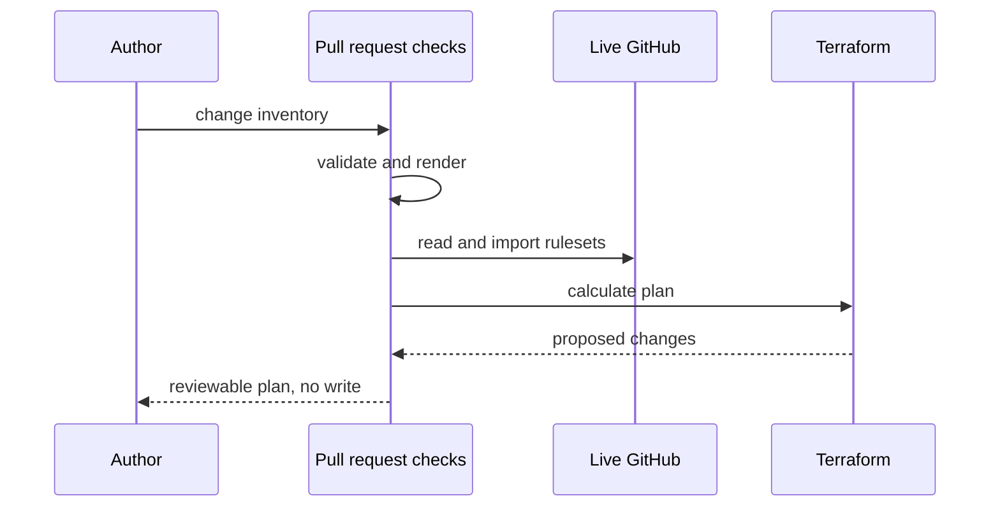
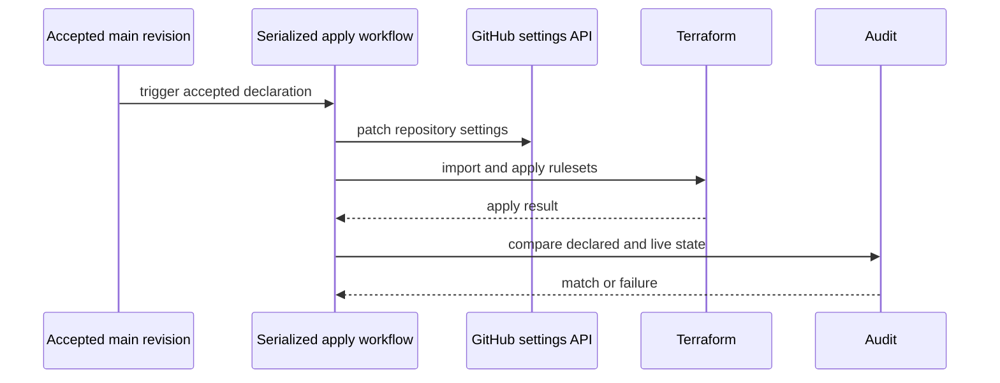

# Governance Model

The `bijux-iac` governance model separates declaration, planning, application,
and audit. Each stage answers a different question and holds different write
authority.

## Control-Plane Stages

| Stage | Question | State access | Result |
| --- | --- | --- | --- |
| inventory validation | Is the declared family complete and structurally valid? | committed source only | validated inventory or explicit rejection |
| deterministic rendering | Do committed Terraform inputs equal the inventory projection? | committed source only | reviewable target set |
| plan | What would change relative to imported live rulesets? | read live state; no governance write | Terraform plan and validation evidence |
| apply | Can the accepted declaration be made active without racing another writer? | repository-administration write | updated settings and rulesets |
| audit | Does live GitHub state now equal the declaration? | read live state | equality evidence or drift failure |

## Plan Before Write

Planning against imported live resources matters because an empty local state
would otherwise describe existing rulesets as new. Import failure is a hard
stop, not permission to create around unknown state.

## Serialized Apply

The workflow concurrency group permits one governance apply at a time. This is
an ownership control: two accepted revisions cannot concurrently rewrite the
same family settings and leave an ambiguous final state.

## Admission And Application Are Different

Repository-local policy workflows protect changes entering each repository.
`bijux-iac` applies the external settings that require those workflows. The two
surfaces reinforce each other but should not be confused:

- repository workflows expose named, reviewable check contexts;
- branch rulesets require those contexts before merge;
- the control plane audits that the requirements remain active;
- product checks remain owned by the product repository.

## Failure Policy

The governance path rejects rather than silently normalizes:

- a missing or duplicate family member;
- an obsolete or unexpected repository identity;
- an unsupported delivery state;
- generated Terraform inputs that do not match inventory;
- a missing required status context;
- a failed live-resource import;
- a difference between declared and active settings after apply.

The correct response is to reconcile source or live state. Weakening the
validator would destroy the evidence that the control plane exists to provide.

## Credential Boundary

Local tests and contract validation are network-free. Planning needs read
access to current governance state. Apply and live audit need administration
access across the governed repositories.

The administration token is a high-impact credential. Its safety depends on:

- protected secret storage;
- use only inside the controlled workflow path;
- absence from committed files and generated reports;
- serialized mutation;
- an immediate post-write audit;
- fail-closed behavior when state ownership cannot be established.

## What Audit Proves

The live audit proves equality for the settings and ruleset fields represented
by the inventory and audit implementation at the observed revision. It does
not prove:

- historical uptime of repository controls;
- product correctness behind a required check;
- organization settings outside the modeled scope;
- that a future manual administrator action cannot introduce new drift.

Continuous trust comes from repeating the audit after governed changes and
treating drift as an actionable failure.

Continue with [Repository Coverage](../repository-coverage/index.md) for the
governed family or [Bijux Standards](../../03-bijux-std/index.md) for the
separate shared-content authority.
