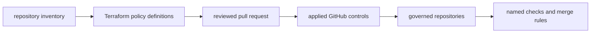

# Governance Model

The `bijux-iac` governance model is simple on purpose: repository
policy should be reviewed, versioned, and rolled out through the same
engineering discipline as source changes.

## Control-Plane Flow

## What This Model Enforces

- repository policy moves through pull requests instead of private admin edits
- branch protection and required checks are named and inspectable
- governance can be rolled out across repositories without hand-tuning each one
- the foundations are governed by the same review model as the consuming repositories

## What This Avoids

- direct `main` drift that only exists in GitHub settings
- different merge behavior across repositories with the same public posture
- undocumented exceptions that only make sense to the current maintainer
- governance logic hidden inside application repositories

## Why It Matters In Practice

When this model is visible, the rule has a home, changes have a path,
and the governed surfaces stay easier to trust over time.

## Continue Reading

- [Bijux Infrastructure-as-Code](../index.md)
- [System Map](../../01-platform/system-map/index.md)
- [Bijux Standards](../../03-bijux-std/index.md)
