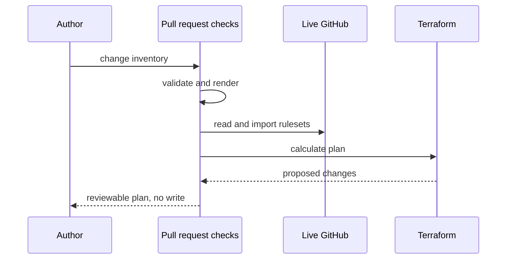
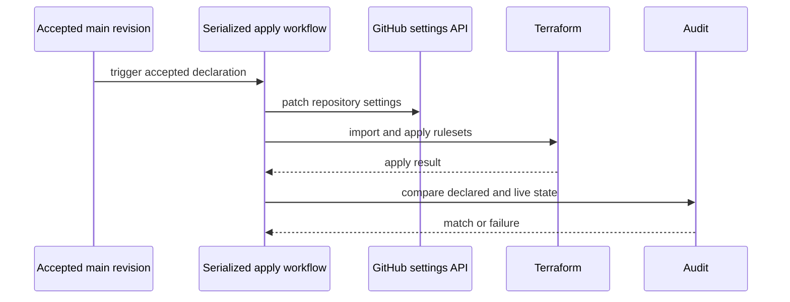
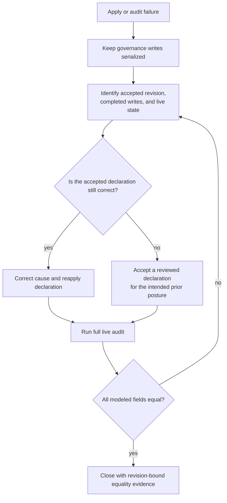
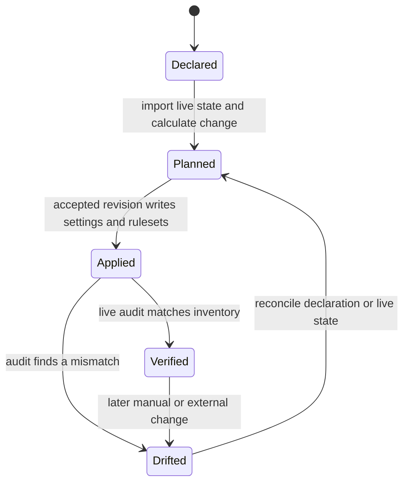
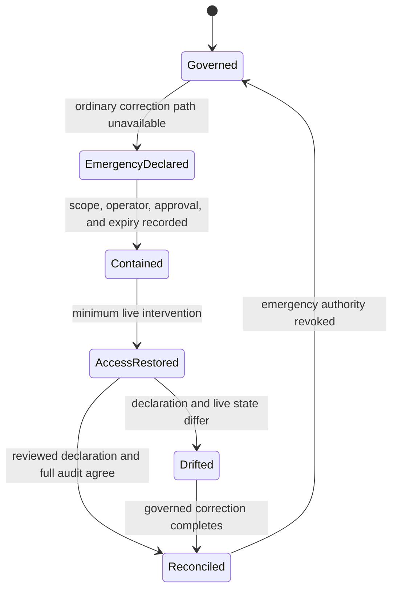

# Governance Model

The `bijux-iac` governance model separates declaration, planning, application,
and audit. Each stage answers a different question and holds different write
authority.

## Control-Plane Stages

| Stage | Question | State access | Result |
| --- | --- | --- | --- |
| inventory validation | Is the declared family complete and structurally valid? | committed source only | validated inventory or explicit rejection |
| deterministic rendering | Do committed Terraform inputs equal the inventory projection? | committed source only | reviewable target set |
| plan | What would change relative to imported live rulesets? | read live state; no governance write | Terraform plan and validation evidence |
| apply | Can the accepted declaration be made active without racing another writer? | repository-administration write | updated settings and rulesets |
| audit | Does live GitHub state now equal the declaration? | read live state | equality evidence or drift failure |

## Plan Before Write

Planning against imported live resources matters because an empty local state
would otherwise describe existing rulesets as new. Import failure is a hard
stop, not permission to create around unknown state.

## Serialized Apply

The workflow concurrency group permits one governance apply at a time. This is
an ownership control: two accepted revisions cannot concurrently rewrite the
same family settings and leave an ambiguous final state.

## Admission And Application Are Different

Repository-local policy workflows protect changes entering each repository.
`bijux-iac` applies the external settings that require those workflows. The two
surfaces reinforce each other but should not be confused:

- repository workflows expose named, reviewable check contexts;
- branch rulesets require those contexts before merge;
- the control plane audits that the requirements remain active;
- product checks remain owned by the product repository.

### Approval Is A Required Check

The default-branch ruleset requires pull requests but sets the native approving
review count to zero. Approval policy is enforced through the required
`policy / pr approval` workflow:

- an owner-authored pull request must carry `owner-self-signoff`;
- a non-owner pull request must have the owner's latest review state recorded
  as approved;
- labeling, new commits, review dismissal, and draft transitions rerun the
  policy check.

This separates merge mechanics from approval authority while retaining a
single required context that the control plane can audit across repositories.

## Failure Policy

The governance path rejects rather than silently normalizes:

- a missing or duplicate family member;
- an obsolete or unexpected repository identity;
- an unsupported delivery state;
- generated Terraform inputs that do not match inventory;
- a missing required status context;
- a failed live-resource import;
- a difference between declared and active settings after apply.

The correct response is to reconcile source or live state. Weakening the
validator would destroy the evidence that the control plane exists to provide.

## Partial Apply Recovery

Repository settings and Terraform-managed rulesets cross separate APIs. A
serialized workflow prevents competing writers, but it cannot turn those APIs
into one transaction. Recovery begins by observing the effective state rather
than assuming that every earlier step rolled back when a later step failed.

The choice is between two governed declarations, not between “forward” and an
unrecorded administrator edit. Forward correction is appropriate when the
accepted policy remains the intended policy. Restoring a prior posture first
requires that posture to be represented by a reviewed source revision. A
manual intervention may be necessary to recover access, but it creates drift
until the declaration and full audit agree again.

| Failure point | State that may already have changed | Recovery evidence |
| --- | --- | --- |
| before import or plan | none from this execution | corrected import or validation result |
| during settings writes | a subset of repository settings | live settings comparison across the declared family |
| during Terraform apply | settings and a subset of rulesets | imported rulesets plus full settings and ruleset audit |
| during post-apply audit | writes may be complete; equality is unknown | successful rerun of the complete live audit |

Retrying without classifying the failure can conceal a mixed state. A retry is
safe only after the operator knows which declaration remains authoritative,
why the previous execution failed, and whether prerequisites such as required
status contexts are actually available.

## Resolve Indeterminate Remote Outcomes Before Retrying

A timeout or interrupted runner does not prove that GitHub rejected a write.
The request may have failed before admission, completed without delivering its
response, or applied only part of a sequence. Blind retry can therefore turn
an observation failure into additional mutation.

| Observed outcome | Safe next evidence |
| --- | --- |
| explicit validation or authorization rejection | correct the declared input or authority; no state change should be inferred |
| explicit rate limit or service-unavailable response | preserve retry guidance, wait within policy, then re-observe live state before planning |
| connection loss before response | classify the write as indeterminate and read the affected control |
| runner cancellation during a write sequence | inventory every operation that could have started and audit the complete affected family |
| acknowledged write followed by audit mismatch | retain the request and response, stop further mutation, and reconcile declared versus effective state |

Backoff protects the remote service but is not a correctness strategy. A retry
is justified only after effective state shows that repeating the operation is
still required and the accepted declaration remains authoritative. Logs must
identify the operation without retaining administration credentials or
sensitive response material.

## Drift And Reconciliation

Drift is not automatically classified as malicious or accidental. The audit
establishes a mismatch; maintainers must decide whether the accepted inventory
or the live system is wrong, then reconcile through the governed path.

Repository settings and Terraform-managed rulesets are written through two
different APIs. The apply workflow serializes writers and audits afterward,
but it does not claim one cross-API transaction or automatic rollback. If a
later write fails after earlier settings changed, the failed workflow and live
audit boundary require explicit reconciliation.

## Reconciliation Closure

A governance incident is not closed when the corrective workflow merely
finishes. Closure requires a complete live audit against an identified
accepted revision and an explanation of the original mismatch. If recovery
changed the intended policy, the replacement declaration and its review are
part of the evidence chain.

The audit observation is time-bounded. A later administrator action can create
new drift, so the closure statement should say when the state was observed and
which modeled surfaces were compared. Unmodeled organization controls, secret
access, product check behavior, and historical continuity remain outside that
claim.

## Credential Boundary

Local tests and contract validation are network-free. Planning needs read
access to current governance state. Apply and live audit need administration
access across the governed repositories.

The administration token is a high-impact credential. Its safety depends on:

- protected secret storage;
- use only inside the controlled workflow path;
- absence from committed files and generated reports;
- serialized mutation;
- an immediate post-write audit;
- fail-closed behavior when state ownership cannot be established.

## Recover Through Explicit Emergency Authority

An ordinary apply path can become unavailable because a required check cannot
report, the workflow environment is inaccessible, a permission was removed,
or the ruleset itself blocks the correction. Emergency administration may be
necessary, but it is a distinct authority state—not an invisible shortcut
inside normal operations.

The emergency record should identify:

- the blocked ordinary path and consumer consequence;
- the exact repositories, settings, or rulesets in scope;
- who authorized and performed the intervention;
- the live state before and after the intervention;
- the expiry or revocation of elevated authority; and
- the accepted declaration and complete audit that closed the drift.

Emergency access should restore the governed path, not become a parallel
governance channel. A successful manual edit is containment evidence. Only a
reviewed declaration plus a matching full audit returns the affected controls
to ordinary governed state.

## Treat Audit Freshness As Dependency Freshness

An audit is an observation over a named target and field population. Its result
can become stale when the declaration, audit implementation, repository
membership, GitHub behavior, or live administration state changes.

| Change after audit | What must be reconsidered |
| --- | --- |
| inventory or rendered target changes | target population and expected field values |
| audit implementation changes | which fields and comparison semantics the prior result actually covered |
| repository transfer, rename, or archival | owner, target identity, residual rulesets, and credential reach |
| manual or external administration | equality for the affected repositories and fields |
| required workflow context changes | whether the protected path can still produce the required result |

Calendar recency alone is insufficient. A recent audit performed before a
material change cannot support the post-change state, while an older audit can
remain the latest valid observation only if no dependency that affects its
claim has changed.

## What Audit Proves

The live audit proves equality for the settings and ruleset fields represented
by the inventory and audit implementation at the observed revision. It does
not prove:

- historical uptime of repository controls;
- product correctness behind a required check;
- organization settings outside the modeled scope;
- that a future manual administrator action cannot introduce new drift.

Continuous trust comes from repeating the audit after governed changes and
treating drift as an actionable failure.

Continue with [Repository Coverage](../repository-coverage/index.md) for the
governed family or [Bijux Standards](../../03-bijux-std/index.md) for the
separate shared-content authority.
