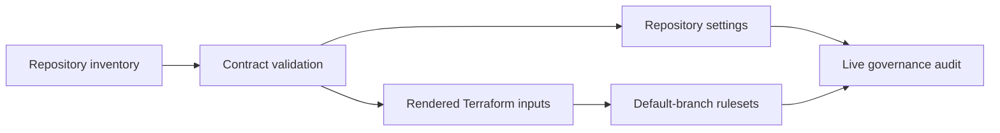
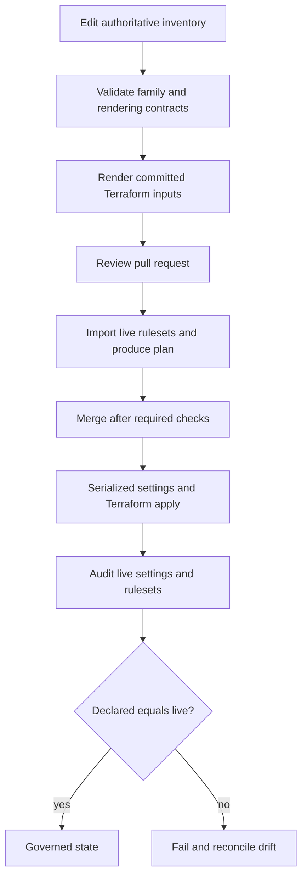
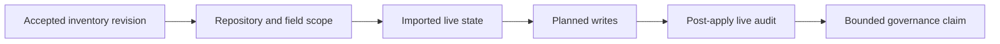

# Bijux Infrastructure-as-Code

`bijux-iac` is the live GitHub governance control plane for the Bijux
repository family. It turns a reviewed twelve-repository inventory into
repository settings and default-branch rulesets, then audits GitHub to verify
that the declared policy is active.

<a class="md-button md-button--primary" href="https://github.com/bijux/bijux-iac">Inspect the control-plane source</a>
<a class="md-button" href="governance-model/">Follow plan, apply, and audit</a>
<a class="md-button" href="repository-coverage/">See governed coverage</a>

## Why A Control Plane Exists

Repository settings affect every accepted change, yet settings changed only in
an administration interface are difficult to review, reproduce, or compare.
They can drift without leaving a useful source history.

`bijux-iac` gives that state a versioned path:

The inventory is authoritative. Generated Terraform inputs are committed so a
pull request reveals the exact target set before an apply can write to GitHub.

## Owned Surfaces

| Surface | Control-plane responsibility |
| --- | --- |
| repository identity and classification | maintain the complete family, stack, and delivery-state contract |
| repository settings | visibility, features, merge behavior, branch deletion, and related administration |
| default-branch rulesets | pull-request requirement, review behavior, required checks, and destructive-action restrictions |
| change planning | validate and import live resources before showing the proposed Terraform change |
| change application | serialize writes, apply settings and rulesets, and stop on failed imports |
| live audit | compare declared inventory with active GitHub settings and rulesets |

## Ownership Boundary

`bijux-iac` owns controls that act on repositories from the outside. It does
not own:

- shared workflow, Make, check, or documentation-shell source; those belong to
  `bijux-std`;
- runtime, package, dataset, or domain behavior; those belong to product
  repositories;
- the hub's public information architecture; that belongs to
  `bijux.github.io`.

The control-plane repository consumes managed standards for its own repository
just like other consumers. Being the governance authority does not make it the
standards authority.

## Default-Branch Baseline

All managed repositories use an active ruleset for the default branch. The
baseline requires:

- pull requests before changes enter `main`;
- merge commits as the allowed merge method;
- dismissal of stale reviews after new commits;
- resolution of review conversations;
- strict required status checks;
- rejection of force pushes and default-branch deletion.

The family baseline names four required contexts:

- `policy / github`;
- `policy / pr approval`;
- `std / standard`;
- `std / report`.

Repository-specific checks can extend the baseline when they run reliably for
that repository.

The native ruleset approval count is zero because approval authority is
enforced by the required `policy / pr approval` context. Owner-authored pull
requests require the `owner-self-signoff` label; other pull requests require
the owner's latest review state to be approved. Keeping this rule in a named
check makes both paths explicit instead of pretending that an owner can submit
a separate approval review on their own pull request.

## Change Path

The apply path does not use a persistent Terraform backend. It imports live
resources into ephemeral runner state for each execution. This avoids a
separate state store, but makes successful import mandatory: the workflow
stops rather than attempting a write against unowned state.

## Change-Set Identity

A governance change is reviewable only when its scope can be named before it
writes. The accepted source revision anchors that identity. Its inventory diff,
rendered targets, imported live state, and Terraform plan answer four distinct
questions:

| Evidence | Question answered |
| --- | --- |
| accepted inventory revision | which declaration authorized the change? |
| repository and field diff | which members and modeled controls can move? |
| imported live resources | what state did planning observe? |
| Terraform plan and settings inputs | what writes were expected? |
| post-apply audit | which declared controls are active after the write? |

The plan is therefore a blast-radius document, not merely a green check. A
family-wide default change and a one-repository extension may use the same
workflow, but they do not carry the same operational risk. Review should call
out the affected repositories, shared fields, repository-specific fields, and
any newly introduced required context. A required context must be available on
the protected path before governance makes it mandatory.

None of these records substitutes for another. In particular, a plan cannot
prove the later write, and a successful apply step cannot prove final equality.

## Security Boundary

Read-only validation and planning use narrower permissions than live
administration. Apply and audit require a GitHub token with repository
administration permission across the governed family. That credential is read
from the protected workflow environment; it does not belong in inventory,
Terraform variables, shell history, or generated artifacts.

Serialization prevents two governance applies from racing. Validation fails
closed on unknown repositories, missing checks, malformed settings, generated
input drift, failed resource imports, or differences between declared and live
state.

## Evidence And Limits

A passing local contract suite proves inventory and rendering behavior without
writing to GitHub. A Terraform plan proves the proposed change against imported
state. Only the post-apply live audit compares the accepted declaration with
active GitHub settings.

The control plane governs GitHub repository admission and settings. It does not
establish the correctness, availability, or scientific validity of a product
delivered from those repositories.

When an apply fails, its evidence remains useful even though it cannot support
an active-governance claim. The accepted revision, completed write steps,
failed step, and live audit delimit the state that must be reconciled. The
closure evidence is a later audit at a named revision—not the absence of a new
workflow error.

## Governance Claim Ladder

| Claim | Minimum evidence | What it does not prove |
| --- | --- | --- |
| the inventory is structurally valid | network-free contract tests and deterministic rendering | that GitHub currently matches the declaration |
| a proposed ruleset change is known | import of live resources and a Terraform plan | that the change was applied |
| an apply workflow completed | settings patch and Terraform apply results | that every modeled field now equals the declaration |
| governance is active as declared | post-apply live audit at an identified revision | historical continuity or future freedom from manual drift |

The strongest governance statement therefore needs the live audit. A local
green check is necessary source evidence, not evidence of active GitHub state.

Continue with [Governance Model](governance-model/index.md) for the evidence
boundaries or [Repository Coverage](repository-coverage/index.md) for the
current family contract.
