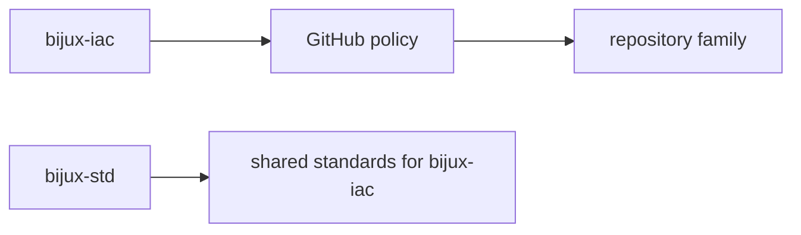

# Bijux Infrastructure-as-Code

`bijux-iac` is the live GitHub control-plane repository for the Bijux
repository family.

`iac` stands for `Infrastructure-as-Code`.

Here that means GitHub administration is declared, reviewed, and
applied in code instead of being left to hidden settings pages.

It explains the part of the Bijux system that acts on repositories from
the outside. It is the control plane for the family, not another
product repository.

## Why It Matters

Strong repository architecture is harder to trust when merge rules,
required checks, and protection models only exist as invisible admin
settings.

`bijux-iac` brings those controls into view:

- repository governance is declared in source
- control-plane changes follow the same review path as the repositories they govern
- `main` protection, required checks, and policy rollout stop being private context

## What You See Quickly

| If you open... | What becomes clear |
| --- | --- |
| repository inventory and policy surfaces | governance is being treated as an owned system, not as scattered settings |
| Terraform-managed GitHub controls | the family is designed to scale without losing review discipline |
| the relationship to `bijux-std` | control-plane policy and shared repository content are separated on purpose |

## What It Owns

`bijux-iac` owns the settings that act on repositories from the outside.

That includes:

- branch protection and merge rules
- required status checks
- repository governance inventory
- Terraform-managed GitHub policy surfaces
- the GitHub control plane applied across the Bijux repository family

## What It Does Not Own

`bijux-iac` does not own the files that repositories synchronize into
themselves. Those belong to `bijux-std`.

The split is direct:

- `bijux-iac` owns live GitHub control-plane policy
- `bijux-std` owns shared repository content
- `bijux-iac` still consumes shared standards from `bijux-std` like the other repositories

## What It Changes Across The Family

When `bijux-iac` is doing its job well:

- repositories inherit the same merge discipline instead of drifting apart
- shared foundations stay governed by the same rules as consuming repositories
- rollout decisions become visible and reversible
- platform standards can be enforced without pretending governance is part of product code

## How It Fits

In practice:

- `bijux-iac` decides how repositories are governed in GitHub
- `bijux-std` decides which shared files and shared checks stay aligned
- each repository still owns its own product, runtime, domain, or learning work

## Current Scope

Right now `bijux-iac` starts with `main` branch protection for the
public Bijux repositories. The scope is intentionally narrow: establish
the control plane first, then expand into more GitHub governance
surfaces over time.

## Read This Next

- [Governance Model](governance-model/index.md)
- [Repository Coverage](repository-coverage/index.md)

## Where To Go Next

- [Platform overview](../01-platform/index.md)
- [System map](../01-platform/system-map/index.md)
- [Bijux standard layer](../03-bijux-std/index.md)
