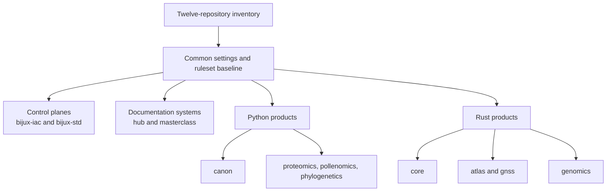
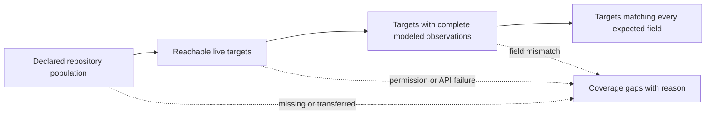
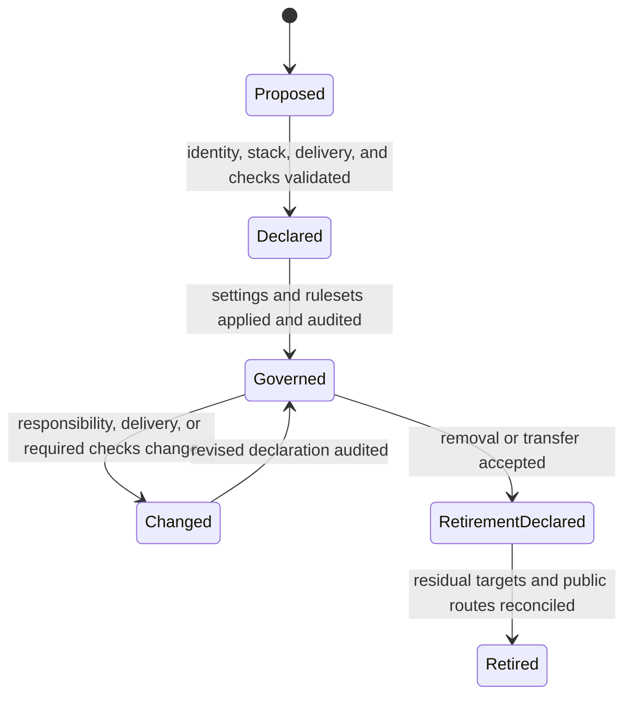

# Repository Coverage

The `bijux-iac` inventory models twelve repositories as one governed family.
Coverage includes repository identity, stack classification, delivery state,
settings, baseline checks, and default-branch ruleset inputs.

## Governed Family

| Repository | Stack | Responsibility | Documentation | Packages |
| --- | --- | --- | --- | --- |
| `bijux-iac` | Terraform | GitHub control plane | not applicable | not applicable |
| `bijux-std` | Make | shared standards control plane | not applicable | not applicable |
| `bijux.github.io` | Docs | public family hub | published | not applicable |
| `bijux-masterclass` | Docs | engineering programs | published | not applicable |
| `bijux-canon` | Python | knowledge-system product | published | published |
| `bijux-proteomics` | Python | proteomics product | published | published |
| `bijux-pollenomics` | Python | pollen-evidence product | published | published |
| `bijux-phylogenetics` | Python | phylogenetics product | published | published |
| `bijux-core` | Rust | execution backbone | published | published |
| `bijux-atlas` | Rust | data-service product | published | published |
| `bijux-gnss` | Rust | GNSS product | published | published |
| `bijux-genomics` | Rust | genomics product | planned | planned |

Delivery state is governance metadata, not promotional language:

- **published** means the public surface exists;
- **planned** means the repository is governed but that delivery surface is not
  yet represented as published;
- **not applicable** means the repository does not own that surface.

## Coverage Topology

Grouping describes operational similarity; it does not replace individual
repository ownership or authorize a group to share product semantics.

## Inventory Contracts

Validation rejects a family declaration when:

- a required member is missing or duplicated;
- a repository carries the wrong stable name or stack;
- delivery metadata uses an unsupported state;
- repository settings fail the shared schema;
- required check declarations are incomplete;
- rendered Terraform input differs from inventory.

This is particularly important for durable identity. Renames and obsolete
repository labels must not re-enter governance through an old script or local
list.

## Coverage Has Several Axes

One repository row carries multiple independent governance claims.

| Axis | Inventory meaning | Live evidence |
| --- | --- | --- |
| identity | stable repository name and family membership | repository exists under the governed owner |
| classification | stack and responsibility used by family contracts | validated inventory value; not inferred from file extensions |
| delivery | documentation and package state | declared `published`, `planned`, or `not-applicable` posture |
| settings | feature, merge, visibility, and branch-cleanup policy | GitHub repository fields equal the merged defaults and overrides |
| admission | baseline and repository-specific required checks | active default-branch ruleset has the exact expected contexts |
| destructive protection | default branch cannot be deleted or force-pushed | active deletion and non-fast-forward rules |

“Covered” means these modeled axes are declared and auditable. It does not mean
that every GitHub organization feature, environment, secret, team permission,
or product setting is modeled.

## Report The Observation Population

A family-level coverage percentage is meaningful only when its numerator and
denominator use the same inventory revision, modeled axes, audit
implementation, and observation window.

| Population state | Required interpretation |
| --- | --- |
| declared but not reachable | coverage is incomplete; absence is not equality |
| reachable but only partly observed | report the missing fields and affected repositories |
| completely observed with mismatch | governance drift is present on the named axes |
| completely observed and matching | equality is supported for the named revision, axes, and time |
| outside the inventory | no family-governance claim is made, even if the repository resembles a member |

Do not remove failed observations from the denominator to produce a cleaner
family result. Permission failures, API omissions, archived targets, and
transfers are part of the coverage state until ownership and observation are
reconciled.

## Keep Unmodeled Authority Visible

Repository coverage intentionally omits some organization and product
surfaces. Those omissions should remain explicit when a governance statement
is reused.

| Unmodeled surface | Owning evidence boundary |
| --- | --- |
| organization roles, teams, and enterprise policy | organization administration and its own effective-state review |
| Actions environments, secrets, and variable values | repository or organization environment ownership and access audit |
| package registry permissions and release credentials | owning release and distribution controls |
| product checks behind required context names | product repository contracts and exercised gate evidence |
| scientific, data, or service readiness | owning product evidence and operational qualification |

A required context proves that GitHub observed a named result in the admission
path. The control plane can require that result; it cannot prove the product
meaning hidden behind the name.

## Baseline And Extensions

Every governed repository receives the common default-branch baseline. A
repository may add checks that reflect its actual product gate, provided those
checks run consistently on the protected admission path.

The model avoids two unsafe extremes:

- a lowest-common-denominator policy too weak for release repositories;
- a universal list of product checks that some repositories cannot produce.

Common governance stays common. Product verification stays local and appears
as a repository-specific extension.

## Coverage Does Not Mean Uniformity

The inventory does not claim that all twelve repositories have identical
maturity, tooling, or delivery status. It claims that their governance inputs
are explicit and validated.

In particular:

- planned delivery is not represented as published;
- stack-specific workflows remain in their owning repositories;
- control-plane repositories are not forced to pretend they publish packages;
- live ruleset equality does not prove product readiness.

## Coverage Changes Require Deliberate Evidence

Adding, renaming, publishing, or retiring a repository changes more than one
list. The review must reconcile:

1. durable identity and family membership;
2. stack and responsibility classification;
3. documentation and package delivery state;
4. repository-specific required contexts;
5. rendered Terraform targets;
6. live settings and ruleset audit after application.

This prevents a new repository from appearing in the public catalog while
remaining outside governance, or a retired name from surviving in policy after
its replacement is active.

## Membership Lifecycle

Family membership changes alter the target set of a high-impact credential and
must be treated as control-plane changes in their own right.

For onboarding, the repository must exist under the expected owner, its stable
identity and classification must be declared, and every required context must
be capable of reporting on its default-branch path. Only then can the rendered
target set be applied and audited. Publishing documentation or a package is a
separate delivery transition; governance coverage does not manufacture those
surfaces.

For retirement or transfer, deleting the inventory row is not sufficient.
Review must account for live rulesets and settings, automation credentials,
repository-specific extensions, public catalog routes, and any standards
consumer relationship. The final claim should distinguish a repository that
is no longer family-governed from one that no longer exists.

## Coverage Change Matrix

| Change | Principal risk | Evidence before apply | Evidence after apply |
| --- | --- | --- | --- |
| add a repository | unprotected admission or unavailable required context | identity, ownership, context availability, rendered target | live settings and ruleset equality |
| publish a delivery surface | catalog overstates an unavailable destination | live destination and declared delivery change | route and delivery-state verification |
| add a required context | merges become blocked by a check that cannot report | workflow trigger and stable context name | ruleset equality and observed protected-path run |
| rename or transfer | old identity remains governed while the new one is omitted | explicit source and destination ownership plan | old and new live targets reconciled |
| retire a repository | credentials, routes, or policy survive unintentionally | dependency and residual-control inventory | absence or deliberate retention of every modeled target |

The matrix bounds what “complete” means for the membership change. Product
data migration, package deprecation, archival retention, and domain-specific
continuity remain responsibilities of their owning repositories and must not be
inferred from a successful governance audit.

Continue with [Governance Model](../governance-model/index.md) for how this
inventory becomes live policy or [System Map](../../01-platform/system-map/index.md)
for product and standards dependencies.
