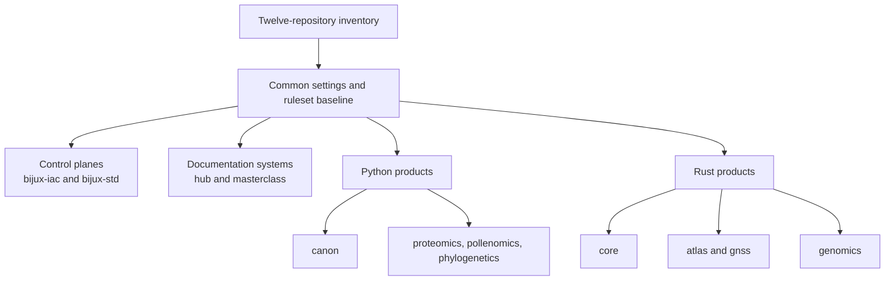

# Repository Coverage

The `bijux-iac` inventory models twelve repositories as one governed family.
Coverage includes repository identity, stack classification, delivery state,
settings, baseline checks, and default-branch ruleset inputs.

## Governed Family

| Repository | Stack | Responsibility | Documentation | Packages |
| --- | --- | --- | --- | --- |
| `bijux-iac` | Terraform | GitHub control plane | not applicable | not applicable |
| `bijux-std` | Make | shared standards control plane | not applicable | not applicable |
| `bijux.github.io` | Docs | public family hub | published | not applicable |
| `bijux-masterclass` | Docs | engineering programs | published | not applicable |
| `bijux-canon` | Python | knowledge-system product | published | published |
| `bijux-proteomics` | Python | proteomics product | published | published |
| `bijux-pollenomics` | Python | pollen-evidence product | published | published |
| `bijux-phylogenetics` | Python | phylogenetics product | published | published |
| `bijux-core` | Rust | execution backbone | published | published |
| `bijux-atlas` | Rust | data-service product | published | published |
| `bijux-gnss` | Rust | GNSS product | published | published |
| `bijux-genomics` | Rust | genomics product | planned | planned |

Delivery state is governance metadata, not promotional language:

- **published** means the public surface exists;
- **planned** means the repository is governed but that delivery surface is not
  yet represented as published;
- **not applicable** means the repository does not own that surface.

## Coverage Topology

Grouping describes operational similarity; it does not replace individual
repository ownership or authorize a group to share product semantics.

## Inventory Contracts

Validation rejects a family declaration when:

- a required member is missing or duplicated;
- a repository carries the wrong stable name or stack;
- delivery metadata uses an unsupported state;
- repository settings fail the shared schema;
- required check declarations are incomplete;
- rendered Terraform input differs from inventory.

This is particularly important for durable identity. Renames and obsolete
repository labels must not re-enter governance through an old script or local
list.

## Baseline And Extensions

Every governed repository receives the common default-branch baseline. A
repository may add checks that reflect its actual product gate, provided those
checks run consistently on the protected admission path.

The model avoids two unsafe extremes:

- a lowest-common-denominator policy too weak for release repositories;
- a universal list of product checks that some repositories cannot produce.

Common governance stays common. Product verification stays local and appears
as a repository-specific extension.

## Coverage Does Not Mean Uniformity

The inventory does not claim that all twelve repositories have identical
maturity, tooling, or delivery status. It claims that their governance inputs
are explicit and validated.

In particular:

- planned delivery is not represented as published;
- stack-specific workflows remain in their owning repositories;
- control-plane repositories are not forced to pretend they publish packages;
- live ruleset equality does not prove product readiness.

Continue with [Governance Model](../governance-model/index.md) for how this
inventory becomes live policy or [System Map](../../01-platform/system-map/index.md)
for product and standards dependencies.
