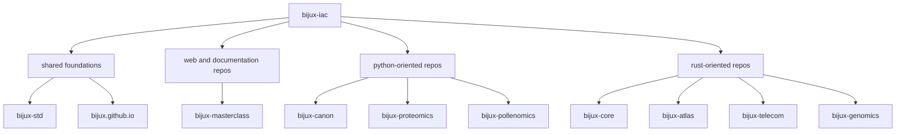

# Repository Coverage

`bijux-iac` governs a repository family, not a single codebase. The
coverage model is therefore grouped by role instead of by one flat list
of unrelated repositories.

## Coverage Map

## Why Coverage Is Grouped

Each group shares similar workflow pressure:

- the foundations need the strictest review posture because they act on the rest of the family
- web and docs repositories need stable publication and review behavior
- Python-oriented repositories already share more mature standards behavior
- Rust-oriented repositories are converging toward stronger shared gates without pretending they are identical today

## Rollout Rule

The control plane should expand when the repository group is ready for a
clear, durable rule. That keeps governance real instead of aspirational.

In practice:

- stable rules should land first in the foundations
- repeated patterns should then move across adjacent repositories
- repository-specific exceptions should stay narrow and temporary
- shared policy should widen only when the workflow is mature enough to deserve enforcement

## Continue Reading

- [Governance Model](../governance-model/index.md)
- [Bijux Standards](../../03-bijux-std/index.md)
- [Repository Matrix](../../01-platform/repository-matrix/index.md)
