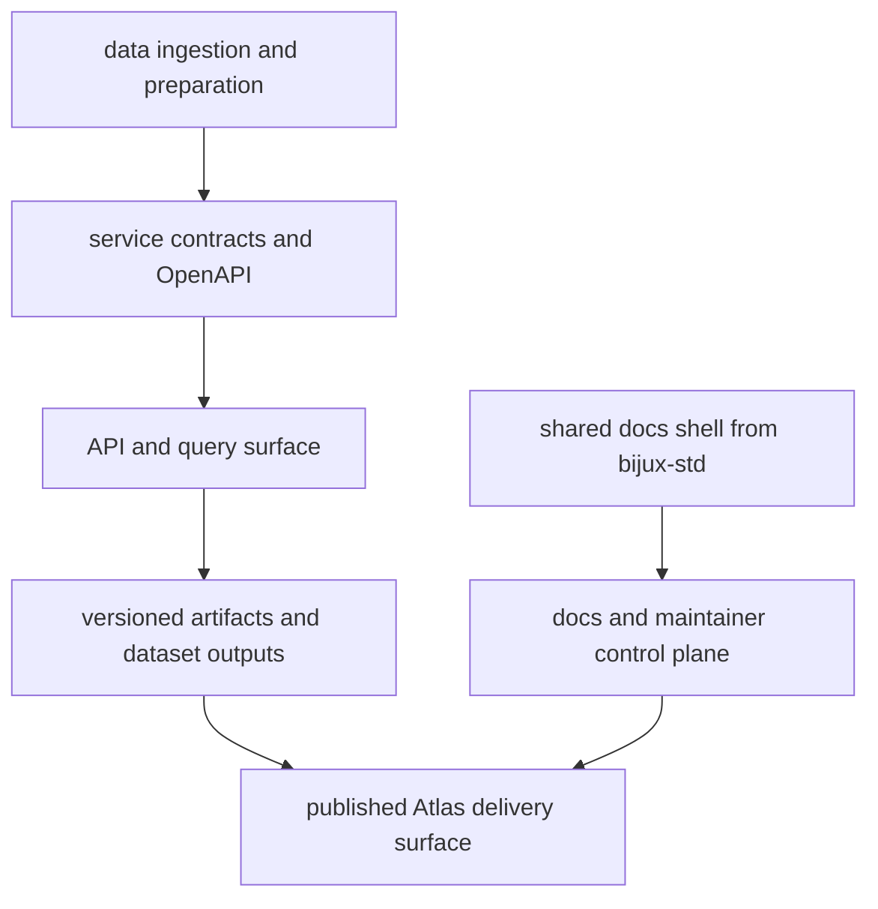

# Bijux Atlas

Bijux Atlas publishes and operates delivery-facing interfaces for
datasets, APIs, service contracts, and documentation.

`bijux-atlas` is the delivery and operational surface for services,
datasets, APIs, and docs control-plane behavior. It is the direct route
in the site for data delivery, service architecture, and operational
visibility.
It keeps queryable delivery, immutable artifacts, service contracts,
and publication surfaces as first-class engineering boundaries.

Shared standards note: Atlas consumes shared docs shell behavior and
cross-repository checks from `bijux-std`; Atlas owns its local
service/data contracts and delivery operations.

Concrete Atlas surfaces include:

- CLI
- API
- OpenAPI export
- docs
- release artifacts
- control plane

<a class="md-button md-button--primary" href="https://bijux.io/bijux-atlas/">View Published Docs</a>
<a class="md-button" href="https://github.com/bijux/bijux-atlas">View GitHub Repository</a>

## Repository Shape

`bijux-atlas` presents data-service work as an operated product surface
rather than a loose data tool. The repository publishes a CLI, server,
OpenAPI export surface, and maintainer control plane around genomics
dataset delivery and immutable query artifacts.

Inherited vs local ownership: navigation shell and baseline docs/check
standards come from `bijux-std`, while Atlas owns API behavior, dataset
publication contracts, and service operations.

## System Map

## What Atlas Owns

- delivery contracts for APIs, datasets, and query behavior
- publication and release surfaces for immutable artifacts
- control-plane operations that keep docs, contracts, and service behavior aligned

## What You Can Verify Quickly

| Surface | Why it matters |
| --- | --- |
| API and OpenAPI surfaces | shows that delivery contracts are documented |
| release artifacts and dataset posture | shows that publication is treated as an owned surface |
| docs-aware operational routes | shows that operations and documentation move together instead of drifting apart |

## What Lives Here

- API and dataset delivery treated as first-class product interfaces
- immutable artifact thinking instead of ad hoc mutable dataset handling
- docs-aware validation, operational reporting, and control-plane behavior as part of delivery
- runtime surfaces that stay separate: CLI, server, OpenAPI export, and maintainer tooling

## Where To Begin

| If you are looking for... | Start with this part of Atlas |
| --- | --- |
| service architecture | the split between CLI, server, OpenAPI export, and maintainer control plane |
| data delivery posture | immutable dataset and artifact language in the docs and README |
| operational seriousness | ops, configs, reporting, and documentation validation behavior |
| published entry points | the handbook structure and published docs site that route into concrete service surfaces |

## How Atlas Differs From Core And Canon

- Atlas owns public delivery interfaces and operated publication surfaces.
- Core owns runtime authority and execution governance.
- Canon owns knowledge-system orchestration and reasoning boundaries.

Atlas is where users and integrators consume stable delivery contracts.
Core and Canon are where runtime and knowledge internals are structured.

## Why This Matters Operationally

- stable queries: service consumers can rely on documented query and API behavior across releases
- traceable releases: dataset and artifact publication history stays visible instead of implied
- service behavior in public: docs, contracts, and operations show how delivery works in practice
- lower integration risk: maintenance workflows stay documented so downstream systems can plan confidently

## When This Page Is Most Useful

- the question is about API delivery, dataset publishing, or service behavior
- you are tracing docs UX checks, ops validation, or operational evidence
- you want a concrete public route into data-service engineering

## In The Larger Picture

Atlas keeps delivery work in the open as something that is published,
validated, and operated rather than described abstractly.

Bijux Atlas should be read as a delivery-facing system where contracts,
artifacts, and public access must align cleanly over time. Within the
broader family, it shows that publication and data delivery are
architectural concerns, requiring the same boundary discipline and
operational rigor as any core runtime surface.
