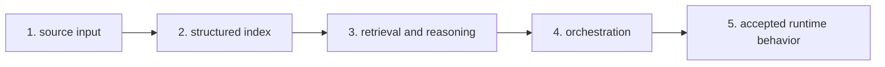

# Bijux Canon

`bijux-canon` is the repository that turns incoming knowledge sources
into structured, queryable, and runtime-controlled system behavior.

`bijux-canon` is the governed knowledge-system stack for deterministic
ingest, retrieval, reasoning, orchestration, and controlled runtime
acceptance. It is a clear route into system decomposition around AI and
knowledge workflows.

Here, "governed knowledge-system stack" means five linked surfaces with
distinct responsibilities: ingestion, indexing, retrieval and
reasoning, orchestration, and runtime control.

Shared standards note: Canon docs and checks align with the shared
documentation shell and shared quality standards owned in `bijux-std`.

<a class="md-button md-button--primary" href="https://bijux.io/bijux-canon/">View Published Docs</a>
<a class="md-button" href="https://github.com/bijux/bijux-canon">View GitHub Repository</a>

## Repository Shape

`bijux-canon` is built as separate layers with accountable interfaces.
Ingest, indexing, reasoning, orchestration, and runtime control are
kept separate through packages, contracts, compatibility surfaces, and
runtime boundaries.
This map shows how knowledge moves through the stack.

Each layer stays separate so inputs, reasoning, and runtime behavior can
be reviewed as connected but distinct responsibilities.

## What You Can Verify Quickly

| Surface | Why it matters |
| --- | --- |
| package split | shows that ingest, index, reason, orchestrate, and runtime are not collapsed into one layer |
| compat surfaces | shows that migration and naming changes are handled in public |
| runtime-control language | shows that knowledge-system behavior is reviewed with the same discipline as execution systems |

## Why The Package Split Is Intentional

| Split reason | Why it matters |
| --- | --- |
| layers change at different speeds | ingest, indexing, reasoning, orchestration, and runtime can evolve without forcing synchronized rewrites |
| compatibility is explicit | compat surfaces stay visible instead of hidden migration breakage |
| boundaries are reviewable | each package edge is a public interface, not only an internal convention |
| growth stays bounded | changes in one layer do not force unrelated redesign in others |

## What Each Layer Prevents

- ingest: prevents raw upstream variability from leaking directly into downstream reasoning.
- indexing: prevents retrieval behavior from depending on ad hoc input assumptions.
- retrieval and reasoning: prevents query and decision logic from being mixed with storage and transport details.
- orchestration: prevents execution flow and policy decisions from being hidden inside single-package internals.
- runtime control: prevents acceptance, replay, and verification rules from becoming implicit and unreviewable.

## What Lives Here

- a contract-first package family instead of one all-purpose AI library
- explicit separation between ingest, index, reason, agent, and runtime responsibilities
- compatibility handled openly through dedicated package surfaces rather than hidden breaking changes
- release and documentation discipline aligned with the repository layout

## Canon Does Not Own

Canon does not own runtime backbone authority, domain-specific scientific
product workflows, or cross-repository standards ownership. Those
responsibilities belong to `bijux-core`, domain repositories, and
`bijux-std`.

## Where To Begin

| If you are looking for... | Start with this part of Canon |
| --- | --- |
| knowledge-system boundaries | the package map across runtime, ingest, index, reason, and agent surfaces |
| contract discipline | checked-in schemas, package-specific docs, and the repository-owned documentation structure |
| compatibility judgment | the compat packages and consolidation material that keep older names explicit |
| governed execution | runtime and replay language that makes control and verification part of the system model |

## One Path Through The Stack

Follow this flow to inspect the stack in order: ingest input,
index structure, reasoning behavior, orchestration control, then runtime
acceptance/replay surfaces.

## When This Page Is Most Useful

- the question is about ingest, indexing, reasoning, agents, or runtime control
- you want to see how a knowledge system is split into accountable components
- you care whether AI-oriented architecture stays inspectable as the package family grows

## In The Larger Picture

Canon keeps knowledge workflows split into maintained parts instead of
collapsing them into one vague layer. The package boundaries stay
visible all the way out to public docs.
