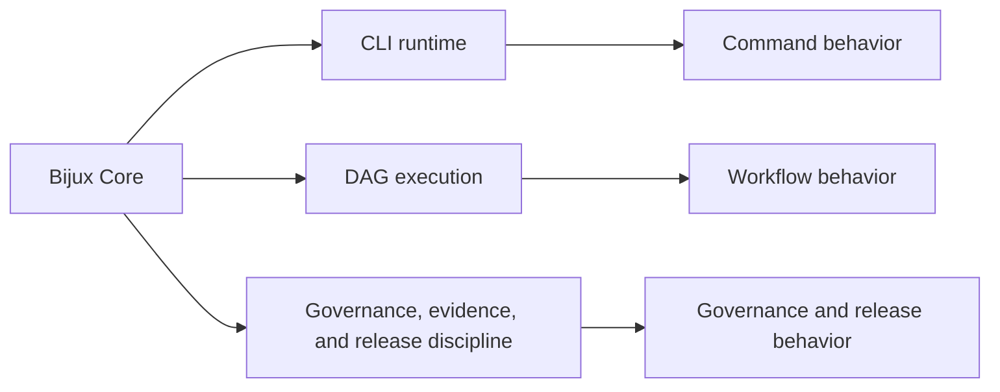
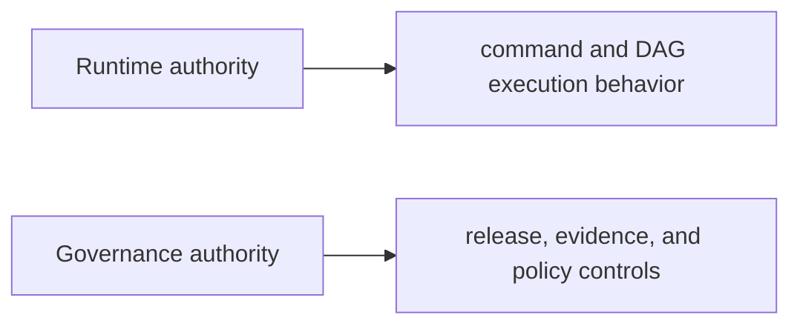

# Bijux Core

`bijux-core` runs the CLI and DAG runtime backbone for the Bijux
repository family and owns the governance and release rules that keep
that backbone stable over time.

Core exposes four concrete surfaces:

- CLI runtime
- DAG execution
- governance and control routes
- evidence and release rules

Relation to shared standards: Core consumes shared docs shell and
cross-repository checks from `bijux-std`, but does not define those
standards.

<a class="md-button md-button--primary" href="https://bijux.io/bijux-core/">View Published Docs</a>
<a class="md-button" href="https://github.com/bijux/bijux-core">View GitHub Repository</a>

## Repository Shape

`bijux-core` is where runtime and governance stop being abstract. The
repository owns the command runtime and DAG execution backbone that
dependent systems depend on, while keeping governance, evidence, and
release discipline visible in the same public surface.
This map summarizes the authority split that keeps Core legible.

The split keeps command semantics, workflow semantics, and repository
governance explicit instead of blending them into one opaque layer.

## What You Can Verify Quickly

| Surface | Why it matters |
| --- | --- |
| CLI and DAG split | shows that command behavior and workflow behavior are separate responsibilities |
| release and evidence language | shows that governance is part of the repository surface, not an afterthought |
| published docs and source layout | shows that runtime authority is documented and inspectable in public |

## Runtime Authority Vs Governance Authority

Runtime authority defines how commands and workflows execute: what can
run, in what order, and with which execution semantics. Governance
authority defines how those runtime surfaces are controlled over time:
release rules, evidence expectations, and repository-level policy
boundaries. Keeping them distinct prevents execution behavior from being
silently changed by policy concerns, and prevents policy controls from
being hidden inside runtime code paths.

## What Core Does Not Own

Core does not own domain-specific scientific workflows, project-specific
delivery interfaces, or shared cross-repository standards ownership.
Those responsibilities belong to domain repositories, delivery
repositories, and `bijux-std`.

## What Lives Here And Why

- `bijux-cli` and `bijux-dag` live here under one governance backbone so runtime behavior and release control stay aligned
- command/runtime semantics and DAG execution semantics stay explicit instead of hidden in scripts
- governance, evidence, and release surfaces stay visible as first-class repository ownership, not side notes
- visible anchors include CLI command surfaces, DAG workflow routes, release evidence, and governance documentation

## Where To Begin

| If you are looking for... | Start with this part of Core |
| --- | --- |
| runtime authority | the CLI and DAG handbooks, plus the crate split across runtime, artifacts, and app layers |
| repository discipline | release flows, evidence surfaces, and maintainer control-plane material |
| product boundaries | the fact that `bijux-cli` and `bijux-dag` are separate products under one governance backbone |
| traceability | public docs, tagged releases, and repository-owned operating rules that align with the code layout |

## When This Page Is Most Useful

- the question is about CLI behavior, DAG execution, runtime control, or release discipline
- you want a direct route into platform engineering structure
- you care whether governance and release posture are visible instead of implied

## In The Larger Picture

Core keeps the rest of the repository family grounded in visible runtime
and governance machinery. The backbone is named, inspectable, and
stable enough to support the higher layers around it.

Bijux Core represents the layer where runtime truth, deterministic
execution, and repository control must remain least ambiguous. Beyond
the tools themselves, it keeps authority boundaries and workflow
semantics explicit so core behavior stays understandable under
long-term change.
