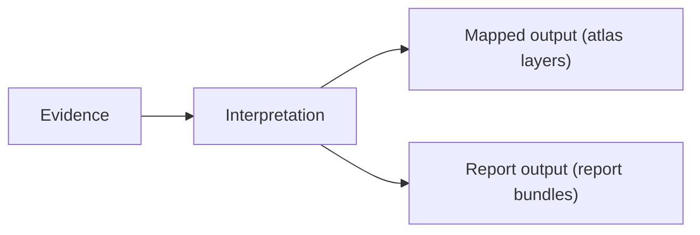

# Bijux Pollenomics

`bijux-pollenomics` helps researchers turn field evidence into maps and
reports they can trace, review, and reuse.

It brings together archaeology, eDNA, aDNA, and pollen evidence so
people can decide where research attention should focus while keeping
methods and data lineage inspectable.

It shows how structured engineering can support field-oriented,
evidence-heavy domain work.
The engineering challenge here is to make uncommon scientific context
operationally clear without losing reproducibility, traceability, or
system structure.

The public docs surface and repository checks follow the shared
documentation shell and standards checks used across the Bijux
repository family.

<a class="md-button md-button--primary" href="https://bijux.io/bijux-pollenomics/">View Published Docs</a>
<a class="md-button" href="https://github.com/bijux/bijux-pollenomics">View GitHub Repository</a>

## Repository Shape

`bijux-pollenomics` takes an unusual domain and makes the outputs
inspectable: tracked source data, rebuildable report bundles, a Nordic
evidence atlas, and a documentation surface that explains where those
artifacts come from.
This flow shows how evidence is interpreted and turned into mapped and
report outputs.

The goal is a domain system that remains reviewable even for readers
outside the immediate subject area.

## Concrete Outputs

- atlas layers for regional evidence visualization
- tracked data assets with explicit lineage
- report bundles for reproducible publication routes
- documentation context that explains interpretation assumptions and boundaries

## What This Repository Covers

- domain modeling that translates archaeology-facing questions into inspectable system surfaces
- evidence handling with tracked inputs, rebuildable outputs, and explicit publication routes
- scientific constraints integrated without collapsing runtime and delivery boundaries
- system clarity that remains readable for both domain and engineering reviewers

## What Lives Here

- evidence mapping framed as a reproducible product surface, not a one-off analysis notebook
- tracked data, checked-in publication artifacts, and explicit rebuild paths
- technical architecture adapted to archaeology-facing and field-oriented context without losing clarity
- honest scope boundaries around what exists today and what does not

## Where To Begin

| If you are looking for... | Start with this part of Pollenomics |
| --- | --- |
| reproducible publication | tracked `data/` and `docs/report/` outputs, plus the atlas and country bundles |
| uncommon domain modeling | the archaeology, eDNA, aDNA, and pollenomics framing in the docs and repository layout |
| scope discipline | the explicit limits around current capabilities, source categories, and report outputs |
| published entry points | the runtime handbook, data reference, and published Nordic atlas material |

## How To Read This Page If You Are Not From The Domain

Start with the outputs rather than domain terminology: open atlas
layers, tracked data, and report bundles first, then read documentation
context to understand how interpretation decisions are constrained by
evidence and reproducibility rules.

## When This Page Is Most Useful

- the question is about evidence mapping, archaeology-facing context, or field-site selection
- you want to understand how the repository family handles uncommon domain boundaries
- you care whether unusual domain work stays reproducible and reviewable

## In The Larger Picture

Pollenomics carries the same structural habits into a specialized domain
that does not come with off-the-shelf engineering narratives.

This repository explicitly tests Bijux platform ideas under evidence and
interpretation pressure: bounded ownership, delivery discipline,
traceable artifacts, and documentation-linked reasoning.

Bijux Pollenomics shows how specialized domain work can be handled with
the same architectural seriousness as any general platform system. Its
importance is not only subject matter depth, but the effort to keep
evidence, interpretation, and public understanding organized through
disciplined software structure.
