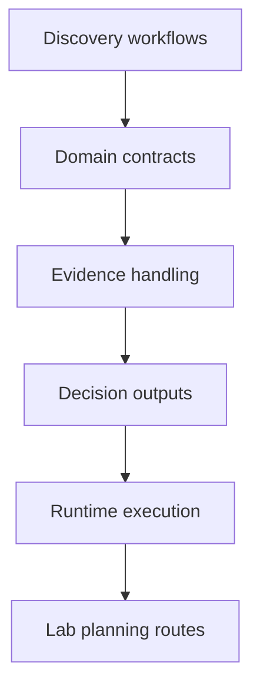
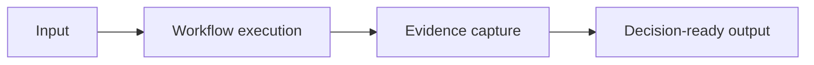

# Bijux Proteomics

`bijux-proteomics` helps scientists and teams run proteomics discovery
workflows as structured software with explicit contracts, runtime
behavior, and evidence handling.

For scientists and teams, this means turning experiment-driven work into
repeatable software routes: run discovery workflows, track evidence,
produce decision-ready outputs, and keep lab-facing planning steps
traceable over time.

Shared standards note: Proteomics docs and checks follow shared shell
and quality standards inherited from `bijux-std`.

<a class="md-button md-button--primary" href="https://bijux.io/bijux-proteomics/">View Published Docs</a>
<a class="md-button" href="https://github.com/bijux/bijux-proteomics">View GitHub Repository</a>

## Repository Shape

`bijux-proteomics` treats protein discovery as a governed software
system rather than a single pipeline. Runtime execution, domain
contracts, decision intelligence, evidence governance, and lab planning
are kept as explicit package boundaries.
Decision intelligence is exposed through the repository's intelligence
surfaces, while lab planning is exposed through lab-oriented package
surfaces and documented workflow routes.
This map summarizes the core technical surfaces in the repository.

It reflects the repository's design choice to keep scientific workflow
concerns explicit rather than hidden in ad hoc glue.

## Why Scientific Product Systems Require Different Structure

| Concern | Scientific product structure |
| --- | --- |
| domain contracts | remain explicit while scientific assumptions evolve |
| evidence handling | treated as a core output, not a side result |
| runtime behavior | optimized for reproducibility and review, not only convenience |
| package boundaries | kept coherent under engineering and domain pressure |

## What This Repository Covers

- evidence governance as a maintained system concern
- runtime design that stays explicit across domain workflows
- package boundaries that preserve responsibility and reviewability
- domain contracts that can be inspected and evolved without hidden coupling

## What Lives Here

- a contract-first package family for scientific product work
- domain models, decision logic, evidence handling, and lab planning kept separate
- reproducibility and reviewability treated as part of the product, not a later cleanup step
- public scientific software that still looks engineered rather than improvised

## One Repository Flow

This flow is the practical path in the repository: ingest scientific
input, run controlled workflow logic, preserve evidence lineage, and
publish outputs that can be reviewed and reused.

## Where To Begin

| If you are looking for... | Start with this part of Proteomics |
| --- | --- |
| domain decomposition | the split across runtime, foundation, core, intelligence, knowledge, and lab packages |
| governed product behavior | the repository’s emphasis on contracts, release discipline, and package-owned responsibilities |
| scientific workflow maturity | the fact that lab planning and evidence resolution are explicit parts of the system model |
| published entry points | the package handbooks and release surfaces for the six published packages |

## When This Page Is Most Useful

- the work is specifically about proteomics, discovery, or lab-facing workflows
- you want to see how engineering structure adapts to scientific product work
- you care whether domain software is treated with the same rigor as platform software
