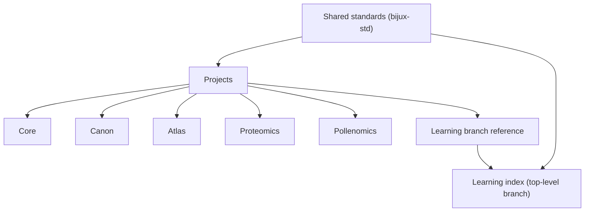

# Projects

This is the fastest way to understand what each public Bijux repository
is for. Projects remain separate in ownership but aligned through shared
standards in `bijux-std`, so this page gives a quick structural view
before deeper project pages.

## Primary Responsibility Clusters

| Capability cluster | Repositories |
| --- | --- |
| runtime authority and execution governance | [Bijux Core](bijux-core/index.md) |
| knowledge-system orchestration and reasoning boundaries | [Bijux Canon](bijux-canon/index.md) |
| public delivery interfaces and service publication | [Bijux Atlas](bijux-atlas/index.md) |
| proteomics scientific product workflows | [Bijux Proteomics](bijux-proteomics/index.md) |
| evidence-mapping product workflows | [Bijux Pollenomics](bijux-pollenomics/index.md) |

Learning is a top-level branch reference, not a peer project repository:
[Learning catalog](../03-learning/index.md).

  <article class="bijux-showcase-card">
    
runtime and governance backbone

    <h2>Bijux Core</h2>
    
What it is: the runtime authority repository for CLI and DAG execution.

    
Why it exists: to keep execution behavior and governance boundaries explicit.

    
<a href="bijux-core/index.md">Open Bijux Core</a>

  </article>
  <article class="bijux-showcase-card">
    
governed knowledge system

    <h2>Bijux Canon</h2>
    
What it is: the knowledge-system orchestration repository.

    
Why it exists: to separate ingest, indexing, reasoning, orchestration, and runtime control into accountable interfaces.

    
<a href="bijux-canon/index.md">Open Bijux Canon</a>

  </article>
  <article class="bijux-showcase-card">
    
data and service delivery

    <h2>Bijux Atlas</h2>
    
What it is: the public delivery-interface repository for APIs, datasets, and publication routes.

    
Why it exists: to keep service delivery behavior inspectable and operated as a product surface.

    
<a href="bijux-atlas/index.md">Open Bijux Atlas</a>

  </article>
  <article class="bijux-showcase-card">
    
applied scientific products

    <h2>Bijux Proteomics</h2>
    
What it is: the proteomics scientific product repository.

    
Why it exists: to apply platform discipline to evidence-heavy discovery workflows.

    
<a href="bijux-proteomics/index.md">Open Bijux Proteomics</a>

  </article>
  <article class="bijux-showcase-card">
    
evidence and site selection

    <h2>Bijux Pollenomics</h2>
    
What it is: the evidence-mapping scientific product repository.

    
Why it exists: to keep archaeology/eDNA/aDNA interpretation outputs traceable and reproducible.

    
<a href="bijux-pollenomics/index.md">Open Bijux Pollenomics</a>

  </article>

## Primary Responsibility By Repository

| Repository | What each repository covers |
| --- | --- |
| [Bijux Core](bijux-core/index.md) | runtime truth, deterministic execution, and control-plane separation in a stable backbone |
| [Bijux Canon](bijux-canon/index.md) | governed knowledge-system decomposition with explicit package contracts and compatibility surfaces |
| [Bijux Atlas](bijux-atlas/index.md) | data-service delivery treated as operated product architecture with immutable artifact posture |
| [Bijux Proteomics](bijux-proteomics/index.md) | scientific product engineering with explicit evidence governance and domain contracts |
| [Bijux Pollenomics](bijux-pollenomics/index.md) | uncommon domain adaptation that keeps reproducibility and engineering structure visible |

## What This Page Makes Clear

- this is a coherent set of repository ownership boundaries, not disconnected projects
- each repository is responsible for a distinct layer in the broader architecture
- architecture, delivery, domain pressure, and learning surfaces are inspectable in public

## Reading Guide

| If you care most about... | Start here |
| --- | --- |
| platform and runtime engineering | [Bijux Core](bijux-core/index.md) |
| governed AI and knowledge systems | [Bijux Canon](bijux-canon/index.md) |
| data delivery and service architecture | [Bijux Atlas](bijux-atlas/index.md) |
| bioinformatics and scientific product work | [Bijux Proteomics](bijux-proteomics/index.md) |
| evidence mapping and field-oriented domain systems | [Bijux Pollenomics](bijux-pollenomics/index.md) |
| teaching and engineering communication | [Learning catalog](../03-learning/index.md) |

## Reading Rule

Use the cards for quick orientation, then open project pages for
repository-owned details and inspection routes.
