# Bijux Standards

`bijux-std` is the canonical source for repository engineering standards shared
across Bijux projects. It publishes versioned documentation infrastructure,
Make libraries, GitHub governance sources, and validation tooling so consumers
can adopt the same contracts from an immutable, reviewable commit.

<a class="md-button md-button--primary" href="https://github.com/bijux/bijux-std">Inspect canonical standards</a>
<a class="md-button" href="shared-surfaces/">Explore shared packages</a>
<a class="md-button" href="promotion-model/">Follow the adoption model</a>

## The Problem It Solves

Private copies of repository infrastructure drift. Commands acquire different
meanings, CI policy diverges, documentation shells behave differently, and a
fix in one repository never reaches the others.

`bijux-std` replaces copy-and-forget reuse with an explicit contract:

- one canonical implementation for shared behavior;
- content digests for every managed shared package;
- capability selection instead of individual-file selection;
- consumer updates resolved from an accepted Git commit;
- generated surfaces validated against manifests and generators;
- product behavior retained by the consuming repository.

## Standards Flow

```mermaid
flowchart LR
    source["Canonical shared sources"] --> contracts["Contracts and generators"]
    contracts --> integrity["Digests and self-validation"]
    integrity --> accepted["Accepted bijux-std commit"]
    accepted --> select["Consumer capability selection"]
    select --> vendor["Vendored .bijux/shared snapshot"]
    vendor --> local["Consumer validation"]
    local --> adoption["Independent consumer adoption"]
```

Consumers do not depend on a developer's local checkout or silently receive a
new `main` revision. The accepted source commit and the consumer update are two
separate review events.

## Canonical Packages

| Package | Stable responsibility |
| --- | --- |
| `bijux-makes` | language-neutral entry points, artifact containment, documentation execution, help, and gate composition |
| `bijux-makes-py` | Python formatting, linting, testing, packaging, API, and environment contracts |
| `bijux-makes-rs` | Rust and Cargo gates, nextest lanes, slow-test selection, and pinned-source full-suite execution |
| `bijux-docs` | MkDocs shell, visual assets, navigation registry, synchronization, and documentation checks |
| `bijux-checks` | capability selection, remote synchronization, digest validation, and standards reporting |
| `bijux-gh` | canonical workflows, templates, policy scripts, and repository-governance sources |

The canonical package inventory and its directory digests are versioned in the
standards repository. Consumer-specific GitHub files are rendered from typed
manifests rather than copied indiscriminately.

## Capability Contract

Consumers request coherent capabilities:

| Capability | Managed packages |
| --- | --- |
| `common` | `bijux-makes`, `bijux-checks`, and `bijux-gh` |
| `docs` | `bijux-docs` |
| `python` | `bijux-makes-py` |
| `rust` | `bijux-makes-rs` |

`common` is always present because synchronization, baseline checks, GitHub
governance sources, and language-neutral entry points form one foundational
contract. Unknown capabilities fail closed. Explicit selection removes
packages that are outside the consumer's declared contract.

## Ownership Boundary

| Authority | Owner | Example |
| --- | --- | --- |
| canonical shared files and generators | `bijux-std` | deployment workflow source or documentation shell partial |
| consumer adoption and product extension | consuming repository | a Rust product adds its own load or domain checks |
| live GitHub administration | `bijux-iac` | applying branch rulesets through GitHub APIs |
| product semantics | consuming repository | API behavior, dataset schema, or scientific interpretation |

The distinction between declared and applied governance is important.
`bijux-std` can define a canonical workflow and policy check. Committing those
files does not apply branch protection; that live control belongs to
`bijux-iac`.

## Integrity Layers

Two digest layers protect different surfaces:

- the shared-directory manifest attests canonical package content;
- each consumer's managed checksum manifest attests synchronized GitHub and
  standards-derived files in that repository.

Contract checks also verify layout, capability selection, pinned actions,
source-of-truth relationships, generated-file parity, and reports. A checksum
proves exact content alignment, not product correctness.

## Shared Does Not Mean Universal

A behavior belongs in `bijux-std` when multiple repositories should consume
the same invariant and divergence would be a defect. The following remain
local:

- product code and domain models;
- repository-specific release policy;
- supported toolchain and compatibility decisions;
- product tests and operational qualification;
- technical and scientific content.

Correct shared defects at the canonical source, then adopt the accepted commit
in consumers. Do not repair the same generated file independently across the
family.

Continue with [Shared Surfaces](shared-surfaces/index.md) for the package map or
[Promotion Model](promotion-model/index.md) for the full change and adoption
chain.
