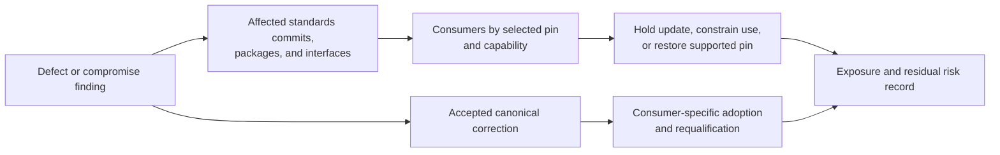
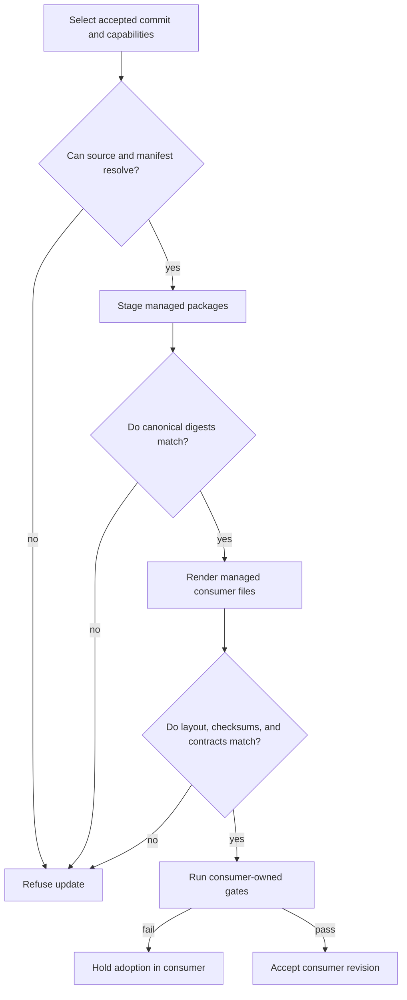
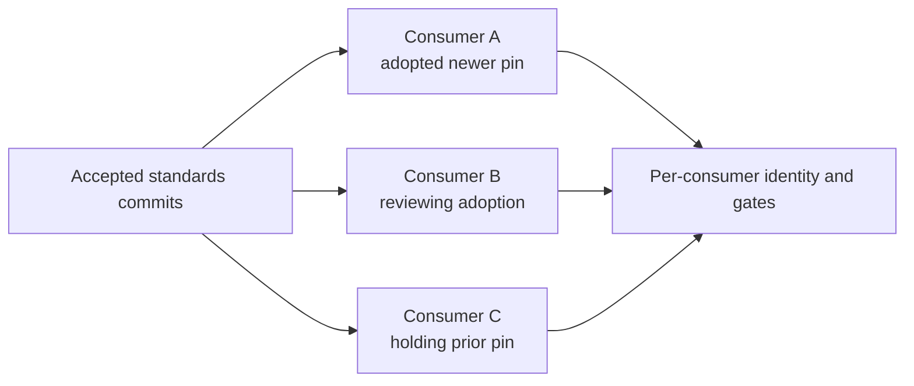

# Bijux Standards

`bijux-std` is the canonical source for repository engineering standards shared
across Bijux projects. It publishes versioned documentation infrastructure,
Make libraries, GitHub governance sources, and validation tooling so consumers
can adopt the same contracts from an immutable, reviewable commit.

<a class="md-button md-button--primary" href="https://github.com/bijux/bijux-std">Inspect canonical standards</a>
<a class="md-button" href="shared-surfaces/">Explore shared packages</a>
<a class="md-button" href="promotion-model/">Follow the adoption model</a>

## The Problem It Solves

Private copies of repository infrastructure drift. Commands acquire different
meanings, CI policy diverges, documentation shells behave differently, and a
fix in one repository never reaches the others.

`bijux-std` replaces copy-and-forget reuse with an explicit contract:

- one canonical implementation for shared behavior;
- content digests for every managed shared package;
- capability selection instead of individual-file selection;
- consumer updates resolved from an accepted Git commit;
- generated surfaces validated against manifests and generators;
- product behavior retained by the consuming repository.

## Standards Flow

```mermaid
flowchart LR
    source["Canonical shared sources"] --> contracts["Contracts and generators"]
    contracts --> integrity["Digests and self-validation"]
    integrity --> accepted["Accepted bijux-std commit"]
    accepted --> select["Consumer capability selection"]
    select --> vendor["Vendored .bijux/shared snapshot"]
    vendor --> local["Consumer validation"]
    local --> adoption["Independent consumer adoption"]
```

Consumers do not depend on a developer's local checkout or silently receive a
new `main` revision. The accepted source commit and the consumer update are two
separate review events.

## Canonical Packages

| Package | Stable responsibility |
| --- | --- |
| `bijux-makes` | language-neutral entry points, artifact containment, documentation execution, help, and gate composition |
| `bijux-makes-py` | Python formatting, linting, testing, packaging, API, and environment contracts |
| `bijux-makes-rs` | Rust and Cargo gates, nextest lanes, slow-test selection, and pinned-source full-suite execution |
| `bijux-docs` | MkDocs shell, visual assets, navigation registry, synchronization, and documentation checks |
| `bijux-checks` | capability selection, remote synchronization, digest validation, and standards reporting |
| `bijux-gh` | canonical workflows, templates, policy scripts, and repository-governance sources |

The canonical package inventory and its directory digests are versioned in the
standards repository. Consumer-specific GitHub files are rendered from typed
manifests rather than copied indiscriminately.

## Capability Contract

Consumers request coherent capabilities:

| Capability | Managed packages |
| --- | --- |
| `common` | `bijux-makes`, `bijux-checks`, and `bijux-gh` |
| `docs` | `bijux-docs` |
| `python` | `bijux-makes-py` |
| `rust` | `bijux-makes-rs` |

`common` is always present because synchronization, baseline checks, GitHub
governance sources, and language-neutral entry points form one foundational
contract. Unknown capabilities fail closed. Explicit selection removes
packages that are outside the consumer's declared contract.

## Ownership Boundary

| Authority | Owner | Example |
| --- | --- | --- |
| canonical shared files and generators | `bijux-std` | deployment workflow source or documentation shell partial |
| consumer adoption and product extension | consuming repository | a Rust product adds its own load or domain checks |
| live GitHub administration | `bijux-iac` | applying branch rulesets through GitHub APIs |
| product semantics | consuming repository | API behavior, dataset schema, or scientific interpretation |

The distinction between declared and applied governance is important.
`bijux-std` can define a canonical workflow and policy check. Committing those
files does not apply branch protection; that live control belongs to
`bijux-iac`.

## Integrity Layers

Two digest layers protect different surfaces:

- the shared-directory manifest attests canonical package content;
- each consumer's managed checksum manifest attests synchronized GitHub and
  standards-derived files in that repository.

Contract checks also verify layout, capability selection, pinned actions,
source-of-truth relationships, generated-file parity, and reports. A checksum
proves exact content alignment, not product correctness.

## What A Consumer Records

A standards adoption is reconstructable only when the consumer retains all of
these relationships:

| Record | Question it answers |
| --- | --- |
| accepted `bijux-std` commit | which canonical source revision was selected? |
| declared capability set | which coherent package groups were requested? |
| vendored package directories | which bytes are available without runtime network access? |
| shared-directory digest manifest | do vendored packages match the accepted source? |
| managed-file checksum manifest | do rendered GitHub and standards-derived files match their governed outputs? |
| consumer checks and product gates | does the selected contract work in this repository? |

None of these records is replaceable by “current standards” or a moving branch
name. The exact commit identifies source; capabilities identify intent;
digests identify content; consumer gates identify local acceptance.

## Establish Source Trust Before Content Equality

A commit SHA and matching directory digest establish identity and byte
equality. They do not by themselves establish that the source was accepted by
the intended repository authority or remained trustworthy after discovery of
a compromised dependency or workflow.

| Trust question | Evidence to retain |
| --- | --- |
| which source was intended? | canonical repository identity, immutable commit, and selected capability set |
| was the source accepted through its governed path? | review and required-check context for the standards revision |
| do the retrieved bytes match? | canonical package manifest, directory digests, and generated-file checksums |
| did the consumer accept those bytes? | managed diff, standards checks, product gates, and consumer revision |
| was the source later withdrawn? | security or correctness finding, affected commit range, replacement identity, and consumer impact record |

Resolving the right hash from an untrusted origin is not source validation.
Likewise, fetching from the expected origin does not remove the need to verify
content. The adoption record needs both relationships.

## Recover From A Defective Accepted Standard

An accepted standards revision can later prove unsafe or incorrect. Correcting
the canonical source is necessary, but consumer exposure remains a separate
fleet question.

The impact record should distinguish consumers that selected the affected
revision, consumers that executed the defective path, and consumers whose
products or releases depended on its output. Pin equality is exposure
evidence, not proof that the defective behavior ran. Conversely, moving the
pin forward does not repair releases, governance decisions, or generated
artifacts already produced under the affected contract.

## Standards Failure Semantics

An upstream standard may be valid while one consumer holds adoption because of
a product compatibility failure. That is useful isolation, not family drift,
provided the consumer does not claim to have adopted bytes it rejected.

## Consumer Fleet State

There is no single mutable “family version” of the standards. Each repository
selects an immutable source commit, so the fleet can legitimately contain
several accepted revisions while adoption proceeds.

| Consumer state | Meaning | Evidence |
| --- | --- | --- |
| current for its declared pin | vendored bytes and generated files match the selected commit | source SHA, capabilities, digests, and consumer checks |
| adoption proposed | a newer accepted commit is under consumer review | managed diff and pending standards and product gates |
| adoption held | the proposed snapshot failed a consumer-owned compatibility gate | failed gate, affected interface, and retained prior pin |
| explicit exception | a bounded local deviation has a named owner and exit condition | exact surface, rationale, validation, and removal or upstream path |
| drifted | committed managed content does not match the claimed source relationship | checksum, layout, renderer, or source comparison failure |

“Current” is meaningful only relative to a repository's declared pin. It must
not be inferred from the newest `bijux-std` commit, and “older” does not by
itself mean drift. A consumer becomes drifted when its recorded identity and
its managed bytes disagree, or when an undeclared local fork replaces the
selected contract.

Fleet reporting should therefore list consumer, selected commit, capabilities,
verification result, and any held adoption or exception. A count of repositories
on the newest commit is useful progress information, not compatibility proof.

## Shared Does Not Mean Universal

A behavior belongs in `bijux-std` when multiple repositories should consume
the same invariant and divergence would be a defect. The following remain
local:

- product code and domain models;
- repository-specific release policy;
- supported toolchain and compatibility decisions;
- product tests and operational qualification;
- technical and scientific content.

Correct shared defects at the canonical source, then adopt the accepted commit
in consumers. Do not repair the same generated file independently across the
family.

Continue with [Shared Surfaces](shared-surfaces/index.md) for the package map or
[Promotion Model](promotion-model/index.md) for the full change and adoption
chain.
