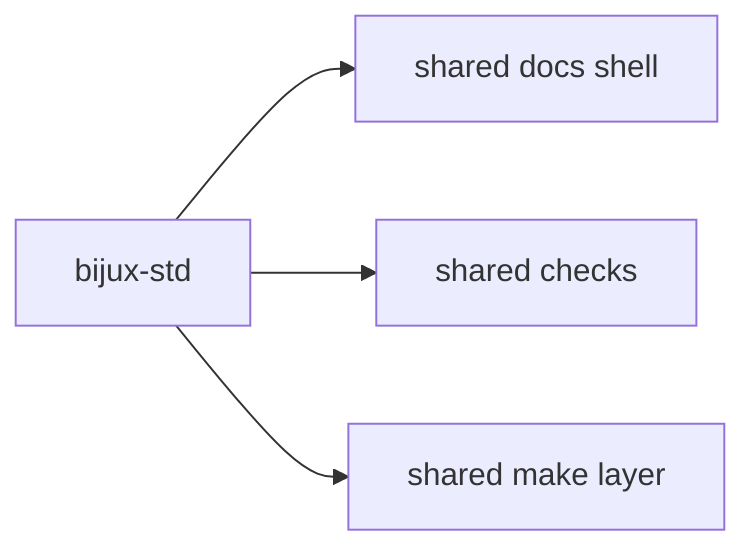

# Bijux Standards

`bijux-std` is the shared standards repository for the Bijux system
family.

It keeps the parts of the family that should stay aligned in one place:
the shared documentation shell, the shared Python-oriented make layer,
and the shared checks that verify them.

This branch shows how repeated repository behavior becomes a durable
standard instead of staying trapped as local convention.

## Why It Matters

Without a visible standards layer, the repositories are easy to see but
harder to understand as one family.

`bijux-std` makes that mechanism clear:

- shared presentation has a named source
- repeated workflow behavior has a reviewable home
- cross-repository checks stop being folklore
- standardization follows real usage instead of abstract policy

## What You See Quickly

| If you open... | What becomes clear |
| --- | --- |
| shared shell assets and manifests | continuity across sites is engineered deliberately |
| shared make behavior and checks | repository quality is being treated as a repeatable system |
| promotion rules for new standards | standardization is earned from usage rather than declared too early |

## Why It Exists

The repositories are split by responsibility. That split only holds if
the shared layer has a clear home. Without one, shell behavior, make
logic, and cross-repository checks drift over time. `bijux-std` keeps
those shared parts defined, synchronized, and verified in one place.

## What It Owns

`bijux-std` owns the cross-repository standards layer.

That includes:

- shared documentation shell assets
- shared Python-oriented make modules
- shared compliance and update checks
- canonical manifests used to verify shared directory integrity

Read [Shared Surfaces](shared-surfaces/index.md) for the public view of
what those exports look like across the family.

The rule behind that ownership is simple: something becomes part of
`bijux-std` after it is already being used in a similar and stable way
across repositories.

## What It Does Not Own

`bijux-std` does **not** own:

- runtime logic from `bijux-core`
- knowledge-system architecture from `bijux-canon`
- delivery products from `bijux-atlas`
- domain software from `bijux-proteomics` or `bijux-pollenomics`
- course content from `bijux-masterclass`

Those remain owned by the repositories that implement them.

## How It Fits The Architecture

In practice:

- the repositories keep their own responsibilities
- `bijux-std` keeps the shared layer consistent across them
- the docs surfaces and CI checks stay aligned without collapsing
  everything into one repository

## What It Changes Across The Family

When `bijux-std` is doing its job well:

- repositories still feel local, but shared behavior stops drifting
- docs sites read as one family without flattening their content
- repeated automation becomes easier to trust and easier to evolve
- standards move upstream only after they are real enough to deserve it

## Promotion Model

Shared behavior is promoted into `bijux-std` after the pattern is
already visible across repositories.

Today that is most mature in the Python-oriented group:

- shared make behavior already exists across repositories such as `bijux-canon`, `bijux-proteomics`, and `bijux-pollenomics`
- documentation shell behavior and baseline checks are already shared across the public family

For the Rust-oriented repositories, the same rule still applies:

- common gates and make behavior should emerge across the Rust repositories first
- once those patterns are stable and clearly shared, they can be promoted into `bijux-std`
- the goal is consistency from real usage, not premature standardization

Read the full [Promotion Model](promotion-model/index.md).

## Shared Vs Local

| Layer | Owned by |
| --- | --- |
| shared docs shell and compliance contract | `bijux-std` |
| repository docs meaning and page content | the consuming repository |
| domain logic, runtime logic, and product behavior | the consuming repository |

This separation gives Bijux continuity across sites and repositories
without erasing local ownership.

## How Repositories Use It

The normal flow is simple:

1. shared standards are updated in `bijux-std`
2. consuming repositories synchronize the shared layer locally
3. checks verify that local copies still match the standard
4. each repository publishes its own docs and keeps ownership of its own content

Operational commands in consuming repositories:

- `make bijux-std-update`
- `make bijux-std-checks`

## Where To Go Next

- [Documentation Network](../01-platform/documentation-network/index.md)
- [System Map](../01-platform/system-map/index.md)
