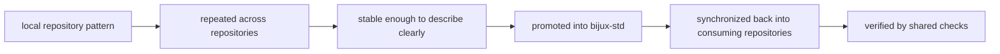

# Promotion Model

`bijux-std` does not invent standards in the abstract. It promotes
shared behavior after the pattern is already visible, repeated, and
stable across repositories.

## Promotion Flow

## What Qualifies For Promotion

- the same problem is being solved in similar ways across repositories
- the pattern has enough maturity that a shared rule will reduce drift instead of causing friction
- the standard can be described without hand-waving or repository-specific exceptions
- the consuming repositories can verify the result with named checks

## What Should Stay Local

- repository-specific product behavior
- one-off experiments that have not proved themselves yet
- Rust or Python workflow details that still differ meaningfully by repository
- temporary shortcuts that would become expensive if frozen into the standard layer

## Why This Matters

This model keeps `bijux-std` from becoming a dumping ground. Shared
standards are strongest when they come from repeated use, not from early
theory.

## Continue Reading

- [Bijux Standards](../index.md)
- [Shell Architecture](../../01-platform/shell-architecture/index.md)
- [Repository Coverage](../../02-bijux-iac/repository-coverage/index.md)
