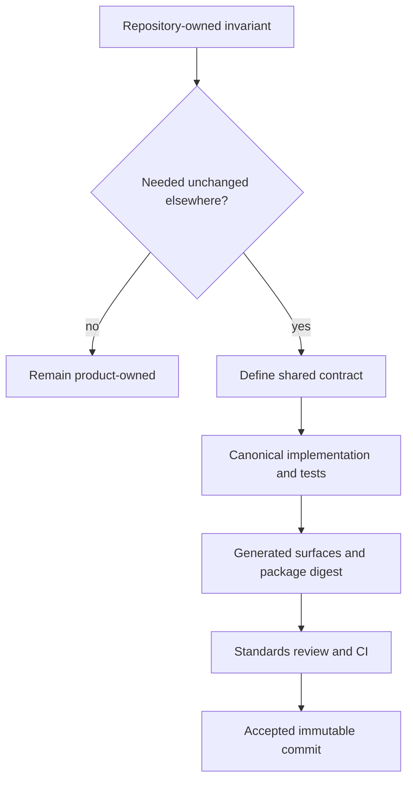
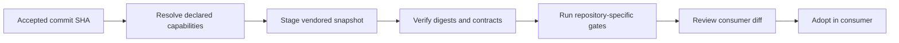
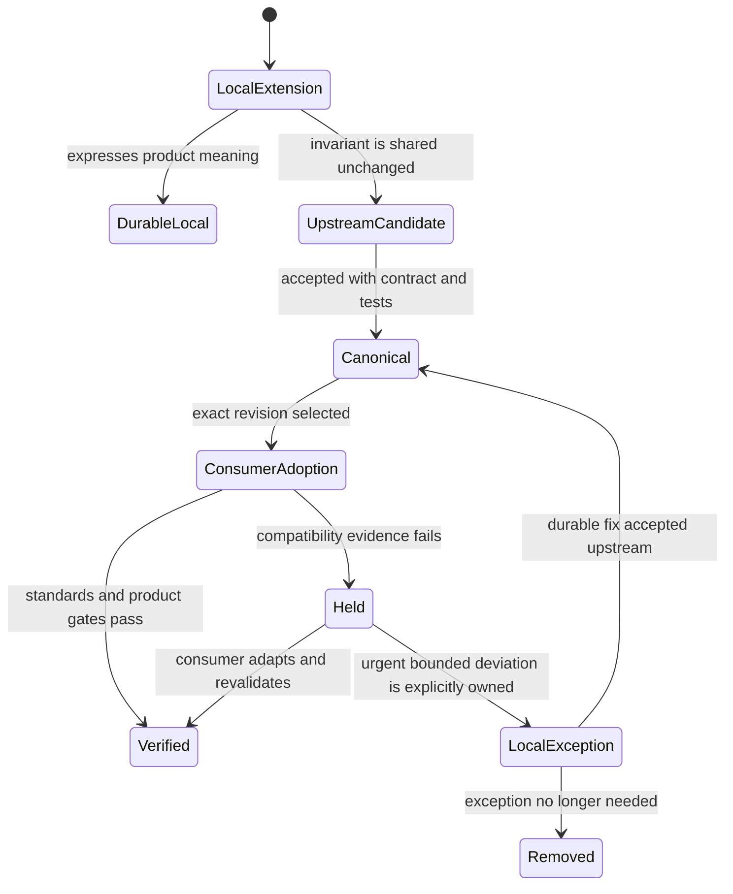

# Standards Adoption Model

A shared standard moves through two independent decisions: acceptance in
`bijux-std` and adoption in each consuming repository. This prevents one merge
from silently mutating the entire repository family.

## From Local Invariant To Shared Contract

Reuse alone is not enough. A candidate belongs in the standards layer only
when its meaning can remain stable across consumers and local divergence would
represent a defect.

## Qualification Questions

| Question | Standardize when | Keep local when |
| --- | --- | --- |
| Is the invariant cross-repository? | consumers need the same semantics | the behavior expresses one product's contract |
| Is the interface stable? | inputs, outputs, and failures can be described precisely | the design is still exploratory |
| Can consumers verify it? | adoption has deterministic checks | success depends on undocumented local state |
| Can it be selected coherently? | it belongs to a capability with clear dependencies | it requires arbitrary individual-file choices |
| Is ownership unambiguous? | canonical fixes have one durable home | consumers would still need incompatible forks |

## Source Acceptance

The canonical change includes every inseparable part of the invariant:

- implementation;
- executable contract or test;
- generated output where applicable;
- package and managed-file digests;
- documentation of inputs, effects, failure behavior, and extension points.

Standards CI validates the source, contract tests, reports, pinned actions,
generated configuration, and repository policy. The merged commit becomes the
immutable source identity available to consumers.

## Consumer Adoption

The consumer records the exact upstream commit, reviews the managed diff,
recomputes its checksum manifest, and runs both standards and product checks.
An accepted standard can therefore be valid upstream yet unsuitable for one
consumer until a compatibility issue is resolved.

## Generated Content

Managed consumer files are outputs of a manifest, generator, or canonical
package. Hand-editing them breaks the source relationship and creates a local
fork with no durable repair path.

When a generated surface is wrong:

1. identify the canonical source or typed manifest;
2. correct and validate it in `bijux-std`;
3. accept that change through standards review;
4. refresh the consumer from the accepted commit;
5. validate the consumer in its own context.

## Exceptions

A repository-specific difference is legitimate when it represents product
meaning rather than a shared-infrastructure defect. It should be implemented
as an explicit extension or local policy, not as an untracked mutation of a
managed file.

Temporary local exceptions weaken reproducibility because the consumer no
longer matches the standard it claims to use. They need a narrow scope, an
owner, and a removal or upstream path.

## Exception Lifecycle

A local exception must never become a second silent source of truth. Its
record should identify the exact managed surface, why local ownership is
temporarily necessary, what evidence bounds the deviation, and which event
removes or upstreams it.

## Adoption Is Independently Reversible

Consumer adoption changes a pinned revision and a managed snapshot. If the new
standard is incompatible, the consumer can retain or restore its last accepted
pin while the upstream standard remains valid for other repositories.

Reversal must preserve identity:

- restore an exact previously accepted commit, not a remembered branch state;
- regenerate the selected capabilities from that source;
- recompute managed checksums rather than copying old files selectively;
- rerun standards and product gates;
- retain the failed adoption evidence for diagnosis.

This is a repository-level rollback of shared inputs. It does not roll back
product data, releases, or live GitHub administration.

## Evidence Boundary

Upstream acceptance proves the shared package against the standards contract.
Consumer adoption proves the selected snapshot against that repository's
declared capabilities and local gates. Neither proves the consumer's
production readiness unless its product qualification exercises that claim.

Continue with [Shared Surfaces](../shared-surfaces/index.md) to see what each
capability brings into a repository.
