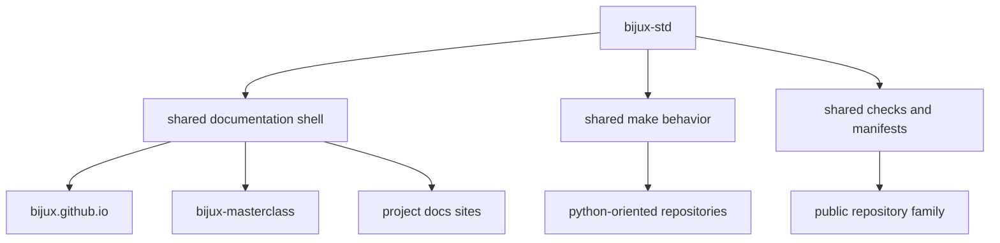

# Shared Surfaces

`bijux-std` becomes visible through the surfaces it exports into the
repository family.

## Standards Surface Map

## Main Shared Surfaces

| Surface | What it gives the family | What remains local |
| --- | --- | --- |
| shared documentation shell | common navigation, chrome, docs assets, and presentation continuity | repository-specific meaning, diagrams, and page content |
| shared make behavior | repeated automation entry points where the workflow is mature enough to share | product logic, domain logic, and repository-specific commands |
| shared checks and manifests | verifiable alignment for synchronized content and baseline repo discipline | repository-specific tests and product-specific gates |

## Why These Surfaces Matter

These surfaces keep the family legible without collapsing it into one
repository:

- shared presentation signals continuity
- shared commands reduce workflow drift
- shared checks keep synchronization honest
- local ownership remains intact where the work actually differs

## Continue Reading

- [Bijux Standards](../index.md)
- [Promotion Model](../promotion-model/index.md)
- [Documentation Network](../../01-platform/documentation-network/index.md)
