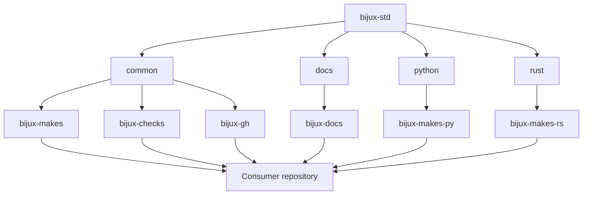

# Shared Surfaces

`bijux-std` exports six managed packages through four capabilities. Together
they define how consumers synchronize shared behavior, verify its identity,
and extend it without losing product ownership.

## Capability Map

## Common Foundation

The `common` capability is always installed.

### Language-neutral Make contract

`bijux-makes` provides stable entry points for help, environment guards,
artifact containment, documentation execution, and gate composition. A
consumer may add product-specific prerequisites, but should not silently change
the meaning of a shared target.

### Synchronization and checks

`bijux-checks` resolves the selected capability set, stages remote content,
validates directory digests, rejects unknown capabilities and layout drift,
and emits standards reports under the consumer's `artifacts/` boundary.

### GitHub governance sources

`bijux-gh` contains canonical workflow, template, policy-script, and repository
configuration sources. Typed manifests select and render consumer-specific
outputs. The package declares expected repository behavior; `bijux-iac`
separately applies live GitHub administration.

## Documentation Capability

`bijux-docs` supplies:

- shared MkDocs header, footer, and family navigation;
- styles, responsive layout primitives, icons, and theme behavior;
- local Mermaid initialization and navigation scripts;
- synchronization, source-of-truth, contract, and table checks;
- viewport and navigation regression tooling in the standards source.

Consumers own page content, local navigation, technical examples, and domain
meaning. The documentation capability makes movement familiar; it does not
standardize every handbook into one structure.

## Python Capability

`bijux-makes-py` composes Python-specific formatting, linting, testing,
packaging, environment, and API-contract behavior. It supports repository
consistency without deciding the consumer's package architecture, public API,
or release eligibility.

## Rust Capability

`bijux-makes-rs` composes Cargo checks, nextest lanes, explicit slow-test
selection, and pinned-source full-suite execution. Rust products still own
their toolchain policy, crate architecture, benchmarks, operational tests, and
release gates.

## Consumer Layout

Managed packages are vendored under `.bijux/shared/`. The exact directory set
depends on declared capabilities. The consumer also keeps its capability and
check configuration in `.bijux/checks.consumer.json` and records managed
integrity in repository checksum manifests.

A second root-level shared tree is not an alternate source. Layout validation
rejects that ambiguity because two candidate authorities would make updates
and audits unreliable.

## Build-Time And Runtime Boundaries

Shared packages are vendored repository infrastructure. They do not create a
runtime control service.

| Surface | When it acts | Network dependency after checkout |
| --- | --- | --- |
| Make contracts | local or CI command execution | none for vendored behavior; individual product commands may use networks |
| standards checks | local or CI validation | canonical comparison may resolve the pinned source; local digest checks use vendored bytes |
| GitHub workflows | GitHub Actions event execution | Actions and declared external services only |
| documentation shell | build time and browser render time | shell, Mermaid, and visual assets are local to the published site |
| capability update | explicit consumer refresh | requires access to the accepted `bijux-std` source revision |

The absence of a central runtime dependency is deliberate. A consumer can
build and inspect its selected standards snapshot without fetching presentation
code or Make logic from `bijux.io`.

## Verification Matrix

| Surface | Identity check | Contract check | Product check |
| --- | --- | --- | --- |
| shared directory | canonical directory digest | capability and layout validation | consumer gate composition |
| generated GitHub file | managed-file checksum | manifest and renderer parity | repository policy workflow |
| documentation shell | source/generated comparison | MkDocs and shell contract | local strict site build |
| Make library | package digest | target semantics and contract tests | consumer-specific commands |

Each column matters. Identity without a contract only proves matching bytes;
a contract without product checks cannot establish local correctness.

## Compatibility Surface

Compatibility attaches to observable interfaces, not to package names alone.
A package can retain its directory name while breaking a consumer through a
changed target, workflow event, manifest field, generated path, or browser
contract.

| Interface | Compatibility question | Evidence boundary |
| --- | --- | --- |
| Make target | do invocation, prerequisites, outputs, and failure behavior retain their contract? | shared contract tests plus consumer command composition |
| typed manifest | can the selected schema be parsed and rendered without guessing defaults? | schema or validator and renderer parity |
| generated GitHub file | do event triggers, permissions, context names, and managed paths remain deliberate? | manifest output, policy checks, and consumer workflow validation |
| documentation shell | do navigation hooks, assets, responsive behavior, and build integration remain valid? | shell contracts, strict consumer build, and relevant visual checks |
| capability | does selection still resolve one coherent package set and remove excluded packages? | capability, layout, and digest validation |
| report or artifact | do path, format, and meaning remain usable by the consumer that reads it? | producer contract and downstream parser or policy gate |

An additive file is not necessarily an additive interface change: a new
required check can block admission, and a new manifest default can alter every
rendered consumer. Conversely, a large internal rewrite can remain compatible
when all observable contracts and evidence stay stable.

## Removal Boundary

Removing a managed interface requires coordinated source and consumer work.
The canonical change owns contract withdrawal, generator and manifest changes,
digest updates, and detection of obsolete managed output. Each consumer owns
the adoption diff, removal of product references, and local verification.

Obsolete files must not survive as untracked alternatives to the new managed
surface. Layout and checksum checks should make residual authority visible.
The standards source can prove that the withdrawn interface is absent from its
packages; only consumer adoption evidence can prove that a particular
repository no longer carries or calls it.

## Failure Ownership

| Failure | Correct owner |
| --- | --- |
| canonical package digest is wrong | `bijux-std` package source and manifest |
| consumer vendored bytes differ from the selected source | consumer adoption change |
| generated GitHub file differs from its manifest output | canonical generator or manifest, then consumer refresh |
| shared target semantics are incorrect everywhere | owning shared Make package |
| shared target is correct but one product needs more gates | consumer-owned extension |
| documentation shell behavior fails across sites | `bijux-docs` canonical source |
| one site's content or navigation is wrong | destination repository |
| live branch protection differs from declared governance | `bijux-iac` reconciliation path |

The owner is selected by the failed invariant, not by the repository where the
symptom was first observed.

## Extension Boundary

A consumer can compose shared mechanics with local behavior when ownership
stays explicit. Atlas can add load and recovery gates; a scientific repository
can add evidence and data-validation gates; Masterclass can add curriculum
builds. Those extensions remain local unless their unchanged invariant later
qualifies for the [Standards Adoption Model](../promotion-model/index.md).
