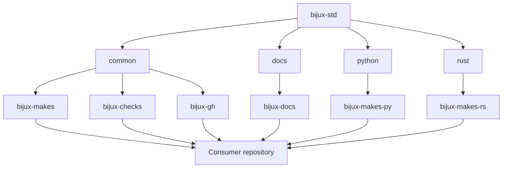

# Shared Surfaces

`bijux-std` exports six managed packages through four capabilities. Together
they define how consumers synchronize shared behavior, verify its identity,
and extend it without losing product ownership.

## Capability Map

## Common Foundation

The `common` capability is always installed.

### Language-neutral Make contract

`bijux-makes` provides stable entry points for help, environment guards,
artifact containment, documentation execution, and gate composition. A
consumer may add product-specific prerequisites, but should not silently change
the meaning of a shared target.

### Synchronization and checks

`bijux-checks` resolves the selected capability set, stages remote content,
validates directory digests, rejects unknown capabilities and layout drift,
and emits standards reports under the consumer's `artifacts/` boundary.

### GitHub governance sources

`bijux-gh` contains canonical workflow, template, policy-script, and repository
configuration sources. Typed manifests select and render consumer-specific
outputs. The package declares expected repository behavior; `bijux-iac`
separately applies live GitHub administration.

## Documentation Capability

`bijux-docs` supplies:

- shared MkDocs header, footer, and family navigation;
- styles, responsive layout primitives, icons, and theme behavior;
- local Mermaid initialization and navigation scripts;
- synchronization, source-of-truth, contract, and table checks;
- viewport and navigation regression tooling in the standards source.

Consumers own page content, local navigation, technical examples, and domain
meaning. The documentation capability makes movement familiar; it does not
standardize every handbook into one structure.

## Python Capability

`bijux-makes-py` composes Python-specific formatting, linting, testing,
packaging, environment, and API-contract behavior. It supports repository
consistency without deciding the consumer's package architecture, public API,
or release eligibility.

## Rust Capability

`bijux-makes-rs` composes Cargo checks, nextest lanes, explicit slow-test
selection, and pinned-source full-suite execution. Rust products still own
their toolchain policy, crate architecture, benchmarks, operational tests, and
release gates.

## Consumer Layout

Managed packages are vendored under `.bijux/shared/`. The exact directory set
depends on declared capabilities. The consumer also keeps its capability and
check configuration in `.bijux/checks.consumer.json` and records managed
integrity in repository checksum manifests.

A second root-level shared tree is not an alternate source. Layout validation
rejects that ambiguity because two candidate authorities would make updates
and audits unreliable.

## Verification Matrix

| Surface | Identity check | Contract check | Product check |
| --- | --- | --- | --- |
| shared directory | canonical directory digest | capability and layout validation | consumer gate composition |
| generated GitHub file | managed-file checksum | manifest and renderer parity | repository policy workflow |
| documentation shell | source/generated comparison | MkDocs and shell contract | local strict site build |
| Make library | package digest | target semantics and contract tests | consumer-specific commands |

Each column matters. Identity without a contract only proves matching bytes;
a contract without product checks cannot establish local correctness.

## Extension Boundary

A consumer can compose shared mechanics with local behavior when ownership
stays explicit. Atlas can add load and recovery gates; a scientific repository
can add evidence and data-validation gates; Masterclass can add curriculum
builds. Those extensions remain local unless their unchanged invariant later
qualifies for the [Standards Adoption Model](../promotion-model/index.md).
